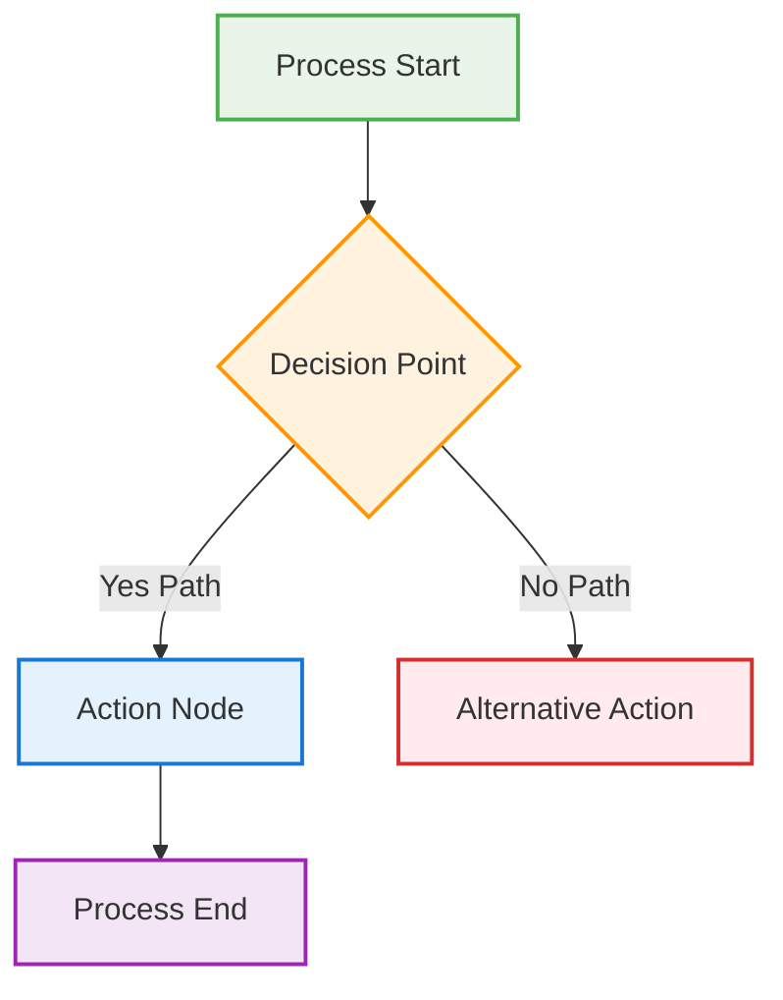
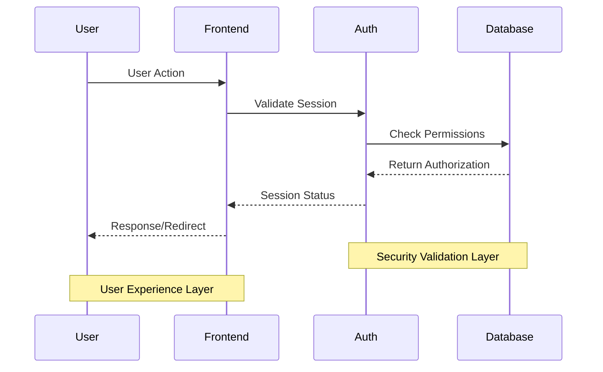
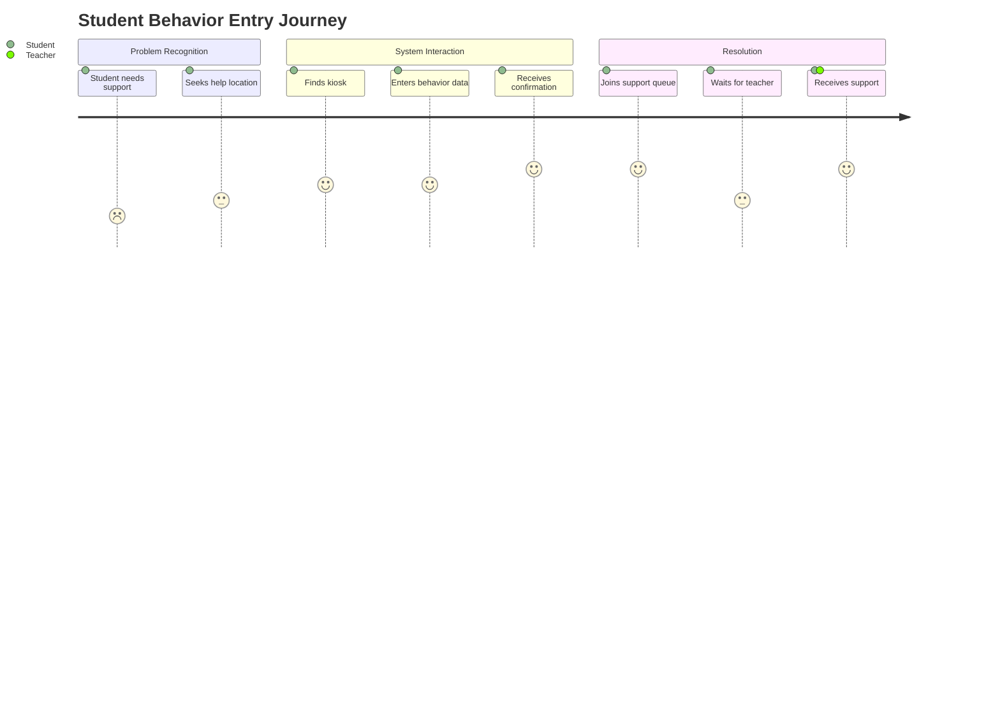

# 🎨 Flowchart Content Generation Guide

## Overview
This guide provides specific instructions for generating accurate, useful, and visually consistent flowchart content. Follow these standards to ensure every flowchart serves its intended purpose and integrates properly with the overall documentation architecture.

## 🎯 Content Generation Workflow

### Step 1: System Analysis & Information Gathering
1. **Codebase Assessment**: Examine actual components, hooks, and file structure
2. **Functionality Testing**: Verify what works vs. what's broken in current system
3. **Security Analysis**: Identify authentication, authorization, and data protection gaps
4. **User Flow Mapping**: Trace actual user paths through system interfaces

### Step 2: Stakeholder Perspective Integration
1. **Student Experience**: Anonymous kiosk access, behavior entry, queue interaction
2. **Teacher Experience**: Dashboard access, student monitoring, intervention coordination
3. **Admin Experience**: User management, system configuration, data oversight
4. **System Experience**: Backend processes, data flow, security boundaries

### Step 3: Architecture Documentation Standards
1. **Component Relationship Mapping**: How components interact and depend on each other
2. **Data Flow Documentation**: Information movement through system layers
3. **Security Boundary Definition**: Authentication gates and authorization checkpoints
4. **Integration Point Identification**: Where system connects to external services

## 📊 Mermaid Diagram Generation Standards

### Flowchart Syntax Best Practices

**Node Types & Styling:**


**Sequence Diagram Standards:**


**User Journey Format:**


### Color Coding Implementation

**System Status Colors:**
- **Functional Green**: `fill:#e8f5e8,stroke:#4caf50` - Working components, successful flows
- **Problem Red**: `fill:#ffebee,stroke:#d32f2f` - Broken functionality, security issues
- **Warning Orange**: `fill:#fff3e0,stroke:#ff9800` - Decision points, conditional logic
- **Security Blue**: `fill:#e3f2fd,stroke:#1976d2` - Authentication/authorization boundaries
- **Future Purple**: `fill:#f3e5f5,stroke:#9c27b0` - Planned features, future integration points

**Accessibility Requirements:**
- Always include text indicators alongside colors (✅ ❌ 🔄 ⚠️)
- Use descriptive node text, not just symbols or abbreviations  
- Ensure sufficient contrast between text and background colors
- Limit diagram complexity to 15 nodes maximum for readability

### Implementation Status Documentation

**Current-State Analysis Format:**
```markdown
## System Component Analysis

### 🔍 Component Inventory
- **AuthContext.tsx**: ✅ Exists - Provides authentication state management
- **ProtectedRoute.tsx**: ❌ Broken - No role-based protection, blocks kiosk access
- **AdminDashboard.tsx**: ⚠️ Insecure - Visible to all authenticated users
- **useSupabaseQueue.ts**: 🔄 Partial - Exists but has broken student lookup logic

### 🚨 Critical Gaps Identified
1. **Missing Role-Based Routes**: No AdminRoute or TeacherRoute components
2. **UI Permission System**: No component-level authorization framework
3. **Session Management**: Google OAuth users display as "Unknown"
4. **Kiosk Access**: Authentication guards prevent student access
```

**Sprint-Target Implementation Status:**
```markdown  
## 📋 Implementation Status

### ✅ IMPLEMENTED
- `AuthContext.tsx` - Authentication state management functional
- `supabase/client.ts` - Database connection and configuration working
- `UniversalKiosk.tsx` - Basic kiosk interface component exists

### 🔄 PARTIALLY IMPLEMENTED
- `useDeviceSession.ts` - Device session tracking exists but needs refinement for role correlation
- `NotificationBell.tsx` - Component exists but dropdown interactions are broken
- `QueueDisplay.tsx` - Shows data but filtering and student lookup logic needs fixes

### ❌ NOT IMPLEMENTED
- `AdminRoute.tsx` - Role-based route protection for admin dashboard access
- `TeacherRoute.tsx` - Role-based route protection for teacher dashboard access  
- `usePermissions.ts` - Component-level UI authorization system
- `permissions.ts` - Permission helper utilities and validation functions
```

## 🔄 Cross-Reference Generation Protocol

### Required Cross-Reference Types

**Problem → Solution Mapping:**
```markdown
> **Solves Current Problem**: See `01-current-authentication-routing.md` - "No Role-Based Route Protection"
> **Implementation Tracking**: `SPRINT-01-LAUNCH/IMPLEMENTATION-CHECKLIST.md` Items 1.1-1.3
> **Technical Requirements**: `SPRINT-01-LAUNCH/BX-OS-TECHNICAL-CONTEXT.md` Section 2.1
```

**Component Dependency Tracking:**
```markdown
> **Component Dependencies**: 
> - Requires: `AuthContext.tsx` (existing), `useProfile.ts` (existing)
> - Integrates with: `App.tsx` routing configuration
> - Blocks: Anonymous kiosk access (intentional for admin/teacher routes)
```

**Architecture Integration Points:**
```markdown
> **Architecture Integration**:
> - Foundation: Current authentication system from `AuthContext.tsx`
> - Security Layer: Supabase RLS policies and user profiles table
> - UI Integration: Role-based component visibility throughout application
> - Future Vision: Scales to multi-school deployment with district-level admin roles
```

## 📋 Content Accuracy Standards

### Codebase State Reflection Requirements
- **File References**: Must reference actual files in repository, with accurate paths
- **Component Status**: Implementation status must match actual component functionality  
- **Integration Accuracy**: Component relationships must reflect actual code dependencies
- **Testing Validation**: Functionality claims must be verifiable through testing

### Technical Detail Standards
- **Specific File Paths**: Use exact repository paths like `src/components/AdminRoute.tsx`
- **Functional Descriptions**: Describe what components actually do, not what they should do
- **Dependency Mapping**: Accurate import/export relationships between components
- **Security Boundaries**: Precise authentication and authorization checkpoint descriptions

### Update Maintenance Protocol
- **Implementation Progress Tracking**: Update status as code is actually written
- **Cross-Reference Validation**: Ensure all internal links remain accurate as repository evolves
- **Functionality Verification**: Re-test component functionality before updating status
- **Sprint Closure Accuracy**: Final status must reflect deliverable system state

## 🎯 User Experience Integration

### Stakeholder Journey Mapping
1. **Student Perspective**: Anonymous access, behavior entry, queue interaction, support reception
2. **Teacher Perspective**: Authenticated access, dashboard monitoring, intervention coordination
3. **Admin Perspective**: User management, system oversight, configuration control
4. **System Perspective**: Security enforcement, data integrity, performance monitoring

### Experience-Technical Integration
- **User Actions**: Map user interface interactions to backend component functionality
- **Decision Points**: Connect user choices to system routing and authorization logic
- **Error Handling**: Document system response to user errors or edge cases
- **Success Flows**: Define complete successful journey from user trigger to system resolution

### Multi-Stakeholder Workflow Integration
- **Handoff Points**: Where one user's action affects another user's experience
- **Permission Boundaries**: How role-based access affects cross-user interactions
- **Data Visibility**: What information each stakeholder can see about others' actions
- **Notification Systems**: How system communicates events between different user roles

## 🔐 Security Documentation Standards

### Authentication Flow Documentation
- **Entry Points**: All system access points and their authentication requirements
- **Session Management**: How user sessions are created, maintained, and terminated
- **Role Assignment**: Process for determining and assigning user roles
- **Anonymous Access**: Specific pathways that bypass authentication (kiosk routes)

### Authorization Boundary Definition
- **Route Protection**: Which routes require which roles for access
- **Component Visibility**: UI elements that should be hidden based on user permissions
- **Function Access**: Backend operations restricted by role or permission level  
- **Data Access**: Information visibility rules based on user role and context

### Security Vulnerability Documentation
- **Current Gaps**: Specific security holes in existing implementation
- **Attack Vectors**: How current gaps could be exploited
- **Mitigation Requirements**: Specific implementation needed to close security gaps
- **Compliance Considerations**: Privacy and safety requirements for student data protection

This guide ensures that all flowchart content accurately reflects system state, provides useful architectural guidance, and maintains consistency across all visual documentation.