# 🔴 Current Kiosk Logic Flow

**Status**: BROKEN - Static routing causing multi-tab conflicts and device management issues

## Current Static Route Implementation

```mermaid
flowchart TD
    A[Student Access] --> B[Hard-coded Routes]
    B --> C["/kiosk1"]
    B --> D["/kiosk2"] 
    B --> E["/kiosk3"]
    
    C --> F[❌ Multi-tab Access Possible]
    D --> G[❌ Multi-tab Access Possible]
    E --> H[❌ Multi-tab Access Possible]
    
    F --> I[Tab 1: Same Student]
    F --> J[Tab 2: Same Student]
    G --> K[Multiple Device Access]
    H --> L[Race Conditions]
    
    style F fill:#ffebee,stroke:#d32f2f,stroke-width:3px
    style G fill:#ffebee,stroke:#d32f2f,stroke-width:3px
    style H fill:#ffebee,stroke:#d32f2f,stroke-width:3px
    style I fill:#ffebee,stroke:#d32f2f,stroke-width:3px
    style J fill:#ffebee,stroke:#d32f2f,stroke-width:3px
    style K fill:#ffebee,stroke:#d32f2f,stroke-width:3px
    style L fill:#ffebee,stroke:#d32f2f,stroke-width:3px
```

## Student Assignment Race Conditions

## Current Kiosk Component Logic Issues

```mermaid
flowchart TD
    A[Kiosk Component Loads] --> B[Manual Student Selection]
    B --> C{Student Available?}
    C -->|No| D[❌ No Auto-Assignment]
    C -->|Yes| E[Manual Assignment]
    
    E --> F[Student Completes BSR]
    F --> G[Submit for Review]
    G --> H[❌ No Auto-Progress to Next]
    
    H --> I[Manual Admin Action Required]
    I --> B
    
    style D fill:#ffebee,stroke:#d32f2f,stroke-width:3px
    style H fill:#ffebee,stroke:#d32f2f,stroke-width:3px
    style I fill:#ffebee,stroke:#d32f2f,stroke-width:3px
```

## Device Binding Issues

```mermaid
flowchart TD
    A[Device Access] --> B{Device Identified?}
    B -->|No| C[❌ No Device Binding]
    B -->|Yes| D[❌ No Session Binding]
    
    C --> E[Multiple Devices → Same Route]
    D --> F[Same Device → Multiple Routes]
    
    E --> G[Conflict: Device 1 & 2 on /kiosk1]
    F --> H[Conflict: iPad opens /kiosk1 & /kiosk2]
    
    style C fill:#ffebee,stroke:#d32f2f,stroke-width:3px
    style D fill:#ffebee,stroke:#d32f2f,stroke-width:3px
    style E fill:#ffebee,stroke:#d32f2f,stroke-width:3px
    style F fill:#ffebee,stroke:#d32f2f,stroke-width:3px
    style G fill:#ffebee,stroke:#d32f2f,stroke-width:3px
    style H fill:#ffebee,stroke:#d32f2f,stroke-width:3px
```

## Authentication Barriers for Kiosks

```mermaid
flowchart TD
    A[Student tries to access /kiosk1] --> B[ProtectedRoute Check]
    B --> C{Is Authenticated?}
    C -->|No| D[❌ Redirect to /auth]
    C -->|Yes| E[Access Denied - Wrong Role]
    
    D --> F[❌ Student blocked from kiosk]
    E --> G[❌ Student blocked from kiosk]
    
    F --> H[❌ Kiosk unusable for students]
    G --> I[❌ Security risk: Cross-user data access]
    
    style D fill:#ffebee,stroke:#d32f2f,stroke-width:3px
    style E fill:#ffebee,stroke:#d32f2f,stroke-width:3px
    style F fill:#ffebee,stroke:#d32f2f,stroke-width:3px
    style G fill:#ffebee,stroke:#d32f2f,stroke-width:3px
    style H fill:#ffebee,stroke:#d32f2f,stroke-width:3px
    style I fill:#ffebee,stroke:#d32f2f,stroke-width:3px
```

## Critical Problems Summary

### 🔴 Technical Issues
1. **Static Routes**: Hard-coded /kiosk1, /kiosk2, /kiosk3 routes
2. **Multi-tab Conflicts**: Same route accessible from multiple tabs
3. **No Device Binding**: No way to identify or bind devices to specific kiosks
4. **Race Conditions**: Multiple tabs can fetch and assign same student

### 🔴 Operational Issues
1. **Authentication Barriers**: Students cannot access kiosk routes
2. **Manual Intervention Required**: No auto-assignment or progression
3. **No Session Management**: No tracking of device-specific sessions

### 🔴 Security Issues
1. **Data Integrity**: Race conditions cause data corruption
2. **Cross-device Access**: Same student data accessible across devices
3. **Session Conflicts**: Multiple sessions can modify same data

## Required Architecture Changes
1. **Dynamic Routing**: Replace static routes with dynamic device assignment
2. **Device Session Management**: Implement device identification and binding
3. **Anonymous Access**: Remove authentication requirements for kiosk routes
4. **Conflict Prevention**: Implement session locking and queue management
5. **Auto-assignment**: Implement automatic student assignment and progression