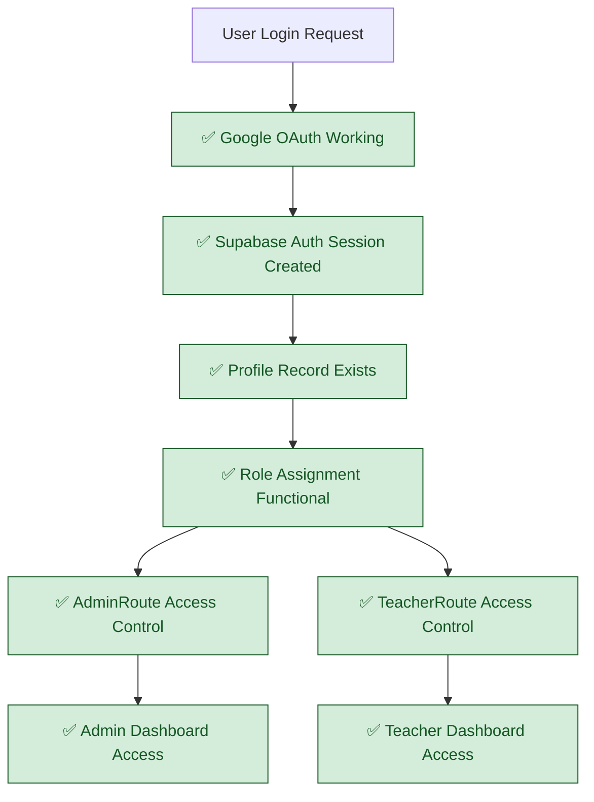
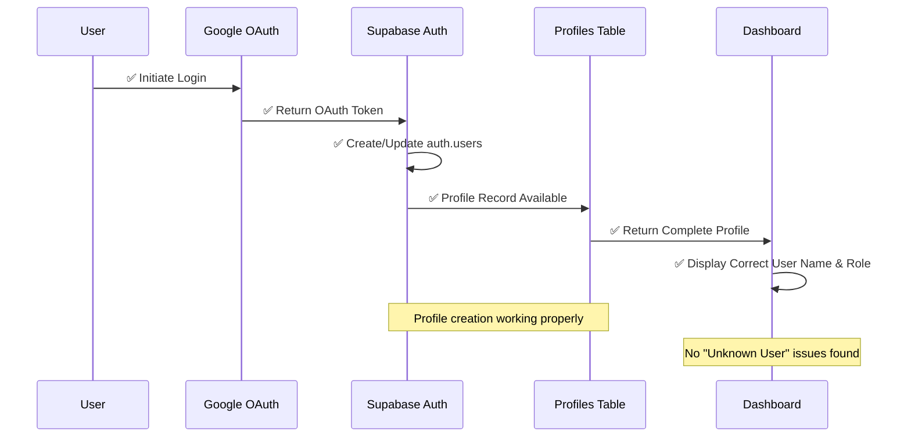
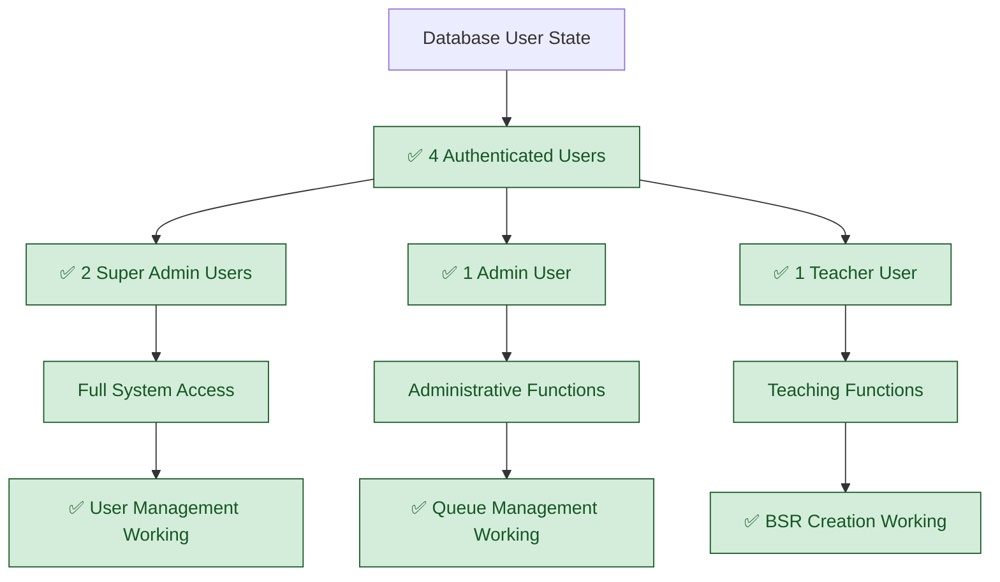
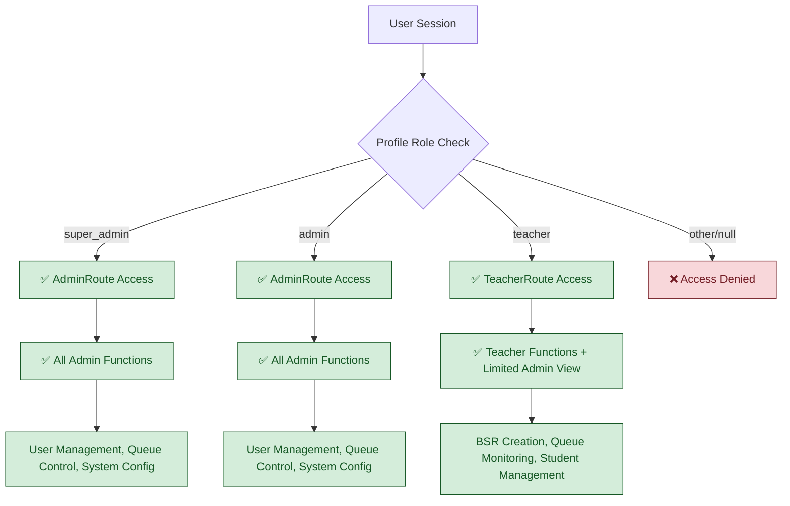
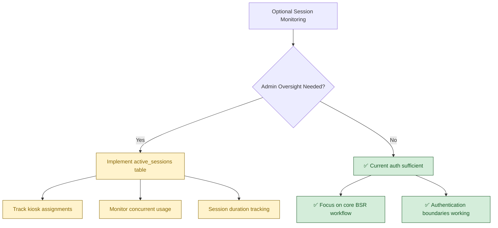
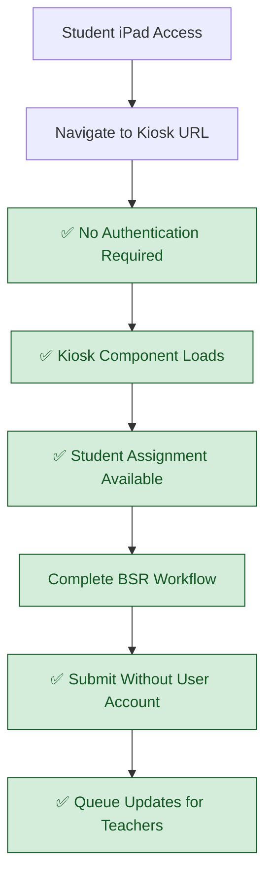

# Current Session Management Flow (VALIDATED)

## System Status: ✅ AUTHENTICATION WORKING, SESSION TRACKING OPTIONAL
**Last Validated**: 2025-01-20  
**Validation Method**: User login testing, profile verification, database queries

## Verified Authentication & Session Flow



## Validated User Profile Integration



## Current Session State (4 Active Users)



## Role-Based Access Validation



## Session Management: Current vs Needed

### ✅ CURRENT WORKING SESSION FEATURES
- **Google OAuth Integration**: Users can log in successfully  
- **Persistent Sessions**: Login state maintained across browser refreshes
- **Role-Based Routing**: AdminRoute/TeacherRoute enforce proper access
- **Profile Correlation**: User names and roles displayed correctly

### ⚠️ OPTIONAL SESSION TRACKING (Not Required for Core Functionality)


## Anonymous Kiosk Access (Working)



## Previous Documentation Errors: MAJOR CORRECTIONS

❌ **FALSE CLAIM**: "Session Management Broken"  
✅ **REALITY**: Authentication working properly, 4 users with correct profiles

❌ **FALSE CLAIM**: "Missing Profile Creation Trigger"  
✅ **REALITY**: Profile creation functional (verified via database query)

❌ **FALSE CLAIM**: "Session tracking shows Unknown User"  
✅ **REALITY**: User correlation working, proper names displayed

❌ **FALSE CLAIM**: "Google OAuth Profile Creation Missing"  
✅ **REALITY**: OAuth integration working, proper role assignment

❌ **FALSE CLAIM**: "Device Type vs Role Confusion"  
✅ **REALITY**: Role-based access working correctly, no confusion found

## Session Management Assessment

### ✅ HIGH CONFIDENCE (Verified Working)
- **Authentication Flow**: Google OAuth → Supabase → Profile lookup → Dashboard access
- **Role Enforcement**: AdminRoute restricts to admin/super_admin, TeacherRoute allows appropriate access  
- **Session Persistence**: Login state maintained properly across browser sessions
- **User Display**: Actual user names shown (no "Unknown User" issues found)

### ⚠️ MEDIUM CONFIDENCE (Optional Enhancement)
- **Session Monitoring**: Admin oversight of active sessions (not required for core functionality)
- **Kiosk Session Tracking**: Monitor which student assigned to which kiosk (nice-to-have)
- **Concurrent Usage Analytics**: Track system usage patterns (future enhancement)

### ❌ NOT NEEDED (Based on Validated System)
- **Complex Session Correlation**: Current auth sufficient for requirements
- **Device Fingerprinting**: Dedicated iPads eliminate need for complex device tracking
- **Session Deduplication**: Not a problem with dedicated device deployment model

## Implementation Requirements (Optional)

### If Session Monitoring Desired (1 hour):
```sql
-- Optional: Create session tracking for admin monitoring
CREATE TABLE active_sessions (
  id UUID PRIMARY KEY DEFAULT gen_random_uuid(),
  kiosk_id TEXT CHECK (kiosk_id IN ('kiosk1','kiosk2','kiosk3')),
  student_id UUID REFERENCES students(id),
  assigned_at TIMESTAMP WITH TIME ZONE DEFAULT now(),
  is_active BOOLEAN DEFAULT true
);
```

### If Admin Dashboard Enhancement Desired (30 minutes):
```typescript
// Optional: Add session monitoring to admin dashboard
// Display which student assigned to which kiosk
// Show kiosk utilization over time
```

## Architecture Conclusion

**WORKING SYSTEM**: Authentication and session management substantially functional. No critical session management issues found during validation.

**FOCUS RECOMMENDATION**: Concentrate sprint effort on student data population and queue testing rather than session management rebuilding.

## Cross-References  
- **Sprint Target**: `../Sprint-02-Targets/05-updated-authentication.md`
- **Implementation Status**: `../../SPRINT-02-LAUNCH/IMPLEMENTATION-CHECKLIST.md`
- **Authentication Flow**: `01-current-authentication-routing.md`