# 🔴 Current Session Management Flow

**Status**: BROKEN - Critical session tracking and user correlation failures

## Current Session Creation Issues

```mermaid
flowchart TD
    A[User Login] --> B[Google OAuth Success]
    B --> C[Supabase Session Created]
    C --> D{Session Object Used?}
    D -->|No| E[❌ Session ignored]
    D -->|Yes| F[Session Processing]
    
    E --> G[❌ No session tracking in DB]
    F --> H{Profile Exists?}
    H -->|No| I[❌ Unknown User]
    H -->|Yes| J[Proper User Display]
    
    G --> K[❌ UI shows wrong info]
    I --> L[❌ Device type confused with role]
    
    style E fill:#ffebee,stroke:#d32f2f,stroke-width:3px
    style G fill:#ffebee,stroke:#d32f2f,stroke-width:3px
    style I fill:#ffebee,stroke:#d32f2f,stroke-width:3px
    style K fill:#ffebee,stroke:#d32f2f,stroke-width:3px
    style L fill:#ffebee,stroke:#d32f2f,stroke-width:3px
```



## Google OAuth Profile Creation (Missing)

```mermaid
flowchart TD
    A[Google OAuth Success] --> B[Supabase User Created]
    B --> C{Profile Creation Trigger?}
    C -->|Missing| D[❌ No profile record]
    C -->|Exists| E[Profile Created]
    
    D --> F[❌ role = undefined]
    D --> G[❌ display_name = "Unknown"]
    D --> H[❌ Session shows wrong info]
    
    E --> I[role = assigned]
    E --> J[display_name = from OAuth]
    E --> K[Correct session display]
    
    style C fill:#ffebee,stroke:#d32f2f,stroke-width:3px
    style D fill:#ffebee,stroke:#d32f2f,stroke-width:3px
    style F fill:#ffebee,stroke:#d32f2f,stroke-width:3px
    style G fill:#ffebee,stroke:#d32f2f,stroke-width:3px
    style H fill:#ffebee,stroke:#d32f2f,stroke-width:3px
```

## Session Display Problems

```mermaid
flowchart TD
    A[SessionMonitor Component] --> B[Fetch Active Sessions]
    B --> C[useActiveSessions Hook]
    C --> D{User Profile Data?}
    D -->|Missing| E[❌ Display "Unknown User"]
    D -->|Exists| F[Display Actual Name]
    
    E --> G[❌ Device type logic error]
    G --> H[❌ Shows device as role]
    
    F --> I[Correct user information]
    I --> J[Proper session list]
    
    style E fill:#ffebee,stroke:#d32f2f,stroke-width:3px
    style G fill:#ffebee,stroke:#d32f2f,stroke-width:3px
    style H fill:#ffebee,stroke:#d32f2f,stroke-width:3px
```

## Device Type vs Role Confusion

```mermaid
flowchart TD
    A[Session Creation] --> B[Device Detection]
    B --> C{Device Type Storage}
    C -->|Incorrect| D[❌ Stores "admin" as device_type]
    C -->|Correct| E[Stores "iPad" as device_type]
    
    D --> F[❌ device_type = "admin"]
    D --> G[❌ device_type = "teacher"]
    
    E --> H[device_type = "mobile"]
    E --> I[device_type = "desktop"]
    
    F --> J[❌ UI: "admin device connected"]
    G --> K[❌ UI: "teacher device connected"]
    
    H --> L[✓ UI: "mobile device connected"]
    I --> M[✓ UI: "desktop device connected"]
    
    style D fill:#ffebee,stroke:#d32f2f,stroke-width:3px
    style F fill:#ffebee,stroke:#d32f2f,stroke-width:3px
    style G fill:#ffebee,stroke:#d32f2f,stroke-width:3px
    style J fill:#ffebee,stroke:#d32f2f,stroke-width:3px
    style K fill:#ffebee,stroke:#d32f2f,stroke-width:3px
```

## Current SessionMonitor Component Issues

```mermaid
sequenceDiagram
    participant SM as SessionMonitor
    participant AS as useActiveSessions
    participant DB as Database
    participant UI as Display

    SM->>AS: Fetch active sessions
    AS->>DB: Query active_sessions table
    DB->>AS: Return session data
    Note over AS: ❌ useActiveSessions processes incorrectly
    AS->>AS: ❌ Treats device_type as role
    AS->>SM: Return malformed session list
    SM->>UI: Display incorrect session info
    Note over UI: Shows "admin device" instead of user name
```



## Missing Profile Creation Trigger

```mermaid
flowchart TD
    A[New User Registration] --> B{Profile Creation Trigger?}
    B -->|Missing| C[❌ Only auth record created]
    B -->|Exists| D[Profile record created]
    
    C --> E[❌ No role assignment]
    C --> F[❌ No display name]
    C --> G[❌ Session tracking fails]
    
    D --> H[Role assigned]
    D --> I[Display name set]
    D --> J[Session tracking works]
    
    style B fill:#ffebee,stroke:#d32f2f,stroke-width:3px
    style C fill:#ffebee,stroke:#d32f2f,stroke-width:3px
    style E fill:#ffebee,stroke:#d32f2f,stroke-width:3px
    style F fill:#ffebee,stroke:#d32f2f,stroke-width:3px
    style G fill:#ffebee,stroke:#d32f2f,stroke-width:3px
```



## Session Deduplication Issues

```mermaid
flowchart TD
    A[User Login] --> B{Existing Active Session?}
    B -->|Yes| C[❌ No deduplication logic]
    B -->|No| D[Create new session]
    
    C --> E[❌ Multiple active sessions]
    E --> F[❌ Cluttered session list]
    E --> G[❌ Cannot track real activity]
    E --> H[❌ Wrong data displayed]
    
    D --> I[Single active session]
    
    B -->|Should be| J[End previous sessions]
    J --> K[Create single new session]
    
    style C fill:#ffebee,stroke:#d32f2f,stroke-width:3px
    style E fill:#ffebee,stroke:#d32f2f,stroke-width:3px
    style F fill:#ffebee,stroke:#d32f2f,stroke-width:3px
    style G fill:#ffebee,stroke:#d32f2f,stroke-width:3px
    style H fill:#ffebee,stroke:#d32f2f,stroke-width:3px
    style J fill:#e8f5e8,stroke:#4caf50,stroke-width:2px
    style K fill:#e8f5e8,stroke:#4caf50,stroke-width:2px
```



## Critical Session Management Problems

### 🔴 Profile Creation
1. **Missing Triggers**: No automatic profile creation on user registration
2. **OAuth Integration Gaps**: Google OAuth data not properly stored
3. **Role Assignment**: No role assignment during registration
4. **Display Name Issues**: Missing display names cause "Unknown" users

### 🔴 Session Tracking
1. **Device Type Confusion**: Device types stored as user roles
2. **No Session Creation**: Login doesn't create session records
3. **No Deduplication**: Multiple active sessions not handled
4. **Wrong Data Display**: Session monitor shows incorrect information

### 🔴 Data Correlation
1. **Missing User-Profile Links**: Sessions not linked to user profiles
2. **Role-Device Mixup**: Device characteristics confused with user roles
3. **Session-User Correlation**: Cannot correlate sessions with actual users
4. **Broken Audit Trail**: No proper tracking of user activity

## Required Fixes for Sprint
1. **Create Profile Triggers**: Automatic profile creation on registration
2. **Fix Session Creation**: Proper session record creation on login
3. **Separate Device Type from Role**: Clear distinction between device and user characteristics
4. **Implement Session Deduplication**: Handle multiple sessions properly
5. **Fix Session Display**: Show actual user names and correct device information
6. **Proper Role Assignment**: Ensure roles are assigned during registration