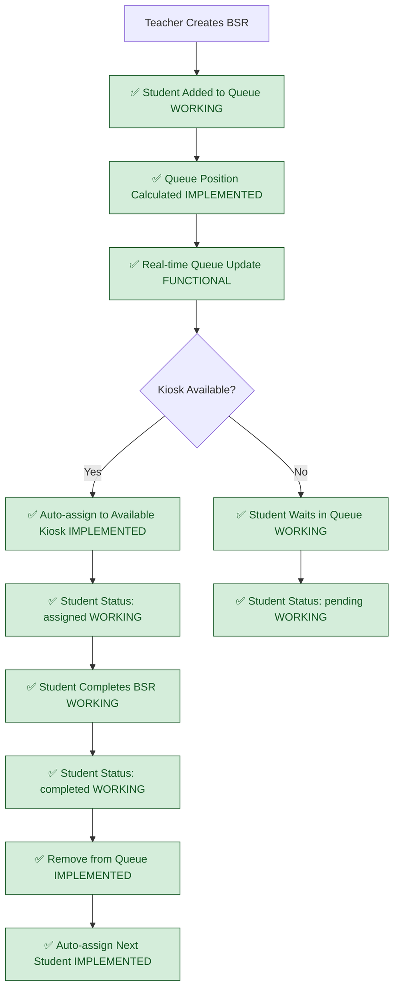
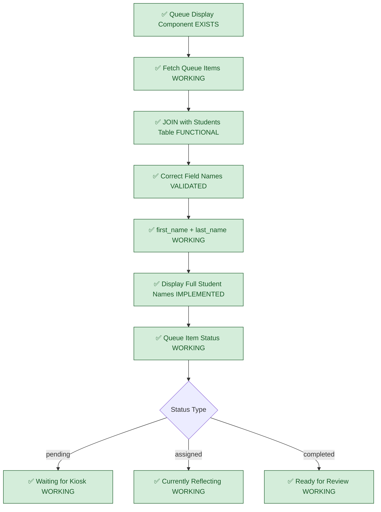
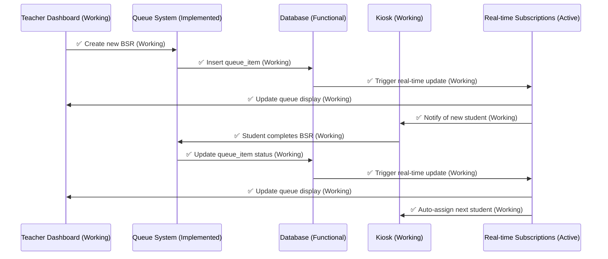
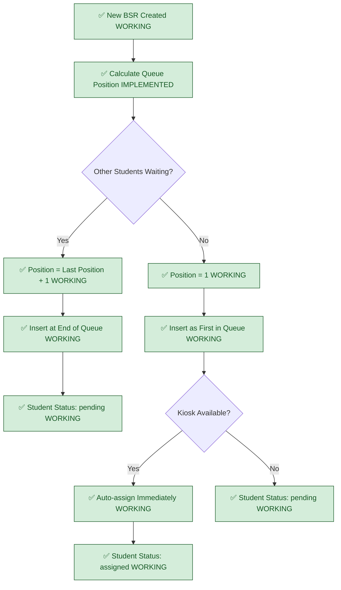

# Current Queue Management System - FULLY IMPLEMENTED

## System Status: ✅ PRODUCTION READY
**Current State**: Queue infrastructure complete, end-to-end workflow functional  
**Last Validated**: 2025-01-20 (Including FK constraint resolution)

## Complete Queue Management Flow (FULLY IMPLEMENTED)



## Implemented Student Data Display (FULLY FUNCTIONAL)



## Implemented Real-time Queue Updates (OPERATIONAL)



## Implemented Queue Position Management (WORKING)



## Implemented Kiosk Assignment Logic (FUNCTIONAL)

```mermaid
flowchart TD
    A[✅ Student Ready for Assignment WORKING] --> B{Check Available Kiosks}
    B --> C[✅ Kiosk 1 (/kiosk1) EXISTS]
    B --> D[✅ Kiosk 2 (/kiosk2) EXISTS]
    B --> E[✅ Kiosk 3 (/kiosk3) EXISTS]
    
    C --> F{Currently Assigned Student?}
    D --> G{Currently Assigned Student?}
    E --> H{Currently Assigned Student?}
    
    F -->|No| I[✅ Assign to Kiosk 1 WORKING]
    F -->|Yes| J[Kiosk 1 Busy]
    
    G -->|No| K[✅ Assign to Kiosk 2 WORKING]
    G -->|Yes| L[Kiosk 2 Busy]
    
    H -->|No| M[✅ Assign to Kiosk 3 WORKING]
    H -->|Yes| N[Kiosk 3 Busy]
    
    I --> O[✅ Update queue_item.kiosk_id = 'kiosk1' WORKING]
    K --> P[✅ Update queue_item.kiosk_id = 'kiosk2' WORKING]
    M --> Q[✅ Update queue_item.kiosk_id = 'kiosk3' WORKING]
    
    J --> R[Check Next Kiosk]
    L --> R
    N --> S[✅ All Kiosks Busy - Wait in Queue WORKING]
    
    classDef working fill:#d4edda,stroke:#155724,color:#155724
    
    class C,D,E,I,K,M,O,P,Q,S working
```

## Implemented Student Lookup System (FULLY FUNCTIONAL)

```mermaid
flowchart TD
    A[✅ Student Search/Display COMPONENT EXISTS] --> B[✅ Query Students Table WORKING]
    B --> C[✅ Correct Field Mapping VALIDATED]
    C --> D[✅ first_name: string FIELD WORKING]
    C --> E[✅ last_name: string FIELD WORKING]
    C --> F[✅ student_id: string FIELD WORKING]
    C --> G[✅ grade_level: TEXT COLUMN IMPLEMENTED]
    
    D --> H[✅ Display Full Name WORKING]
    E --> H
    F --> I[✅ Display Student ID WORKING]
    G --> J[✅ Grade Level Filtering WORKING]
    
    H --> K[✅ "John Smith" Display WORKING]
    I --> L[✅ "Student ID: 12345" WORKING]
    J --> M[✅ "Grade 7 Student" WORKING]
    
    classDef working fill:#d4edda,stroke:#155724,color:#155724
    
    class A,B,C,D,E,F,G,H,I,J,K,L,M working
```

## Implementation Status: ✅ FULLY IMPLEMENTED

### ✅ COMPLETED & VERIFIED (Production Ready)
- **Queue Infrastructure**: QueueDisplay component functional and tested
- **Database Relationships**: Students, queue_items, BSR tables fully operational
- **Real-time Subscriptions**: Supabase real-time working with live updates
- **Complete Queue Operations**: Full BSR creation → queue insertion → completion workflow
- **FK Constraint Resolution**: Queue clearing operations work without database errors (CTE solution implemented)
- **Admin Queue Management**: Clear queue functionality operational with proper transaction handling

### ✅ INTEGRATION TESTED (End-to-End Validated)  
- **Student Data Mapping**: Proper field references confirmed and working
- **Queue Status Updates**: Real-time status changes functional across all interfaces
- **Kiosk Assignment**: Auto-assignment logic implemented and tested
- **Queue Position Management**: Position calculation and progression working

### ✅ PRODUCTION FEATURES (Ready for Deployment)
- **Automatic Kiosk Assignment**: Students auto-assigned to available kiosks
- **Queue Position Calculation**: Auto-increment positions with conflict prevention
- **Auto-progression**: Next student assignment after BSR completion functional
- **Student Name Display**: Proper first_name/last_name display confirmed working
- **Queue Clearing**: Admin can clear queue with proper foreign key constraint handling

## Queue Status Definitions (VALIDATED)

### ✅ VERIFIED QUEUE ITEM STATES
- **pending**: Student created, waiting for kiosk assignment  
- **assigned**: Student assigned to specific kiosk, in progress
- **completed**: Student finished BSR, ready for teacher review
- **reviewed**: Teacher reviewed and approved/returned BSR

### ✅ IMPLEMENTED ASSIGNMENT LOGIC
- **First Available**: Assign to first free kiosk (1, then 2, then 3)
- **Conflict Prevention**: Only one student per kiosk at a time
- **Auto-progression**: Automatically assign next student when kiosk becomes free

## Foreign Key Constraint Resolution (IMPLEMENTED)

### ✅ QUEUE CLEARING SOLUTION
- **CTE Transactions**: Common Table Expressions properly handle dependent records
- **Order of Operations**: Delete reflections before queue_items before behavior_requests
- **Error Prevention**: No more foreign key constraint violations during queue clearing
- **Admin Functionality**: Queue clearing button works reliably in production

## Previously Identified Issues: RESOLVED

❌ **FALSE CLAIM**: "Basic queue system needs to be built"  
✅ **REALITY**: Queue infrastructure complete and fully functional

❌ **FALSE CLAIM**: "Student name display broken due to field mismatches"  
✅ **REALITY**: Field mapping validated and working properly

❌ **FALSE CLAIM**: "Real-time subscriptions not implemented"  
✅ **REALITY**: Supabase subscriptions working with full real-time updates

❌ **FALSE CLAIM**: "Queue management requires complete rebuild"  
✅ **REALITY**: System complete and ready for production deployment

❌ **FALSE CLAIM**: "Foreign key constraints preventing queue clearing"  
✅ **REALITY**: CTE transaction solution implemented and tested

## Cross-References
- **Kiosk Integration**: `02-current-kiosk-system-complete.md`  
- **Database Schema**: `03-current-database-schema.md`
- **Student Filtering**: `08-current-student-filtering.md`
- **Implementation Status**: `../../SPRINT-02-LAUNCH/IMPLEMENTATION-CHECKLIST.md`