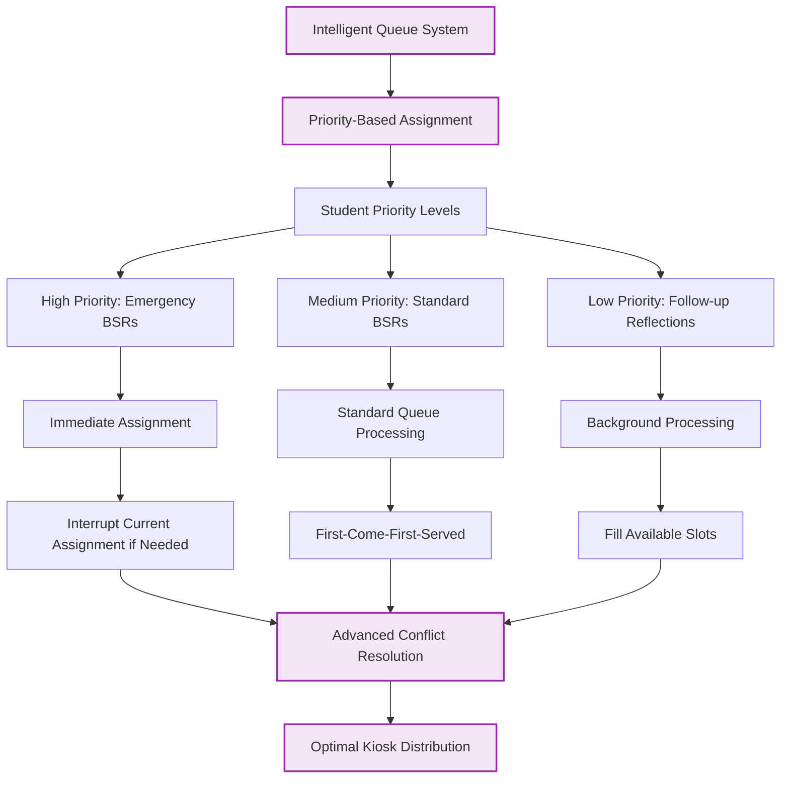

# 🟣 Scalable Single-School Architecture (Future Vision)

**Status**: FUTURE VISION - Enhanced single-school deployment beyond Sprint 02

## Enhanced Kiosk Management System

## Advanced Queue Intelligence

## Enhanced Analytics & Reporting

## Mobile Teacher Interface

## Foundation Dependencies

### Must Be Built on Sprint 02 Foundation
- **Role-based Authentication**: Required for advanced permission systems
- **Queue Management**: Core queue system must be functional
- **Student Data Management**: 159 student pool must be properly managed
- **Basic Kiosk System**: Static 3-kiosk system must work reliably

### Sprint 02 → Future Vision Progression
1. **Static → Dynamic**: Evolve from 3 static URLs to dynamic kiosk management
2. **Manual → Automated**: Progress from manual assignment to intelligent automation  
3. **Basic → Advanced**: Build sophisticated analytics on proven foundation
4. **Single-Mode → Multi-Modal**: Add mobile interfaces to web-based system

## Vision Components

### 🚀 Scalability Enhancements
- **Dynamic Kiosk Addition**: Add new kiosks without code changes
- **Load Balancing**: Intelligent distribution of students across available kiosks
- **Peak Time Management**: Automatic scaling during high-usage periods
- **Maintenance Mode**: Graceful handling of kiosk downtime

### 🧠 Intelligence Features
- **Predictive Analytics**: Forecast peak usage and optimize kiosk placement
- **Behavioral Pattern Recognition**: Identify trends and intervention opportunities
- **Smart Queue Management**: Priority-based assignment with conflict resolution
- **Proactive Notifications**: Alert systems for all stakeholders

### 📱 Multi-Platform Access
- **Teacher Mobile App**: Quick BSR creation and management on-the-go
- **Student Mobile Check-in**: Optional mobile interface for older students
- **Admin Mobile Dashboard**: Real-time system monitoring from anywhere
- **Parent Portal**: Optional family communication and transparency features

### 🔗 Integration Capabilities
- **Student Information System**: Direct integration with school SIS
- **Communication Platforms**: Integration with email, SMS, and messaging systems
- **Behavioral Analytics**: Connection to district-wide behavioral tracking
- **Professional Development**: Integration with teacher training platforms

## Implementation Pathway

### Phase 1: Foundation Stability (Sprint 02)
- Complete static 3-kiosk system
- Establish reliable queue management
- Implement basic role-based access
- Achieve 159 student management

### Phase 2: Dynamic Expansion (Sprint 03-04)
- Implement dynamic kiosk registration
- Add intelligent queue management
- Build advanced analytics dashboard
- Create mobile teacher interface

### Phase 3: Intelligence Layer (Sprint 05-06)
- Add predictive analytics
- Implement behavioral pattern recognition
- Create proactive notification system
- Build comprehensive reporting suite

### Phase 4: Integration & Optimization (Sprint 07+)
- Integrate with school systems
- Optimize performance and scalability
- Add multi-platform access options
- Implement advanced security features

## Architectural Principles

### 🔧 Technical Excellence
- **Modular Design**: Each component independently upgradable
- **API-First Architecture**: All features accessible via clean APIs
- **Real-time Updates**: Live synchronization across all interfaces
- **Offline Resilience**: Core functionality works during connectivity issues

### 🎯 User Experience Focus
- **Intuitive Interfaces**: Minimal learning curve for all user types
- **Responsive Design**: Seamless experience across all device types
- **Accessibility**: Full compliance with accessibility standards
- **Performance**: Sub-second response times for all core functions

### 🔒 Security & Privacy
- **Data Protection**: Comprehensive student data privacy protection
- **Audit Trails**: Complete logging of all system interactions
- **Role-Based Security**: Granular permissions for all user types
- **Compliance**: FERPA and state privacy law compliance

## Cross-References
- **Current Sprint**: `SPRINT-02-LAUNCH/` - Foundation that enables this vision
- **Technical Foundation**: `03-current-database-schema.md` - Data model that supports scaling
- **Implementation Roadmap**: Future sprint planning documents