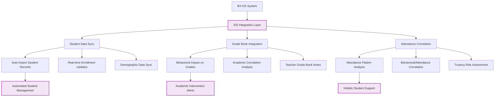
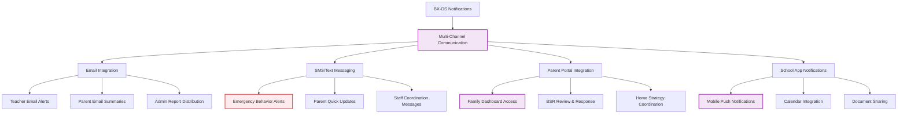
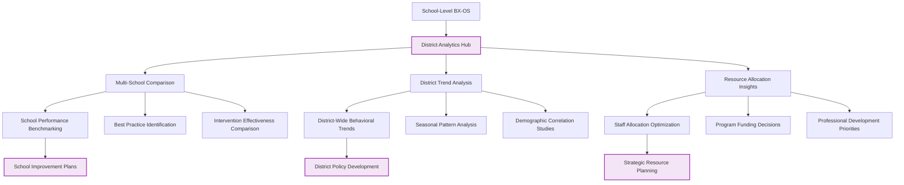
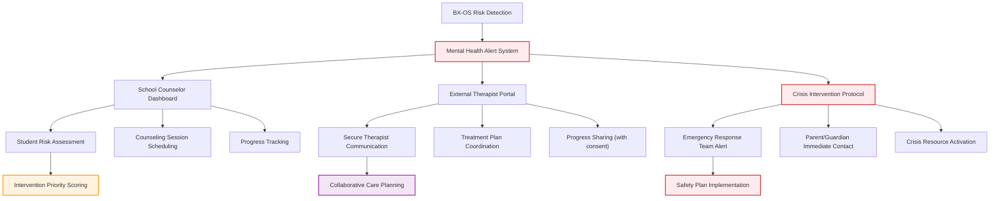
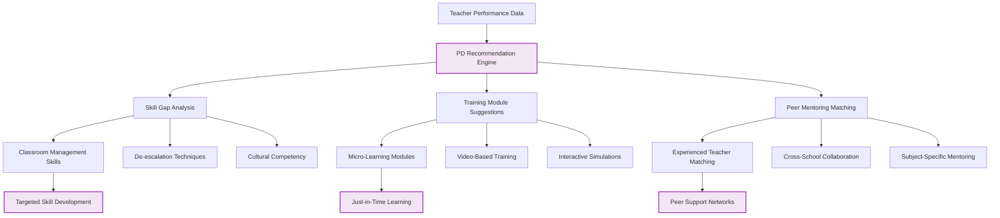
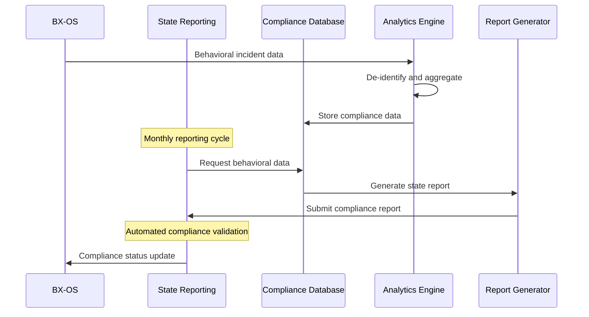

# 🟣 System Integration Architecture (Future Vision)

**Status**: FUTURE VISION - External system integrations beyond Sprint 02

## Student Information System Integration

## Communication Platform Integration

## District-Wide Analytics Integration

## Mental Health & Counseling Integration

## Professional Development Integration

## State Reporting & Compliance Integration

## Foundation Dependencies

### Required Sprint 02 Infrastructure
- **Stable Data Models**: Consistent student, BSR, and queue data structures
- **Authentication System**: Secure user management for external integrations
- **API Foundation**: RESTful APIs for external system communication
- **Role-based Access**: Proper permissions for different integration levels

### Security & Privacy Requirements
- **FERPA Compliance**: Student data protection across all integrations
- **API Security**: OAuth 2.0 and secure token management
- **Data Encryption**: End-to-end encryption for sensitive data transfers
- **Audit Logging**: Complete tracking of all external data access

## Vision Components

### 🔗 Core Integration Capabilities
- **Bidirectional Data Sync**: Real-time data exchange with external systems
- **API-First Architecture**: Comprehensive API for all system functions
- **Webhook Support**: Event-driven notifications to external systems
- **Batch Processing**: Efficient bulk data operations for large integrations

### 📊 Data Intelligence
- **Cross-System Analytics**: Correlate behavioral data with academic and attendance data
- **Predictive Modeling**: Use integrated data for enhanced prediction accuracy
- **Comparative Analysis**: Benchmark against district and state averages
- **Longitudinal Tracking**: Multi-year student progress across systems

### 🔒 Security & Compliance
- **Zero-Trust Architecture**: Verify all external system connections
- **Data Minimization**: Share only necessary data for each integration
- **Consent Management**: Granular control over data sharing permissions
- **Compliance Automation**: Automated reporting and audit trail generation

### 🌐 Scalability Features
- **Multi-Tenant Support**: Serve multiple schools/districts from single instance
- **Regional Clustering**: Optimize performance for geographic distribution
- **Load Balancing**: Handle high-volume integrations efficiently
- **Disaster Recovery**: Robust backup and failover for critical integrations

## Implementation Pathway

### Phase 1: API Foundation (Post Sprint 02)
- Build comprehensive REST API
- Implement OAuth 2.0 authentication
- Create webhook infrastructure
- Establish data security protocols

### Phase 2: Core Integrations (Months 3-6)
- Student Information System integration
- Email/SMS communication platforms
- Basic parent portal connectivity
- State reporting compliance

### Phase 3: Advanced Integrations (Months 6-12)
- Mental health system integration
- Professional development platforms
- District-wide analytics hub
- Advanced communication features

### Phase 4: Intelligence Layer (Year 2+)
- Cross-system predictive analytics
- AI-powered intervention recommendations
- Research collaboration platforms
- Advanced compliance automation

## Technical Architecture

### 🔧 Integration Infrastructure
- **Message Queue**: Reliable, scalable message processing
- **API Gateway**: Centralized API management and security
- **Data Pipeline**: ETL processes for external data integration
- **Service Mesh**: Secure, monitored inter-service communication

### 📡 Communication Protocols
- **REST APIs**: Standard HTTP-based integrations
- **GraphQL**: Flexible data querying for complex integrations
- **WebSockets**: Real-time bidirectional communication
- **FHIR**: Healthcare interoperability for mental health integrations

### 🗄️ Data Management
- **Data Warehouse**: Centralized storage for integrated data
- **CDC (Change Data Capture)**: Real-time data synchronization
- **Data Lineage**: Track data flow across all systems
- **Master Data Management**: Consistent entity resolution across systems

## Compliance & Privacy

### 📋 Regulatory Compliance
- **FERPA**: Student education record privacy
- **COPPA**: Children's online privacy protection
- **HIPAA**: Health information privacy (for mental health integrations)
- **State Privacy Laws**: Compliance with individual state requirements

### 🔐 Privacy by Design
- **Data Minimization**: Collect only necessary data
- **Purpose Limitation**: Use data only for stated purposes
- **Storage Limitation**: Retain data only as long as necessary
- **Transparency**: Clear communication about data use and sharing

## Cross-References
- **Current Foundation**: `SPRINT-02-LAUNCH/` - Basic system that enables integrations
- **Analytics Foundation**: `10-behavior-analytics-enhancement.md` - Data analysis capabilities
- **Scalability Vision**: `09-scalable-single-school-architecture.md` - Infrastructure requirements