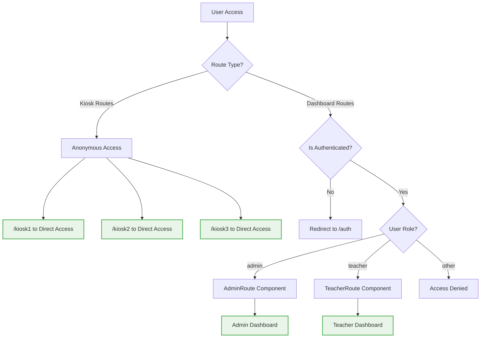
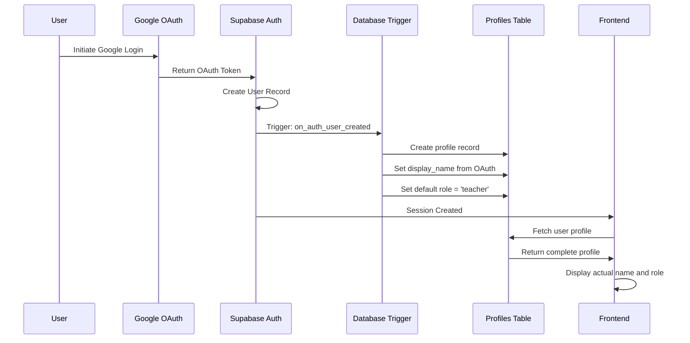

# 🟢 Updated Authentication Architecture (Sprint 02 Target)

**Status**: SPRINT TARGET - Role-based routing with anonymous kiosk access

## Target Authentication Flow



## Role-Based Route Protection System

```mermaid
flowchart TD
    A[Route Access] --> B{Route Component}
    B --> C[AdminRoute]
    B --> D[TeacherRoute]
    
    C --> E{User Role Check}
    E -->|admin| F[Allow Access]
    E -->|other| G[Redirect to unauthorized]
    
    D --> H{User Role Check}
    H -->|teacher| I[Allow Access]
    H -->|admin| J["Allow Access (admin can view teacher)"]
    H -->|other| K[Redirect to unauthorized]
    
    F --> L[Admin Dashboard Functions]
    I --> M[Teacher Dashboard Functions]
    J --> N[Teacher Dashboard (Admin View)]
    
    style F fill:#e8f5e8,stroke:#4caf50,stroke-width:2px
    style I fill:#e8f5e8,stroke:#4caf50,stroke-width:2px
    style J fill:#e8f5e8,stroke:#4caf50,stroke-width:2px
    style L fill:#e8f5e8,stroke:#4caf50,stroke-width:2px
    style M fill:#e8f5e8,stroke:#4caf50,stroke-width:2px
    style N fill:#e8f5e8,stroke:#4caf50,stroke-width:2px
```

## Component-Level Permission System

```mermaid
flowchart TD
    A[Component Render] --> B[usePermissions Hook]
    B --> C{Check User Role}
    C --> D[return hasPermission function]
    
    D --> E{UI Element Type}
    E -->|User Management| F{hasPermission('admin')}
    E -->|BSR Creation| G{hasPermission('teacher')}
    E -->|Queue Viewing| H{hasPermission('teacher', 'admin')}
    
    F -->|true| I[Show User Management]
    F -->|false| J[Hide Component]
    
    G -->|true| K[Show BSR Creation]
    G -->|false| L[Hide Component]
    
    H -->|true| M[Show Queue Display]
    H -->|false| N[Hide Component]
    
    style I fill:#e8f5e8,stroke:#4caf50,stroke-width:2px
    style K fill:#e8f5e8,stroke:#4caf50,stroke-width:2px
    style M fill:#e8f5e8,stroke:#4caf50,stroke-width:2px
```

## Fixed Google OAuth Profile Creation



## Implementation Status

### ✅ IMPLEMENTED
- Basic authentication routes exist
- Google OAuth integration functional
- Protected route wrapper exists

### 🔄 PARTIALLY IMPLEMENTED  
- Role-based permissions partially implemented
- Profile creation needs trigger completion
- Session management needs refinement

### ❌ NOT IMPLEMENTED
- `AdminRoute` and `TeacherRoute` components need creation
- `usePermissions` hook needs implementation
- Anonymous kiosk access needs route modification
- Component-level permission controls need implementation

## Implementation Requirements

### 1. Create Role-Based Route Components
```typescript
// AdminRoute.tsx - Restrict to admin users only
// TeacherRoute.tsx - Allow admin and teacher users
```

### 2. Build Permission System
```typescript  
// usePermissions.ts - Hook for component-level authorization
// permissions.ts - Utility functions for role checking
```

### 3. Fix OAuth Profile Creation
```sql
-- Database trigger for automatic profile creation
-- Default role assignment logic
-- Display name extraction from OAuth data
```

### 4. Update Route Configuration
```typescript
// Remove ProtectedRoute from kiosk routes
// Add role-specific route components
// Implement unauthorized access handling
```

## Cross-References
- **Implementation Details**: `SPRINT-02-LAUNCH/IMPLEMENTATION-CHECKLIST.md` items 1.1-1.4
- **Technical Context**: `SPRINT-02-LAUNCH/BX-OS-TECHNICAL-CONTEXT.md` Security Architecture
- **Current Problems**: `01-current-authentication-routing.md`