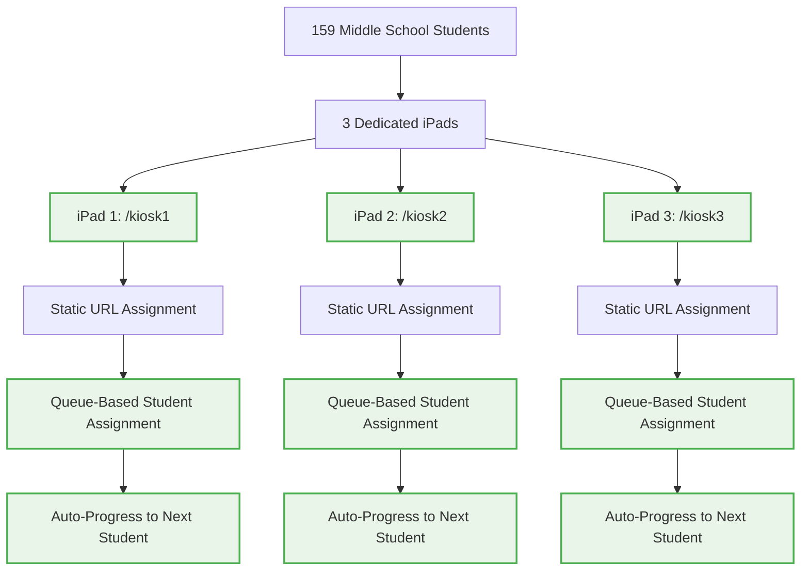
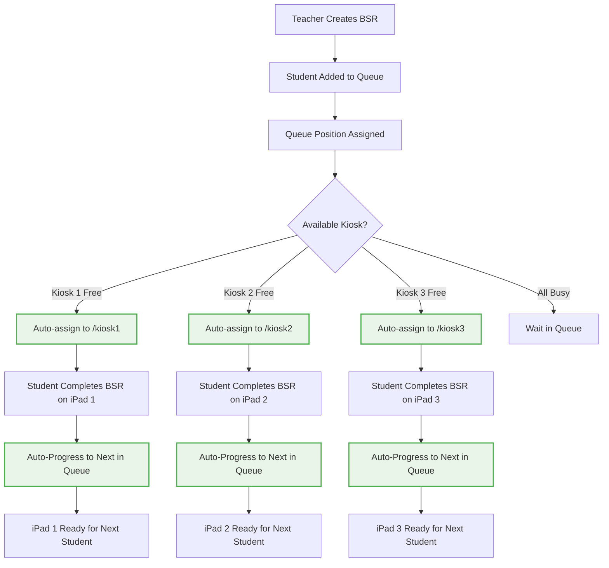
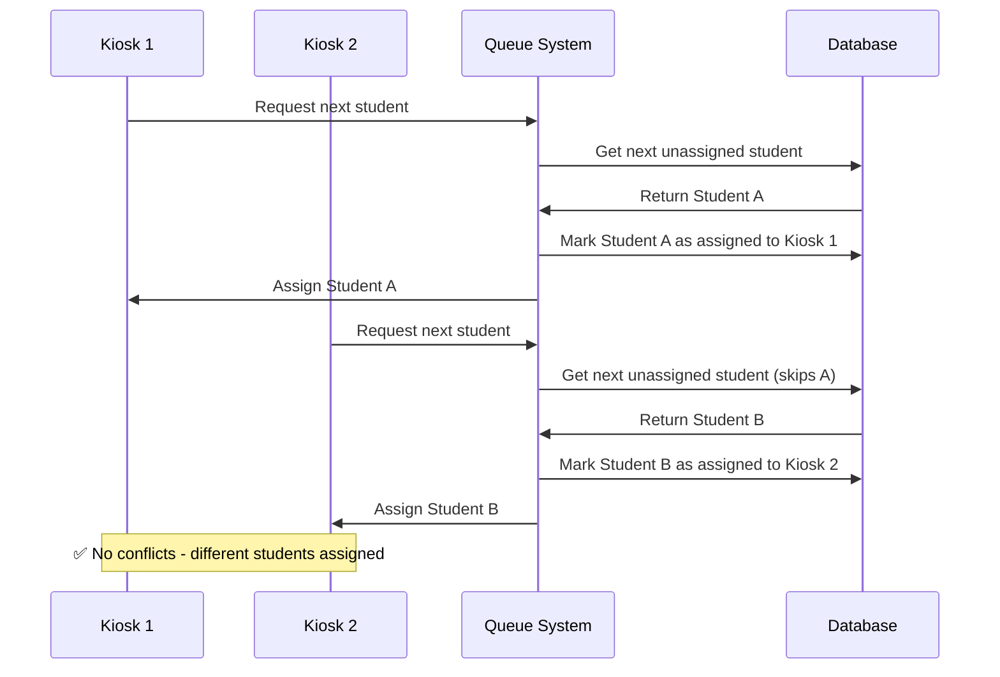
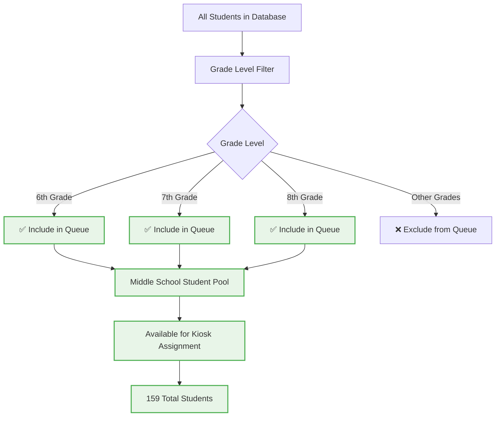

# 🟢 Simplified Kiosk System (Sprint 02 Target)

**Status**: SPRINT TARGET - Static URL system for 3 dedicated iPads serving 159 middle school students

## Target Kiosk Architecture



## Queue-Based Student Assignment Flow



## Anonymous Access Implementation

```mermaid
flowchart TD
    A[Student Accesses iPad] --> B[Navigate to assigned URL]
    B --> C[/kiosk1, /kiosk2, or /kiosk3]
    C --> D[✅ No Authentication Required]
    
    D --> E[Load Kiosk Component]
    E --> F[Fetch Assigned Student]
    F --> G{Student Available?}
    
    G -->|Yes| H[Load Student BSR]
    G -->|No| I[Display "No Students Assigned"]
    
    H --> J[Student Completes Reflection]
    J --> K[Submit for Teacher Review]
    K --> L[Auto-Progress to Next Student]
    
    I --> M[Wait for Queue Assignment]
    
    style D fill:#e8f5e8,stroke:#4caf50,stroke-width:2px
    style E fill:#e8f5e8,stroke:#4caf50,stroke-width:2px
    style H fill:#e8f5e8,stroke:#4caf50,stroke-width:2px
    style L fill:#e8f5e8,stroke:#4caf50,stroke-width:2px
```

## Conflict Prevention System



## Middle School Student Filtering



## Implementation Status

### ✅ IMPLEMENTED
- Basic kiosk components exist (KioskOne, KioskTwo, KioskThree)
- Student database with grade level filtering
- Queue system foundation exists

### 🔄 PARTIALLY IMPLEMENTED
- Queue assignment logic needs refinement
- Auto-progression needs completion
- Student filtering by grade level needs validation

### ❌ NOT IMPLEMENTED
- Anonymous access for kiosk routes (remove ProtectedRoute)
- Automatic student assignment from queue
- Conflict prevention system
- Auto-progression after BSR completion

## Implementation Requirements

### 1. Remove Authentication Barriers
```typescript
// Update App.tsx routing
// Remove ProtectedRoute wrapper from kiosk routes
// Enable direct access to /kiosk1, /kiosk2, /kiosk3
```

### 2. Implement Queue-Based Assignment
```typescript
// Update kiosk components to auto-fetch next student
// Implement conflict prevention logic
// Add auto-progression after completion
```

### 3. Add Middle School Filtering
```typescript
// Filter students by grade_level (6, 7, 8)
// Ensure only middle school students appear in queue
// Validate total count of 159 students
```

### 4. Conflict Prevention
```typescript
// Implement session locking for student assignments
// Prevent multiple kiosks from getting same student
// Add real-time queue updates
```

## Simplified Architecture Benefits

### 🎯 Operational Simplicity
- **Static URLs**: Each iPad has fixed assignment (/kiosk1, /kiosk2, /kiosk3)
- **No Device Binding**: Removes complexity of dynamic device detection
- **Predictable Access**: Teachers know exactly which URL each iPad uses

### 🎯 Student Experience
- **No Authentication**: Students can immediately start their reflection
- **Automatic Assignment**: System assigns next student from queue
- **Clear Process**: One student per kiosk, clear progression

### 🎯 Teacher Management
- **Simple Setup**: Configure 3 iPads with 3 static URLs
- **Easy Monitoring**: Know which student is on which kiosk
- **Queue Visibility**: See all students waiting for reflection

## Cross-References
- **Implementation Details**: `SPRINT-02-LAUNCH/IMPLEMENTATION-CHECKLIST.md` items 2.1-2.4
- **Technical Context**: `SPRINT-02-LAUNCH/BX-OS-TECHNICAL-CONTEXT.md` Simplified Architecture
- **Current Problems**: `02-current-kiosk-logic.md`