# Simplified Kiosk System (Sprint 02 Target) - VALIDATED INFRASTRUCTURE

## System Status: ✅ COMPONENTS EXIST - Queue Integration Needed
**Current State**: Kiosk components functional, static routing working  
**Sprint Target**: Complete queue-based assignment and auto-progression

## Validated Kiosk Architecture (INFRASTRUCTURE READY)

```mermaid
flowchart TD
    A[159 Middle School Students] --> B[3 Dedicated iPads]
    
    B --> C[✅ iPad 1: /kiosk1 WORKING]
    B --> D[✅ iPad 2: /kiosk2 WORKING]  
    B --> E[✅ iPad 3: /kiosk3 WORKING]
    
    C --> F[✅ Static URL Assignment FUNCTIONAL]
    D --> G[✅ Static URL Assignment FUNCTIONAL]
    E --> H[✅ Static URL Assignment FUNCTIONAL]
    
    F --> I[⚠️ Queue-Based Student Assignment READY]
    G --> J[⚠️ Queue-Based Student Assignment READY]
    H --> K[⚠️ Queue-Based Student Assignment READY]
    
    I --> L[🎯 Auto-Progress to Next Student TARGET]
    J --> M[🎯 Auto-Progress to Next Student TARGET]
    K --> N[🎯 Auto-Progress to Next Student TARGET]
    
    classDef working fill:#d4edda,stroke:#155724,color:#155724
    classDef ready fill:#fff3cd,stroke:#856404,color:#856404
    classDef target fill:#cce5ff,stroke:#0066cc,color:#0066cc
    
    class C,D,E,F,G,H working
    class I,J,K ready
    class L,M,N target
```



## Verified Anonymous Access Implementation (WORKING)


## Queue-Based Student Assignment Flow (TARGET IMPLEMENTATION)


## Validated Component Infrastructure (ALREADY EXISTS)

### ✅ VERIFIED WORKING COMPONENTS
- **KioskOnePage**: `src/pages/KioskOnePage.tsx` - Component loads successfully
- **KioskTwoPage**: `src/pages/KioskTwoPage.tsx` - Component loads successfully  
- **KioskThreePage**: `src/pages/KioskThreePage.tsx` - Component loads successfully
- **MoodSlider**: Student mood selection functional
- **BehaviorSelection**: Behavior categorization working
- **ReviewReflection**: Student reflection input operational

### ⚠️ INTEGRATION READY (Needs Queue Connection)
- **Queue Infrastructure**: QueueDisplay, useSupabaseQueue hooks exist
- **Real-time Updates**: Supabase subscriptions configured
- **Database Schema**: Queue tables and relationships functional

## Conflict Prevention System (TARGET IMPLEMENTATION)


## Middle School Student Filtering (NEEDS SCHEMA UPDATE)


## Implementation Status: MAJOR REVISION

### ✅ ALREADY IMPLEMENTED (Verified Working)
- **Kiosk Components**: All three kiosk page components exist and functional
- **Static URL Routing**: `/kiosk1`, `/kiosk2`, `/kiosk3` routes accessible
- **Anonymous Access**: Students can access kiosk routes without authentication
- **BSR Workflow**: MoodSlider, BehaviorSelection, ReviewReflection operational
- **Queue Infrastructure**: Database tables, components, hooks exist

### ⚠️ INFRASTRUCTURE READY (Needs Integration Testing)  
- **Queue System**: Components exist but need student assignment integration
- **Real-time Updates**: Supabase subscriptions configured but need validation
- **Database Relationships**: Foreign keys and RLS policies operational

### 🎯 SPRINT TARGETS (Implementation Focus)
- **Student Data Population**: Add 159 middle school students with grade filtering  
- **Queue Assignment Logic**: Auto-assign students to available kiosks
- **Auto-progression**: Automatic next student after BSR completion
- **Grade Level Filtering**: Database schema enhancement for middle school focus

## Implementation Requirements: REVISED SCOPE

### Priority 1: Database Schema & Data (1 hour)
```sql
-- Add missing columns for student filtering
ALTER TABLE students ADD COLUMN grade_level TEXT CHECK (grade_level IN ('6','7','8'));
ALTER TABLE students ADD COLUMN active BOOLEAN DEFAULT true;

-- Import 159 middle school students with proper grade assignments
```

### Priority 2: Queue Assignment Integration (1.5 hours)
```typescript
// Connect existing kiosk components to queue system  
// Implement auto-assignment logic for available kiosks
// Add conflict prevention (one student per kiosk)
// Test real-time updates between components
```

### Priority 3: Auto-progression & Testing (1.5 hours)
```typescript
// Add automatic next student assignment after completion
// Validate concurrent kiosk usage (3 simultaneous sessions)
// Test end-to-end BSR workflow with real student data
// Performance testing under expected load
```

## Simplified Architecture Benefits (ALREADY REALIZED)

### ✅ OPERATIONAL SIMPLICITY (WORKING)
- **Static URLs**: Each iPad has fixed assignment - no dynamic routing complexity
- **No Device Binding**: Dedicated iPad deployment eliminates device detection needs
- **Predictable Access**: Teachers know exactly which URL each iPad uses

### ✅ STUDENT EXPERIENCE (FUNCTIONAL)  
- **No Authentication**: Students can immediately start reflection workflow
- **Component Workflow**: BSR completion process operational
- **Clear Interface**: Kiosk components optimized for iPad interaction

### 🎯 TARGETS (IMPLEMENTATION FOCUS)
- **Automatic Assignment**: System assigns next student from queue
- **Queue Visibility**: Teachers see which student on which kiosk
- **Auto-progression**: Seamless flow from student to next student

## Cross-References
- **Current State**: `../Current-State/02-current-kiosk-logic.md`
- **Implementation Status**: `../../SPRINT-02-LAUNCH/IMPLEMENTATION-CHECKLIST.md`
- **Database Schema**: `../Current-State/03-current-database-schema.md`

## Sprint Focus Shift: CRITICAL UPDATE

**ORIGINAL ASSUMPTION**: "Kiosk system broken" - extensive rebuilding needed  
**VALIDATED REALITY**: Kiosk infrastructure functional - queue integration needed  
**REVISED SPRINT FOCUS**: Complete queue assignment logic vs rebuilding kiosk system