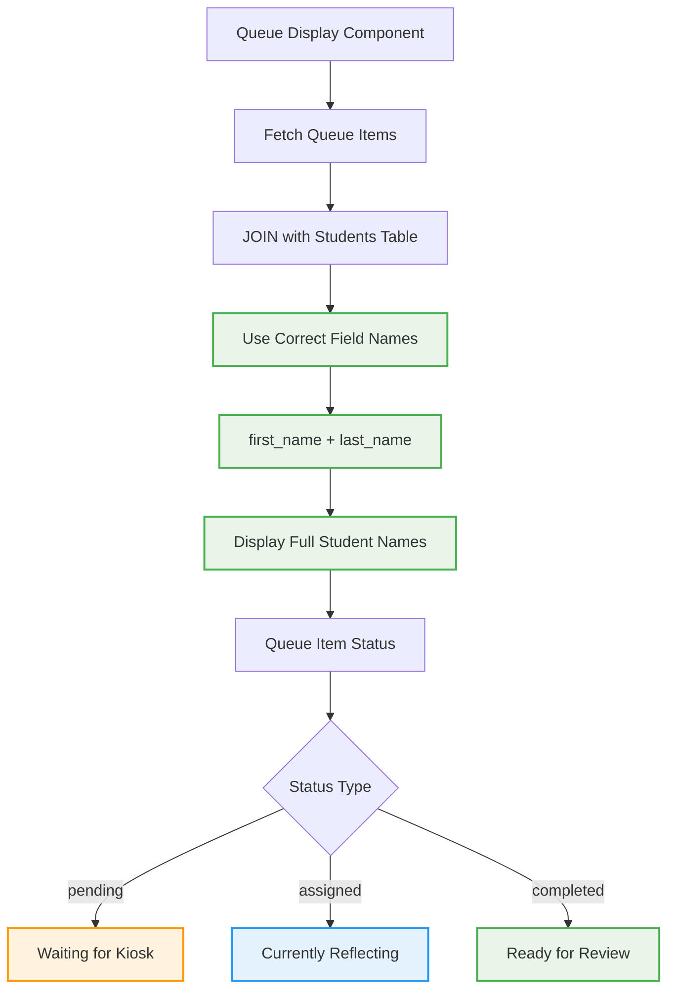
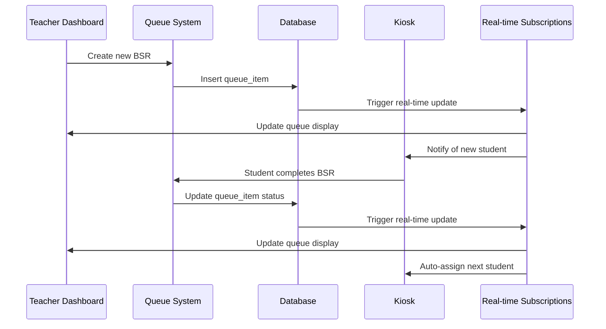

# 🟢 Updated Queue Management System (Sprint 02 Target)

**Status**: SPRINT TARGET - Fixed end-to-end queue workflow with proper student assignment

## Target Queue Management Flow

```mermaid
flowchart TD
    A[Teacher Creates BSR] --> B[Student Added to Queue]
    B --> C[Queue Position Calculated]
    C --> D[Real-time Queue Update]
    
    D --> E{Kiosk Available?}
    E -->|Yes| F[Auto-assign to Available Kiosk]
    E -->|No| G[Student Waits in Queue]
    
    F --> H[Student Status: "assigned"]
    G --> I[Student Status: "pending"]
    
    H --> J[Student Completes BSR]
    J --> K[Student Status: "completed"]
    K --> L[Remove from Queue]
    L --> M[Auto-assign Next Student]
    
    style B fill:#e8f5e8,stroke:#4caf50,stroke-width:2px
    style C fill:#e8f5e8,stroke:#4caf50,stroke-width:2px
    style D fill:#e8f5e8,stroke:#4caf50,stroke-width:2px
    style F fill:#e8f5e8,stroke:#4caf50,stroke-width:2px
    style H fill:#e8f5e8,stroke:#4caf50,stroke-width:2px
    style J fill:#e8f5e8,stroke:#4caf50,stroke-width:2px
    style K fill:#e8f5e8,stroke:#4caf50,stroke-width:2px
    style L fill:#e8f5e8,stroke:#4caf50,stroke-width:2px
    style M fill:#e8f5e8,stroke:#4caf50,stroke-width:2px
```

## Fixed Student Data Display



## Real-time Queue Updates



## Queue Position Management

```mermaid
flowchart TD
    A[New BSR Created] --> B[Calculate Queue Position]
    B --> C{Other Students Waiting?}
    C -->|Yes| D[Position = Last Position + 1]
    C -->|No| E[Position = 1]
    
    D --> F[Insert at End of Queue]
    E --> G[Insert as First in Queue]
    
    F --> H[Student Status: "pending"]
    G --> I{Kiosk Available?}
    I -->|Yes| J[Auto-assign Immediately]
    I -->|No| K[Student Status: "pending"]
    
    J --> L[Student Status: "assigned"]
    
    style B fill:#e8f5e8,stroke:#4caf50,stroke-width:2px
    style D fill:#e8f5e8,stroke:#4caf50,stroke-width:2px
    style E fill:#e8f5e8,stroke:#4caf50,stroke-width:2px
    style J fill:#e8f5e8,stroke:#4caf50,stroke-width:2px
    style L fill:#e8f5e8,stroke:#4caf50,stroke-width:2px
```

## Kiosk Assignment Logic

```mermaid
flowchart TD
    A[Student Ready for Assignment] --> B{Check Available Kiosks}
    B --> C[Kiosk 1 (/kiosk1)]
    B --> D[Kiosk 2 (/kiosk2)]
    B --> E[Kiosk 3 (/kiosk3)]
    
    C --> F{Currently Assigned Student?}
    D --> G{Currently Assigned Student?}
    E --> H{Currently Assigned Student?}
    
    F -->|No| I[Assign to Kiosk 1]
    F -->|Yes| J[Kiosk 1 Busy]
    
    G -->|No| K[Assign to Kiosk 2]
    G -->|Yes| L[Kiosk 2 Busy]
    
    H -->|No| M[Assign to Kiosk 3]
    H -->|Yes| N[Kiosk 3 Busy]
    
    I --> O[Update queue_item: assigned_to = 'kiosk1']
    K --> P[Update queue_item: assigned_to = 'kiosk2']
    M --> Q[Update queue_item: assigned_to = 'kiosk3']
    
    J --> R[Check Next Kiosk]
    L --> R
    N --> S[All Kiosks Busy - Wait in Queue]
    
    style I fill:#e8f5e8,stroke:#4caf50,stroke-width:2px
    style K fill:#e8f5e8,stroke:#4caf50,stroke-width:2px
    style M fill:#e8f5e8,stroke:#4caf50,stroke-width:2px
    style O fill:#e8f5e8,stroke:#4caf50,stroke-width:2px
    style P fill:#e8f5e8,stroke:#4caf50,stroke-width:2px
    style Q fill:#e8f5e8,stroke:#4caf50,stroke-width:2px
```

## Fixed Student Lookup System

```mermaid
flowchart TD
    A[Student Search/Display] --> B[Query Students Table]
    B --> C[Correct Field Mapping]
    C --> D[first_name: string]
    C --> E[last_name: string]
    C --> F[student_id: string]
    C --> G[grade_level: number]
    
    D --> H[Display Full Name]
    E --> H
    F --> I[Display Student ID]
    G --> J[Grade Level Filtering]
    
    H --> K[John Smith]
    I --> L[Student ID: 12345]
    J --> M[Grade 7 Student]
    
    K --> N[No More "Unknown Student"]
    
    style C fill:#e8f5e8,stroke:#4caf50,stroke-width:2px
    style D fill:#e8f5e8,stroke:#4caf50,stroke-width:2px
    style E fill:#e8f5e8,stroke:#4caf50,stroke-width:2px
    style H fill:#e8f5e8,stroke:#4caf50,stroke-width:2px
    style N fill:#e8f5e8,stroke:#4caf50,stroke-width:2px
```

## Implementation Status

### ✅ IMPLEMENTED
- Basic queue system exists
- Student database with proper fields
- Queue display component exists

### 🔄 PARTIALLY IMPLEMENTED
- Student name display needs field mapping fix
- Queue status updates need completion
- Real-time subscription needs validation

### ❌ NOT IMPLEMENTED
- Automatic kiosk assignment logic
- Queue position calculation
- Auto-progression after BSR completion
- Real-time queue position updates

## Implementation Requirements

### 1. Fix Student Data Display
```typescript
// Update useSupabaseQueue hook
// Fix field name references (first_name, last_name)
// Ensure proper JOIN with students table
```

### 2. Implement Automatic Assignment
```typescript
// Add kiosk availability checking
// Implement assignment algorithm
// Add conflict prevention logic
```

### 3. Add Real-time Updates
```typescript
// Implement Supabase real-time subscriptions
// Update queue display on status changes
// Notify kiosks of new assignments
```

### 4. Queue Position Management
```typescript
// Calculate queue positions automatically
// Handle position updates when students complete
// Display accurate wait times
```

## Queue Status Definitions

### 📋 Queue Item States
- **pending**: Student created, waiting for kiosk assignment
- **assigned**: Student assigned to specific kiosk, in progress
- **completed**: Student finished BSR, ready for teacher review
- **reviewed**: Teacher reviewed and approved/returned BSR

### 🎯 Assignment Logic
- **First Available**: Assign to first free kiosk (1, then 2, then 3)
- **Conflict Prevention**: Only one student per kiosk at a time
- **Auto-progression**: Automatically assign next student when kiosk becomes free

## Cross-References
- **Implementation Details**: `SPRINT-02-LAUNCH/IMPLEMENTATION-CHECKLIST.md` items 3.1-3.4
- **Technical Context**: `SPRINT-02-LAUNCH/BX-OS-TECHNICAL-CONTEXT.md` Queue Management
- **Current Problems**: Database field mapping issues in current queue system