# Middle School Student Filtering System (Sprint 02 Target) - VALIDATED FOUNDATION

## System Status: ✅ STUDENT TABLE EXISTS - Schema Enhancement Needed
**Current State**: Students table functional, missing grade filtering columns  
**Sprint Target**: Add grade filtering and populate 159 middle school students

## Verified Student Population Management (DATABASE READY)


## Verified Student Data Import Infrastructure (CSV READY)

```mermaid
flowchart TD
    A[✅ CSV Import: hillel_students_2025.csv FILE EXISTS] --> B[✅ Data Import System READY]
    B --> C{Grade Level Validation}
    
    C -->|Valid (6,7,8)| D[🎯 Import Student TARGET]
    C -->|Invalid (other)| E[Skip Student]
    
    D --> F[🎯 Create Student Record TARGET]
    F --> G[🎯 Assign grade_level Field TARGET] 
    G --> H[🎯 Set active = true TARGET]
    
    H --> I[🎯 Student Available for BSR TARGET]
    I --> J[🎯 Add to System Count TARGET]
    
    E --> K[Log Excluded Student]
    K --> L[Exclude from Count]
    
    J --> M[🎯 Verify Total = 159 TARGET]
    
    classDef working fill:#d4edda,stroke:#155724,color:#155724
    classDef target fill:#cce5ff,stroke:#0066cc,color:#0066cc
    
    class A,B working
    class D,F,G,H,I,J,M target
```

## Validated Student Selection Interface (COMPONENTS EXIST)

```mermaid
flowchart TD
    A[✅ Teacher Creates BSR WORKING] --> B[✅ Student Selection Component EXISTS]
    B --> C[✅ Query Students Database WORKING]
    C --> D[🎯 Apply Grade Level Filter TARGET]
    
    D --> E[🎯 WHERE grade_level IN ('6','7','8') TARGET]
    E --> F[🎯 AND active = true TARGET]
    F --> G[✅ ORDER BY last_name, first_name WORKING]
    
    G --> H[✅ Display Filtered Results COMPONENT READY]
    H --> I[✅ Student Search Functionality EXISTS]
    I --> J{Search Type}
    
    J -->|Name Search| K[✅ Search first_name + last_name READY]
    J -->|Student ID| L[✅ Search student_id WORKING]
    J -->|Homeroom| M[✅ Search homeroom_teacher WORKING]
    
    K --> N[🎯 Display Matching Students TARGET]
    L --> N
    M --> N
    
    N --> O[✅ Teacher Selects Student WORKING]
    O --> P[✅ Create BSR for Selected Student WORKING]
    
    classDef working fill:#d4edda,stroke:#155724,color:#155724
    classDef ready fill:#fff3cd,stroke:#856404,color:#856404
    classDef target fill:#cce5ff,stroke:#0066cc,color:#0066cc
    
    class A,B,C,G,H,I,L,M,O,P working
    class K ready
    class D,E,F,N target
```

## Target Grade-Based Dashboard Analytics (ENHANCEMENT)

```mermaid
flowchart TD
    A[✅ Admin Dashboard EXISTS] --> B[🎯 Student Analytics TARGET]
    B --> C[🎯 Grade Level Breakdown TARGET]
    
    C --> D[🎯 6th Grade Count TARGET]
    C --> E[🎯 7th Grade Count TARGET]  
    C --> F[🎯 8th Grade Count TARGET]
    
    D --> G[🎯 BSRs per Grade Level TARGET]
    E --> H[🎯 BSRs per Grade Level TARGET]
    F --> I[🎯 BSRs per Grade Level TARGET]
    
    G --> J[🎯 Behavioral Trends by Grade TARGET]
    H --> J
    I --> J
    
    J --> K[🎯 Teacher Insights TARGET]
    K --> L[🎯 Grade-Specific Interventions TARGET]
    
    classDef working fill:#d4edda,stroke:#155724,color:#155724
    classDef target fill:#cce5ff,stroke:#0066cc,color:#0066cc
    
    class A working
    class B,C,D,E,F,G,H,I,J,K,L target
```



## Verified Homeroom Teacher Integration (INFRASTRUCTURE READY)

```mermaid
flowchart TD
    A[✅ Student Data FIELDS EXIST] --> B[✅ Homeroom Teacher Field EXISTS]
    B --> C[✅ Teacher Dashboard Filter COMPONENT READY]
    
    C --> D{Filter Options}
    D -->|My Students| E[🎯 homeroom_teacher = current_user TARGET]
    D -->|All Students| F[🎯 All Middle School Students TARGET]
    D -->|Specific Teacher| G[🎯 homeroom_teacher = selected_teacher TARGET]
    
    E --> H[🎯 Teacher's Homeroom Students Only TARGET]
    F --> I[🎯 All 159 Students TARGET]
    G --> J[🎯 Colleague's Students TARGET]
    
    H --> K[✅ Create BSR for My Students READY]
    I --> L[✅ Create BSR for Any Student READY]
    J --> M[🎯 Collaborative Support TARGET]
    
    classDef working fill:#d4edda,stroke:#155724,color:#155724
    classDef ready fill:#fff3cd,stroke:#856404,color:#856404
    classDef target fill:#cce5ff,stroke:#0066cc,color:#0066cc
    
    class A,B,C working
    class K,L ready
    class E,F,G,H,I,J,M target
```



## Validated Data Quality Infrastructure (IMPORT SYSTEM READY)

```mermaid
sequenceDiagram
    participant CSV as CSV File (Exists)
    participant I as Import System (Ready)
    participant V as Validation (Ready)
    participant DB as Database (Working)
    participant A as Admin Dashboard (Exists)

    CSV->>I: ✅ Upload student data (Ready)
    I->>V: 🎯 Validate each record (Target)
    V->>V: 🎯 Check grade_level (6,7,8) (Target)
    V->>V: ✅ Validate required fields (Ready)
    V->>V: ✅ Check for duplicates (Ready)
    V->>DB: 🎯 Insert valid records only (Target)
    DB->>A: 🎯 Return import summary (Target)
    A->>A: 🎯 Display 159 students imported (Target)
    Note over A: 🎯 Show any excluded records (Target)
```



## Implementation Status: MAJOR REVISION

### ✅ ALREADY IMPLEMENTED (Verified Working)
- **Students Table**: Database table exists with proper relationships
- **Student Selection Components**: UI components for student selection functional
- **CSV Import Infrastructure**: File exists, import system components ready
- **Homeroom Teacher Field**: Database field exists and populated
- **Admin Dashboard**: Base dashboard exists for displaying analytics

### ⚠️ INFRASTRUCTURE READY (Needs Minor Enhancement)
- **Student Search**: Search functionality exists, needs grade filtering integration
- **Data Validation**: Import validation logic exists, needs grade level validation
- **Component Integration**: Student selection works, needs filtering enhancement

### 🎯 SPRINT TARGETS (Implementation Focus)  
- **Database Schema**: Add grade_level and active columns to students table
- **Student Data Population**: Import 159 middle school students with grades
- **Grade Filtering**: Implement grade-based filtering in all student selection
- **Analytics Enhancement**: Add grade-level breakdown to admin dashboard

## Implementation Requirements: REVISED SCOPE

### Priority 1: Database Schema Enhancement (30 minutes)
```sql
-- Add required columns for middle school filtering
ALTER TABLE students ADD COLUMN grade_level TEXT CHECK (grade_level IN ('6','7','8'));
ALTER TABLE students ADD COLUMN active BOOLEAN DEFAULT true;

-- Validate schema changes
SELECT COUNT(*) FROM students WHERE grade_level IS NOT NULL;
```

### Priority 2: Student Data Population (45 minutes)
```typescript
// Import CSV with grade level assignments
// Validate 159 middle school students total
// Ensure proper data quality and relationships
// Test student selection with real data
```

### Priority 3: Grade Filtering Implementation (45 minutes)
```typescript
// Update all student queries to include grade filtering
// Add grade level display in student selection components  
// Implement homeroom teacher filtering options
// Test filtering functionality across all interfaces
```

## Student Data Structure: VALIDATED & ENHANCED

### ✅ EXISTING FUNCTIONAL FIELDS
```typescript
interface Student {
  id: uuid; // ✅ EXISTS - Primary key working
  first_name: string; // ✅ EXISTS - Display working
  last_name: string; // ✅ EXISTS - Display working  
  student_id: string; // ✅ EXISTS - Unique identifier working
  homeroom_teacher: string; // ✅ EXISTS - Teacher assignment working
  created_at: timestamp; // ✅ EXISTS - Auto-generated
  updated_at: timestamp; // ✅ EXISTS - Auto-managed
}
```

### 🎯 REQUIRED ADDITIONS  
```typescript
interface StudentEnhanced extends Student {
  grade_level: string; // 🎯 TARGET - Must be '6', '7', or '8'  
  active: boolean; // 🎯 TARGET - Only active students available
}
```

## Filtering Logic Implementation

### 🎯 TARGET CORE FILTERING
- **Grade Filter**: `grade_level IN ('6', '7', '8')`
- **Active Filter**: `active = true`
- **Total Count**: Exactly 159 students
- **Homeroom Filter**: Optional filtering by homeroom teacher

### ✅ EXISTING SEARCH CAPABILITIES
- **Name Search**: `first_name ILIKE '%term%' OR last_name ILIKE '%term%'`
- **ID Search**: `student_id ILIKE '%term%'`
- **Teacher Search**: `homeroom_teacher ILIKE '%term%'`

## Data Import Validation: READY FOR ENHANCEMENT

### ✅ CURRENT VALIDATION (WORKING)
- All required fields present
- No duplicate student IDs
- Valid first_name/last_name format
- Homeroom teacher assignments

### 🎯 TARGET VALIDATION ADDITIONS
- Grade level is 6, 7, or 8
- Active status set to true for current enrollment
- Total imported count equals 159
- Grade distribution validation

## Cross-References
- **Current State**: `../Current-State/03-current-database-schema.md`
- **Implementation Status**: `../../SPRINT-02-LAUNCH/IMPLEMENTATION-CHECKLIST.md`
- **CSV Data**: `public/data/hillel_students_2025.csv`

## Sprint Focus Shift: CRITICAL UPDATE

**ORIGINAL ASSUMPTION**: "Student filtering system needs to be built from scratch"  
**VALIDATED REALITY**: Student infrastructure exists - grade filtering enhancement needed  
**REVISED SPRINT FOCUS**: Database schema completion and data population vs system rebuilding