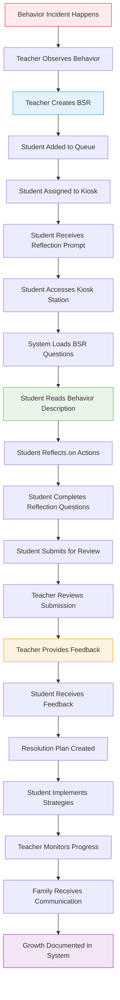
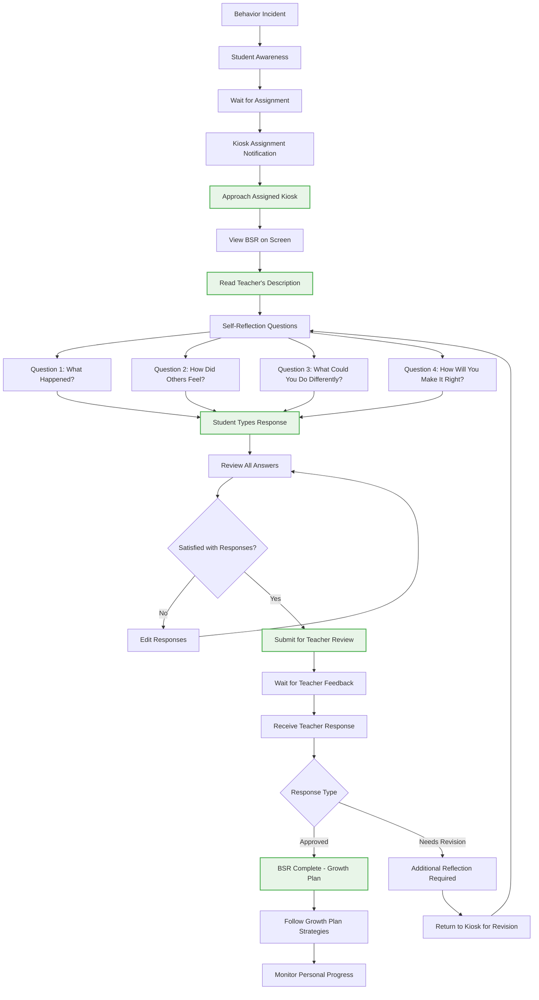
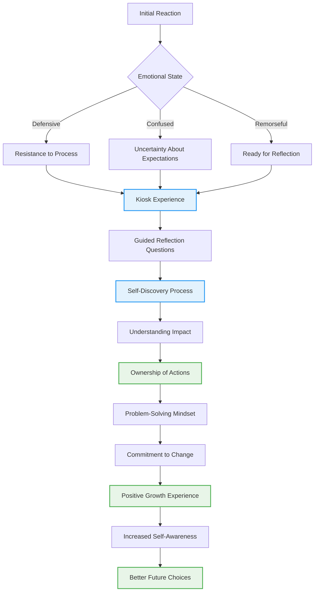
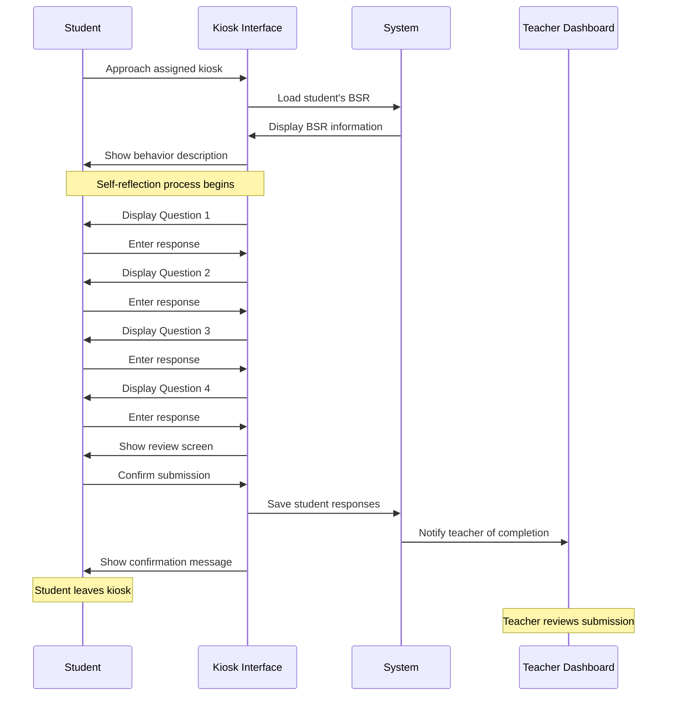

# 🎯 Complete Student Journey (User Experience Flow)

**Journey Scope**: End-to-end student behavior support experience from incident to resolution

## Student Behavior Support Journey

## Detailed Student Experience Flow

## Student Emotional Journey

## Kiosk Interaction Experience

## Journey Phases

### 🔴 Phase 1: Incident & Assignment (30 seconds)
**Student Experience:**
- Incident occurs in classroom/school setting
- Student receives immediate kiosk assignment notification
- Teacher directs student to specific kiosk
- Student leaves classroom for reflection

**Emotional State:** Often defensive or confused
**Support Needed:** Clear, immediate communication about process

### 🟡 Phase 2: Kiosk Reflection (5-10 minutes)
**Student Experience:**
- Immediately approaches assigned kiosk (iPad station)
- Views teacher's description of behavior
- Responds to four guided reflection questions
- Reviews and submits responses

**Emotional State:** Transition from resistance to understanding
**Support Needed:** User-friendly interface and focused questions

### 🔵 Phase 3: Teacher Review & Return (2-3 minutes)
**Student Experience:**
- Teacher immediately reviews submission
- Receives immediate feedback and guidance
- May need brief additional reflection if required
- Returns to class once approved

**Emotional State:** Anticipation for immediate feedback
**Support Needed:** Quick, constructive teacher feedback

### 🟢 Phase 4: Immediate Return to Class
**Student Experience:**
- Returns to classroom immediately after approval
- Continues with regular classroom activities
- Implements learned strategies in real-time
- Brief follow-up with teacher as needed

**Emotional State:** Relief and readiness to move forward
**Support Needed:** Smooth re-entry into classroom environment

**Total Process Time:** 15-20 minutes maximum from incident to return to class

## Stakeholder Experience Requirements

### 👤 Student-Centered Design
- **Simple Interface**: Age-appropriate design for middle school students
- **Clear Instructions**: Step-by-step guidance through reflection process
- **Emotional Support**: Encouraging messages and positive framing
- **Privacy**: Safe space for honest reflection without judgment

### 🍎 Teacher Support
- **Quick Creation**: Efficient BSR creation process
- **Quality Reviews**: Tools for providing meaningful feedback
- **Progress Tracking**: Visibility into student growth over time
- **Communication**: Easy coordination with families and support staff

### 👨‍👩‍👧‍👦 Family Engagement
- **Transparency**: Clear communication about incidents and responses
- **Home Strategies**: Guidance for supporting student at home
- **Progress Updates**: Regular communication about student growth
- **Collaboration**: Opportunity to participate in support planning

### 🏫 Administrative Oversight
- **System Monitoring**: Real-time visibility into process effectiveness
- **Data Insights**: Analytics on behavioral trends and interventions
- **Resource Management**: Efficient allocation of support resources
- **Compliance**: Documentation for required reporting and accountability

## Success Indicators

### 📈 Student Growth Metrics
- **Self-Awareness**: Increased understanding of behavior impact
- **Problem-Solving**: Improved ability to identify alternative choices
- **Responsibility**: Greater ownership of actions and consequences
- **Relationship Skills**: Better understanding of others' perspectives

### 🎯 Process Effectiveness
- **Completion Rates**: High percentage of students completing reflections
- **Quality Responses**: Thoughtful, detailed reflection submissions
- **Behavior Improvement**: Reduced repeat incidents
- **Student Satisfaction**: Positive feedback about the reflection process

### 🏆 Long-term Outcomes
- **Behavioral Growth**: Sustained improvement in student choices
- **Academic Success**: Positive correlation with academic performance
- **School Climate**: Improved overall school behavioral culture
- **Student Voice**: Increased student agency in behavior management

## Cross-Journey Integration

### 🔗 Teacher Workflow Connection
- Seamless handoff from teacher BSR creation to student reflection
- Clear communication channels between teacher and student experiences
- Efficient review and feedback processes

### 🔗 Administrative Oversight Connection
- Real-time monitoring of student progress through journey
- Data collection for system improvement and accountability
- Resource allocation based on student needs and journey bottlenecks

### 🔗 Family Communication Connection
- Appropriate family notification and involvement at key journey points
- Home-school collaboration opportunities
- Transparent communication about student progress and growth

## Cross-References
- **Teacher Journey**: `12-teacher-workflow-journey.md` - Complementary educator experience
- **Admin Journey**: `13-admin-oversight-journey.md` - System monitoring and management
- **System Implementation**: `SPRINT-02-LAUNCH/` - Foundation enabling this journey