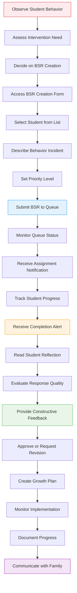
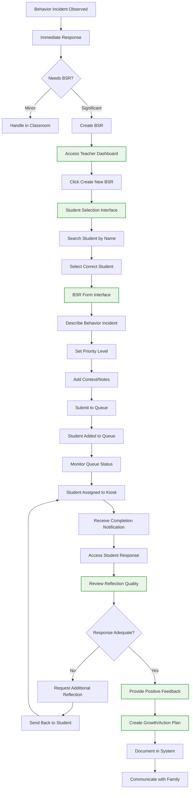
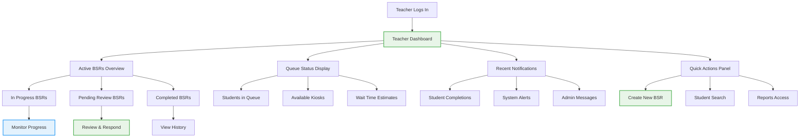
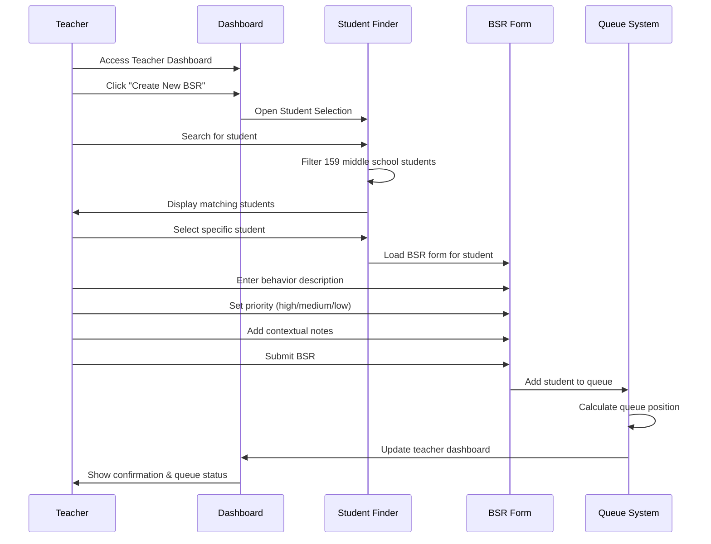
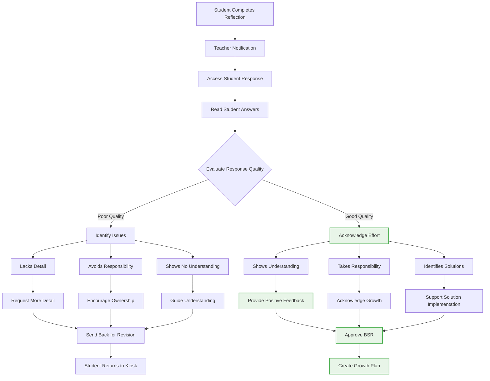

# 🎯 Teacher Workflow Journey (User Experience Flow)

**Journey Scope**: Complete teacher experience from behavior observation to student growth tracking

## Teacher BSR Management Journey

## Detailed Teacher Workflow

## Teacher Dashboard Experience

## BSR Creation Process

## Review & Feedback Process

## Teacher Experience Phases

### 🔴 Phase 1: Complete BSR Creation & Assignment (15-30 seconds total)
**Teacher Experience:**
- Observes behavior requiring immediate intervention
- Instantly decides BSR is necessary
- Opens app and locates correct student from 159 middle schoolers
- Creates BSR description and submits to queue
- Student immediately assigned to available kiosk and sent out

**Pain Points:** Must complete entire process extremely fast during class management
**Success Factors:** One-click app access, smart student search, instant queue processing

### 🟡 Phase 2: Student Reflection Period (5-10 minutes)
**Teacher Experience:**
- Continues normal classroom instruction
- Receives real-time notification when student completes reflection
- Knows exactly when to review submission
- No extended waiting or uncertainty

**Pain Points:** Need immediate notification when ready for review
**Success Factors:** Real-time alerts, clear completion status

### 🔵 Phase 3: Immediate Review & Approval (2-3 minutes)
**Teacher Experience:**
- Reviews student reflection immediately upon completion
- Provides quick feedback or approval
- Student returns to class within minutes
- Process completes during same class period

**Pain Points:** Must review quickly to minimize class disruption
**Success Factors:** Simple approval interface, clear response quality indicators

**Total Teacher Time Investment:** 3-5 minutes spread across class period

## Teacher Support Requirements

### ⚡ Efficiency Needs
- **Quick Access**: Fast login and dashboard navigation
- **Smart Search**: Efficient student finding with autocomplete
- **Form Efficiency**: Minimal required fields, smart defaults
- **Batch Actions**: Handle multiple BSRs when needed

### 📊 Information Needs
- **Queue Visibility**: Real-time status of student assignments
- **Progress Tracking**: Clear indicators of student progress
- **Historical Data**: Access to previous BSRs and patterns
- **Analytics**: Insights into behavioral trends and intervention effectiveness

### 🤝 Collaboration Needs
- **Peer Consultation**: Easy sharing with colleagues when appropriate
- **Admin Communication**: Clear escalation paths for serious incidents
- **Family Contact**: Integrated communication tools
- **Support Services**: Connection to counselors and specialists

### 📚 Professional Development Needs
- **Best Practices**: Guidance on effective BSR creation
- **Response Quality**: Tools for evaluating student reflection quality
- **Intervention Strategies**: Suggestions for growth plans and follow-up
- **Training Resources**: Access to professional development materials

## Success Indicators

### 📈 Efficiency Metrics
- **BSR Creation Time**: Average time under 5 minutes
- **Response Review Time**: Efficient evaluation and feedback process
- **Queue Visibility**: Teachers always know student status
- **System Adoption**: High usage rates across teaching staff

### 🎯 Quality Metrics
- **Student Engagement**: High completion rates for assigned reflections
- **Response Quality**: Meaningful student reflections and growth
- **Teacher Satisfaction**: Positive feedback about workflow efficiency
- **Behavioral Outcomes**: Reduced repeat incidents, improved student behavior

### 🏆 Professional Growth
- **Intervention Skills**: Improved teacher ability to address behavioral issues
- **Student Relationships**: Stronger teacher-student connections
- **Collaborative Practice**: Increased peer consultation and support
- **Data-Driven Decisions**: Use of system analytics to improve practice

## Workflow Integration Points

### 🔗 Student Journey Integration
- Clear handoff from teacher BSR creation to student reflection
- Real-time communication about student progress and completion
- Collaborative growth planning involving both teacher and student

### 🔗 Administrative Integration  
- Automatic data collection for administrative oversight
- Escalation protocols for high-priority incidents
- Professional development recommendations based on BSR patterns

### 🔗 Family Communication Integration
- Automated family notifications at appropriate points
- Easy sharing of growth plans and progress updates
- Collaborative problem-solving involving home and school

## Technology Requirements

### 📱 Mobile Optimization
- Responsive design for teacher tablets and phones
- Quick BSR creation from any location in school
- Push notifications for important updates
- Offline capability for basic functions

### 🔔 Notification System
- Real-time alerts for student completions
- Escalation notifications for overdue reviews
- System maintenance and update communications
- Customizable notification preferences

### 📊 Reporting & Analytics
- Individual teacher dashboard with personal metrics
- Grade-level and school-wide behavioral trends
- Intervention effectiveness tracking
- Professional development recommendations

## Cross-References
- **Student Journey**: `11-complete-student-journey.md` - Complementary student experience
- **Admin Journey**: `13-admin-oversight-journey.md` - System oversight and support
- **System Implementation**: `SPRINT-02-LAUNCH/` - Technical foundation enabling workflow