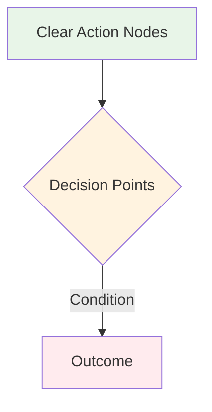

# 🏗️ Sprint Workflow Framework - Repository Structure Generator

## Overview

This framework is a **reusable template** that automatically generates the correct folder and file structure for every sprint. It prioritizes information architecture and legibility at scale, ensuring consistent, intuitive organization for both human developers and AI assistants.

## 🎯 Primary Goal: Structure Generation

Every sprint execution MUST produce this exact repository structure:

```
/
├── README.md                          ← global repo readme
│
├── Docs/                              ← universal documentation container
│   ├── README.md                      ← orientation for Docs folder
│   ├── SPRINT-WORKFLOW-FRAMEWORK.md  ← system-level instruction (this file)
│   ├── FINAL-PROJECT-KNOWLEDGE.md    ← high-level canonical project knowledge
│   └── Flowcharts/                   ← system architecture & user journey visuals
│       ├── README.md                 ← flowchart navigation and organization
│       ├── Current-State/            ← existing system problems & gaps
│       ├── Sprint-01-Targets/        ← current sprint deliverable blueprints
│       ├── Future-Vision/            ← long-term architectural vision
│       └── User-Journeys/            ← complete stakeholder experience flows
│
├── SPRINT-[SPRINT-NAME]/              ← main sprint container
│   ├── README.md                      ← sprint overview & execution summary
│   ├── Sprint-Prep/                   ← all preparation phase work
│   │   ├── README.md                  ← prep phase guide
│   │   ├── PHASE-1-DIAGNOSTIC-SUMMARY.md
│   │   ├── PHASE-2-DOCUMENT-SCORING.md
│   │   ├── PHASE-2.5-INTENT-SYNTHESIS.md
│   │   ├── PHASE-3-ALIGNMENT-MAPPING.md
│   │   └── PHASE-4-SPRINT-PLAN.md
│   │
│   ├── IMPLEMENTATION-CHECKLIST.md   ← execution tracking
│   ├── CURRENT-STATE-SUMMARY.md      ← system state snapshot
│   ├── SPRINT-FEATURE-REQUIREMENTS.md ← functional specifications
│   └── BX-OS-TECHNICAL-CONTEXT.md    ← technical context & constraints
```

## 📋 Sprint Initialization Protocol

### Step 1: Folder Structure Creation
When starting any new sprint, immediately create:

1. **Sprint Container**: `SPRINT-[DESCRIPTIVE-NAME]/`
   - Use clear, descriptive names (e.g., `SPRINT-01-LAUNCH`, `SPRINT-02-AUTHENTICATION`)
   
2. **Preparation Subfolder**: `SPRINT-[NAME]/Sprint-Prep/`
   - All diagnostic and planning work lives here
   
3. **Flowcharts Subfolder**: `Docs/Flowcharts/`
   - Visual architecture diagrams and user journey maps (project-wide resource)

### Step 2: Document Template Generation
Create these files with appropriate content for each sprint:

**Sprint-Level Files:**
- `README.md` - Sprint overview, objectives, and completion status
- `IMPLEMENTATION-CHECKLIST.md` - Execution tracking and validation
- `CURRENT-STATE-SUMMARY.md` - System state snapshot at sprint start
- `SPRINT-FEATURE-REQUIREMENTS.md` - Functional requirements and acceptance criteria
- `BX-OS-TECHNICAL-CONTEXT.md` - Technical constraints and architectural context

**Sprint-Prep Files:**
- `PHASE-1-DIAGNOSTIC-SUMMARY.md` - System health and gap analysis
- `PHASE-2-DOCUMENT-SCORING.md` - Documentation audit and scoring
- `PHASE-2.5-INTENT-SYNTHESIS.md` - Requirements synthesis and prioritization
- `PHASE-3-ALIGNMENT-MAPPING.md` - Technical alignment and dependency mapping
- `PHASE-4-SPRINT-PLAN.md` - Final execution plan and timeline

### Step 3: Flowchart Architecture Generation
Create comprehensive visual documentation following the **BX-OS Flowchart Protocol**:

**Current-State Flowcharts (01-04):**
- `01-current-authentication-routing.md` - Authentication and role-based routing analysis
- `02-current-kiosk-logic.md` - Kiosk workflow and device management state
- `03-current-database-schema.md` - Database structure and relationship mapping
- `04-current-session-management.md` - Session tracking and user correlation

**Sprint-Target Flowcharts (05-08):**
- `05-updated-authentication.md` - Role-based route protection and UI permissions
- `06-device-instance-management.md` - Dynamic kiosk assignment and session management
- `07-updated-kiosk-workflow.md` - Complete end-to-end kiosk user journey
- `08-fixed-session-management.md` - Corrected session architecture and tracking

**Future-Vision Flowcharts (09-12+):**
- `09-scalable-kiosk-architecture.md` - Multi-school deployment architecture
- `10-behavior-analytics-flow.md` - AI analysis and pattern recognition systems
- `12-system-integration-architecture.md` - External system integrations and APIs

**User-Journey Flowcharts (11+):**
- `11-user-journey-map.md` - Complete stakeholder experience flows

## 🤖 AI ASSISTANT SPRINT ORIENTATION

### MANDATORY ENTRY PROTOCOL FOR AI ASSISTANTS

Before ANY sprint work, AI assistants MUST:

1. **📋 READ SPRINT ENTRY PROTOCOL**
   - Complete `Docs/AI-ASSISTANT-SPRINT-PROTOCOL.md` checklist
   - Validate current system state vs claimed implementation status
   - Run reality check tools from `Docs/REALITY-TESTING-INTEGRATION.md`

2. **🔍 VERIFY ACTUAL SYSTEM STATE**
   - Test critical components exist and function (don't trust documentation)
   - Check authentication boundaries actually work
   - Validate database connectivity and data integrity

3. **🎯 IDENTIFY TRUE IMPLEMENTATION GAPS**
   - Compare documentation claims against actual codebase functionality
   - Focus only on explicitly broken or missing functionality
   - Plan minimal changes to address specific user requests

4. **⚠️ MANDATORY VALIDATION GATES**
   - NEVER claim completion without functional testing
   - ALWAYS test end-to-end workflows before declaring success
   - MUST validate security boundaries and role restrictions work in practice

### ASSISTANT SELF-VALIDATION REQUIREMENTS

Every implementation phase requires:
- **Component Testing**: Individual parts work in isolation  
- **Integration Testing**: Parts work together correctly
- **System Testing**: Complete user workflows function end-to-end
- **Security Testing**: Authentication and authorization boundaries enforced

See `Docs/SPRINT-VALIDATION-FRAMEWORK.md` for complete testing protocols.

## 🔄 Sprint Execution Phases

**🚀 CONTINUOUS IMPLEMENTATION MODE**: Phases are organizational only. Implementation continues through all phases until completion or critical blocker. No manual approval required between phases.

### Phase 1: Diagnostic & Structure Setup (Foundation)
1. **Create Repository Structure** - Generate folders and base documents
2. **Generate Flowchart Architecture** - Create complete visual documentation suite
3. **System Health Assessment** - Run diagnostics and document current state
4. **Documentation Audit** - Score existing documentation accuracy
5. **Gap Analysis** - Identify architectural prerequisites and blockers

### Phase 2: Planning & Alignment (Architecture)
1. **Intent Synthesis** - Clarify requirements and success criteria
2. **Alignment Mapping** - Map technical dependencies and prerequisites
3. **Sprint Planning** - Define execution phases and validation checkpoints
4. **Risk Assessment** - Identify and plan mitigation for critical blockers

### Phase 3: Foundation-First Implementation (Security)
1. **Architectural Prerequisites** - Complete foundational systems before features
2. **Security Boundaries** - Implement authentication and authorization early
3. **Core System Validation** - Ensure fundamental functionality before enhancement
4. **Incremental Progress** - Build in small, testable, verifiable increments

### Phase 4: Feature Implementation & Validation (Delivery)
1. **Feature Development** - Implement planned functionality on stable foundation
2. **Integration Testing** - Validate end-to-end workflows and data integrity
3. **Security Validation** - Confirm authorization boundaries and session management
4. **Documentation Update** - Ensure implementation status reflects actual system state

## 📊 BX-OS Flowchart Protocol Standards

### Flowchart Category Architecture

**🔴 Current-State (01-04)** - System problems and architectural gaps
- **Purpose**: Document existing broken functionality and security vulnerabilities
- **Color Coding**: Red for problems, white for existing functional components
- **Content Structure**: Problem identification → Impact analysis → System flow diagrams
- **Implementation Notes**: Add status notes about partial fixes or improvements

**🟢 Sprint-Targets (05-08)** - Current sprint deliverable blueprints  
- **Purpose**: Define target architecture and implementation requirements
- **Color Coding**: Green for deliverables, blue for security layers, purple for future integration points
- **Content Structure**: Target architecture → Implementation requirements → Success criteria
- **Implementation Status**: Must include ✅ IMPLEMENTED, 🔄 PARTIALLY IMPLEMENTED, ❌ NOT IMPLEMENTED sections

**🟣 Future-Vision (09-12+)** - Long-term architectural vision
- **Purpose**: Document scalable architecture beyond current sprint
- **Color Coding**: Purple for future features, blue for integration points
- **Content Structure**: Vision overview → Architecture principles → Integration strategy
- **Foundation Reference**: Must reference current sprint implementations as foundation

**🎯 User-Journeys (11+)** - Complete stakeholder experience flows
- **Purpose**: Map end-to-end user experiences across all system touchpoints
- **Color Coding**: Role-based colors (teacher, student, admin, anonymous)
- **Content Structure**: Journey phases → Decision points → System interactions → Success outcomes

### Mermaid Diagram Standards

**Flowchart Syntax Requirements:**


**Color Coding Standards:**
- **🟢 Green (#e8f5e8,#4caf50)**: Functional components, successful flows
- **🔴 Red (#ffebee,#d32f2f)**: Broken functionality, security vulnerabilities  
- **🟠 Orange (#fff3e0,#ff9800)**: Decision points, conditional logic
- **🔵 Blue (#e3f2fd,#1976d2)**: Security layers, authentication boundaries
- **🟣 Purple (#f3e5f5,#9c27b0)**: Future features, integration points

**Accessibility Requirements:**
- All nodes must have descriptive text, not just icons
- Color coding must be supplemented with text indicators (✅❌🔄)
- Diagram complexity should not exceed 15 nodes for readability

### Implementation Status Tracking Protocol

**Sprint-Target Flowcharts Must Include:**
```markdown
## 📋 Implementation Status

### ✅ IMPLEMENTED
- `ComponentName.tsx` - Brief functionality description
- `hookName.ts` - Implementation status note

### 🔄 PARTIALLY IMPLEMENTED  
- `ExistingComponent.tsx` - What exists vs what's needed
- `PartialHook.ts` - Specific gaps to address

### ❌ NOT IMPLEMENTED
- `MissingComponent.tsx` - Required functionality
- `NeededHook.ts` - Integration requirements
```

**Status Update Requirements:**
- Must reflect actual codebase state, not aspirational goals
- Include specific file references and functionality gaps
- Update status as implementation progresses throughout sprint
- Cross-reference with Implementation Checklist for validation

### Cross-Reference Integration Standards

**Required Cross-References:**
- Current-State problems → Sprint-Target solutions (explicit mapping)
- Sprint-Target components → Implementation Checklist items
- Future-Vision features → Current sprint foundation dependencies
- User-Journey flows → Technical component requirements

**File Reference Format:**
```markdown
> **Cross-Reference**: See `SPRINT-01-LAUNCH/IMPLEMENTATION-CHECKLIST.md` Line 45-52
> **Component Status**: Tracked in `06-device-instance-management.md` Implementation Status
> **Architecture Context**: Foundation documented in `03-current-database-schema.md`
```

## 🏛️ Information Architecture Principles

### Folder Hierarchy Logic
- **Global (`Docs/`)**: Project-wide, sprint-spanning knowledge
- **Sprint-Specific**: Time-bound execution materials
- **Prep Subfolder**: All planning and diagnostic work isolated
- **Flowcharts Subfolder**: Visual materials separated from text documentation

### Document Naming Conventions
- Use descriptive, hierarchical naming (e.g., `PHASE-2.5-INTENT-SYNTHESIS.md`)
- Include execution sequence in filenames where relevant
- Maintain consistent capitalization and hyphenation patterns
- Ensure names are self-documenting and searchable

### Content Organization Standards
- **One Purpose Per Document**: Each file serves a single, clear function
- **Scannable Structure**: Use consistent headers, lists, and formatting
- **Cross-Reference Integrity**: Maintain accurate internal links and dependencies
- **Status Tracking**: Include completion status and validation checkmarks

## ✅ Completion Validation Checklist

### Repository Structure Validation
- [ ] Correct folder hierarchy created
- [ ] All required documents present with appropriate content
- [ ] Cross-references and internal links functional
- [ ] Naming conventions followed consistently

### Content Quality Gates
- [ ] Implementation status reflects actual system state
- [ ] Technical documentation current and accurate
- [ ] Security boundaries documented and validated
- [ ] Success criteria met and verified through testing

### Sprint Closure Protocol
- [ ] All planned functionality operational
- [ ] Documentation updated to match implementation
- [ ] Known issues and technical debt documented
- [ ] Repository structure clean and navigation-ready

### 🔬 MANDATORY AI ASSISTANT VALIDATION PROTOCOL

Before claiming sprint completion, AI assistants MUST:

#### Pre-Completion System Validation
- [ ] **Authentication Testing**: Role-based route protection verified with actual user accounts
- [ ] **Component Functionality**: All claimed components exist and work in practice  
- [ ] **UI Interactions**: Critical interactive elements (NotificationBell, QueueDisplay) function correctly
- [ ] **Data Flow Testing**: Student lookup, queue management, BSR workflows tested end-to-end
- [ ] **Security Boundaries**: Anonymous kiosk access and role restrictions verified

#### Reality Check Requirements  
- [ ] **Database Queries**: Run validation queries to check actual data state
- [ ] **Console Log Review**: No critical JavaScript errors during normal operation
- [ ] **Network Request Testing**: API calls succeed and return expected data
- [ ] **Cross-Session Testing**: Real-time updates work across multiple browser windows
- [ ] **Role-Based Testing**: Test system with actual admin, teacher, and anonymous users

#### User Handoff Preparation
- [ ] **Accurate Documentation**: Implementation status reflects tested reality, not aspirational goals
- [ ] **Clear Testing Instructions**: Provide specific user scenarios to validate
- [ ] **Known Issues Documentation**: Honest reporting of limitations and edge cases
- [ ] **Rollback Plan**: Clear instructions if critical issues discovered during user testing

#### Sprint Success Criteria Validation
- [ ] **Core Workflows Functional**: Admin dashboard, teacher dashboard, kiosk access tested
- [ ] **Security Architecture**: Role isolation and authentication boundaries working
- [ ] **Data Integrity**: Student records, queue management, session tracking accurate  
- [ ] **UI/UX Functionality**: Interactive components respond correctly to user actions

**CRITICAL**: Sprint is NOT complete until ALL validation requirements pass functional testing.

## 🎯 Framework Success Metrics

This structure-generating approach ensures:

- **Consistent Information Architecture** - Every sprint follows the same organizational pattern
- **Scalable Documentation** - Clear separation between global and sprint-specific knowledge
- **AI-Assistant Friendly** - Predictable structure enhances automated tooling effectiveness
- **Human Navigation** - Intuitive folder hierarchy supports efficient knowledge retrieval
- **Quality Assurance** - Built-in validation checkpoints prevent documentation drift

---

**Framework Philosophy**: Repository structure IS the foundation for all other work. Getting this right from sprint initialization prevents architectural confusion, documentation drift, and collaboration friction throughout the development cycle.