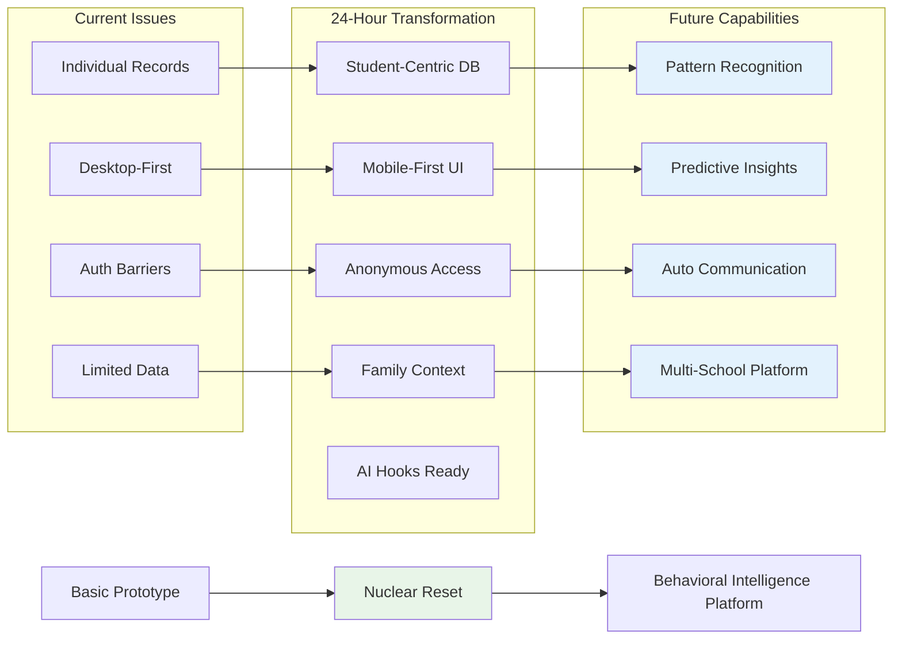
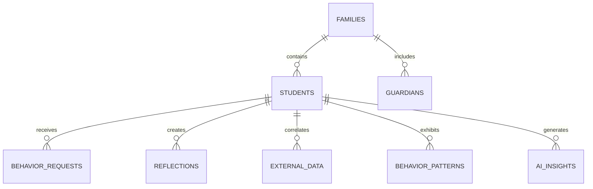

# 🚀 BX-OS: Behavioral Intelligence Platform

**Nuclear Reset Transformation - Complete Strategic Documentation Repository**

> This repository contains the complete strategic documentation for transforming BX-OS from a basic prototype into a production-ready Behavioral Intelligence Platform through a 24-hour nuclear reset sprint.

## 🎯 Strategic Mission

Transform student behavioral support through intelligent, family-centered technology that empowers educators, engages families, and supports student success through data-driven insights and automated intervention recommendations.

## 📋 Complete Documentation Architecture  

### 🎯 Core Strategic Documents
- **[NUCLEAR-RESET-PLAN.md](NUCLEAR-RESET-PLAN.md)** - 24-hour transformation implementation guide
- **[BX-OS-STRATEGIC-ROADMAP.md](BX-OS-STRATEGIC-ROADMAP.md)** - Complete platform evolution strategy  
- **[BX-OS-PRODUCTION-KNOWLEDGE.md](BX-OS-PRODUCTION-KNOWLEDGE.md)** - Master system knowledge container

### 🏗️ Architecture & Design
- **[Future State Database](docs/architecture/future-state-database.md)** - Complete ER diagrams and schema design
- **[Platform Evolution Flowcharts](docs/architecture/platform-evolution-flowcharts.md)** - Visual transformation roadmap
- **[AI Integration Architecture](docs/architecture/ai-integration-architecture.md)** - Behavioral intelligence framework
- **[Transformation Blueprint](docs/architecture/transformation-blueprint.md)** - Nuclear reset technical strategy

### 🔧 Implementation Guides
- **[CSV Import Strategy](docs/technical/csv-import-strategy.md)** - Student data transformation process
- **[Extension Architecture](docs/technical/extension-architecture.md)** - AI and integration framework
- **[Production Sprint Checklist](docs/technical/production-sprint-checklist.md)** - Hour-by-hour execution plan
- **[Testing & Verification Protocol](docs/technical/testing-verification-protocol.md)** - Quality assurance framework

### 👥 Developer Resources
- **[Development Handoff](docs/DEVELOPMENT-HANDOFF.md)** - Complete developer onboarding guide
- **[Git Workflow Strategy](docs/technical/git-workflow-strategy.md)** - Version control procedures
- **[Anonymous Access Strategy](docs/technical/anonymous-access-strategy.md)** - Kiosk implementation guide
- **[Database Migration Plan](docs/technical/database-migration-plan.md)** - Schema transformation steps

## 🚀 Nuclear Reset Transformation Overview

### **Current State → Future Vision**

## 🎯 Critical Success Factors

### **Immediate Goals (24-Hour Sprint)**
- ✅ **Student-Centric Database**: Family-based architecture supporting 100+ students
- ✅ **Anonymous Kiosk Access**: Students complete reflections without login barriers  
- ✅ **Mobile-First Experience**: Touch-optimized for tablet deployment
- ✅ **Real-Time Communication**: Live notifications and updates
- ✅ **Extension Point Preparation**: AI and integration hooks ready

### **Future Evolution Path**
1. **Phase 2**: AI behavioral pattern recognition and predictive insights
2. **Phase 3**: Automated parent communication and engagement workflows  
3. **Phase 4**: Multi-school platform with district-wide intelligence

## 📊 Architecture Foundation

### **Database Evolution**

### **Technology Stack**
- **Frontend**: React 18 + TypeScript + Tailwind CSS + Vite
- **Backend**: Supabase (PostgreSQL + Auth + Real-time + Edge Functions)
- **Mobile**: Progressive Web App with touch optimization
- **AI Integration**: OpenAI GPT-4 hooks prepared
- **Security**: Row Level Security (RLS) with multi-tier authentication

## 🔄 Implementation Status

### **Documentation Complete** ✅
- Strategic roadmap and transformation blueprint
- Complete architectural diagrams and flowcharts
- Implementation guides and developer resources
- Testing protocols and validation frameworks

### **Ready for Implementation** 🚀  
- Nuclear reset database transformation
- Anonymous kiosk access implementation
- Mobile-first UI development
- Real-time notification system
- Extension point framework integration

## 📈 Success Metrics & Validation

### **Functional Requirements**
- Students access kiosks without authentication barriers
- Teachers receive real-time queue notifications  
- Super admin has development access via /dev-login
- CSV import processes 100+ student records successfully
- Mobile tablets support all core functionality

### **Technical Requirements** 
- Database architecture supports AI integration
- RLS policies enforce role-based security
- Real-time notifications perform efficiently  
- Extension points ready for immediate development
- Cross-browser and mobile compatibility validated

### **Future-Proof Requirements**
- AI behavioral pattern recognition hooks functional
- External SIS data correlation framework operational
- Communication automation foundation established
- Multi-school architecture preparation complete

---

## 🎯 Next Steps

**For Implementation Teams:**
1. Review the [NUCLEAR-RESET-PLAN.md](NUCLEAR-RESET-PLAN.md) for step-by-step execution
2. Follow the [Production Sprint Checklist](docs/technical/production-sprint-checklist.md) for hour-by-hour progress
3. Use the [Testing & Verification Protocol](docs/technical/testing-verification-protocol.md) for quality assurance
4. Reference the [Development Handoff](docs/DEVELOPMENT-HANDOFF.md) for technical context

**For Strategic Planning:**
1. Review the [BX-OS-STRATEGIC-ROADMAP.md](BX-OS-STRATEGIC-ROADMAP.md) for long-term vision
2. Examine the [Platform Evolution Flowcharts](docs/architecture/platform-evolution-flowcharts.md) for transformation visualization
3. Study the [AI Integration Architecture](docs/architecture/ai-integration-architecture.md) for future capabilities

---

**Documentation Status**: ✅ **COMPLETE** - All strategic documentation aligned and ready for nuclear reset implementation.