# 🚀 BX-OS Data Population & Feature Implementation Plan

## 24-Hour Implementation Strategy

This document outlines the complete implementation plan for populating the existing BX-OS database architecture with student data and implementing critical missing features to create a production-ready Behavioral Intelligence Platform.

## 🎯 Mission: Data Population & Feature Implementation

**Objective:** Populate the existing student-centric database architecture with 100+ students and implement missing critical features including Google OAuth, notification system, and tutorial guidance.

## 📋 Phase-by-Phase Implementation

### **Phase 1: Data Foundation & CSV Import (Hours 0-8)**

#### 1.1 Database Verification & CSV Import Setup

```mermaid
flowchart TD
    A[Existing Database Architecture] --> B{Verify Tables Exist}
    B -->|✅ CONFIRMED| C[CSV Processing Pipeline]
    C --> D[Family Normalization]
    D --> E[Student Import with Family Links]
    E --> F[Guardian Contact Processing]
    F --> G[Data Population Complete]
    
    G --> H[Google OAuth Configuration]
    H --> I[Anonymous Kiosk Liberation]
    I --> J[Phase 1 Complete]
```

#### 1.2 Current Database Architecture (VERIFIED EXISTS)
- **✅ families** - Family units with primary contact information
- **✅ students** - Student records linked to families with external correlation markers  
- **✅ guardians** - Guardian/parent contacts with communication preferences
- **✅ behavior_requests** - Teacher-initiated BSR records with family context
- **✅ reflections** - Student responses with AI analysis hooks
- **✅ behavior_history** - Completed workflow records with intervention tracking
- **✅ Extension Point Tables** - Ready for AI and communication features

#### 1.3 Anonymous Kiosk Access Liberation
- Remove authentication guards from /kiosk1, /kiosk2, /kiosk3 routes
- Implement device-based identification (already architected)
- Enable anonymous student reflection completion

### **Phase 2: Notification System Implementation (Hours 8-16)**

#### 2.1 Real-Time Notification Infrastructure
- Supabase real-time subscriptions for behavior request updates
- NotificationBell component with PWA installation guidance
- Role-based notification filtering and management
- Mobile-optimized notification interactions

#### 2.2 Google OAuth Integration
- Google Cloud Console configuration
- Supabase Google Auth provider setup
- Domain restrictions for teacher/admin access
- Enhanced authentication flow with OAuth options

### **Phase 3: Tutorial System & Final Validation (Hours 16-24)**

#### 3.1 Optional Tutorial System (Enhancement)
- Interactive user onboarding system
- Role-based tutorial content
- Step progression and completion tracking
- Skip/replay functionality for user guidance

#### 3.2 System Validation & Testing
- Cross-device compatibility testing
- Performance optimization and validation
- Security audit of anonymous access implementation
- Comprehensive feature testing and documentation

## 🎯 Success Criteria

### Functional Validation
- [ ] 100+ students imported with complete family relationships
- [ ] Students can access kiosks without authentication barriers
- [ ] Teachers receive real-time notifications for behavior requests
- [ ] Google OAuth provides seamless teacher/admin authentication
- [ ] PWA installation guidance helps users enable notifications
- [ ] Tutorial system guides new users through core functionality

### Technical Validation
- [ ] CSV import processes large datasets efficiently (< 5 minutes for 100+ records)
- [ ] Database maintains referential integrity post-import
- [ ] Real-time notifications perform efficiently across devices
- [ ] Anonymous access maintains security boundaries
- [ ] Google OAuth integrates seamlessly with existing auth flow

### Future-Proof Validation
- [ ] Extension point tables prepared for immediate AI integration
- [ ] External data correlation framework operational
- [ ] Communication automation foundation established
- [ ] Multi-school architecture preparation maintained

## 🔄 Implementation Execution Framework

### Hour 0-4: CSV Import & Data Population
1. **CSV Processing Pipeline** (120 minutes)
2. **Family Normalization & Student Import** (90 minutes)
3. **Data Validation & Integrity Checks** (30 minutes)

### Hour 4-8: Authentication & Access
1. **Google OAuth Configuration** (120 minutes)
2. **Anonymous Kiosk Liberation** (60 minutes)
3. **Authentication Flow Testing** (60 minutes)

### Hour 8-12: Notification System Foundation
1. **NotificationBell Component Development** (180 minutes)
2. **Supabase Real-Time Integration** (60 minutes)

### Hour 12-16: PWA & Mobile Enhancement
1. **PWA Installation Guidance System** (120 minutes)
2. **Mobile Notification Optimization** (120 minutes)

### Hour 16-20: Tutorial System (Optional)
1. **Tutorial System Implementation** (180 minutes)
2. **Role-Based Content Development** (60 minutes)

### Hour 20-24: Validation & Final Testing
1. **Cross-Device Testing** (120 minutes)
2. **Performance Optimization** (60 minutes)
3. **Comprehensive Feature Validation** (60 minutes)

## 📊 Implementation Metrics

### Data Population Success
- **Target:** 100% CSV import success rate
- **Performance:** < 5 minutes processing time for 100+ students
- **Integrity:** 100% relational link accuracy between families/students/guardians

### Feature Implementation Success
- **Authentication:** Google OAuth + existing email/password working seamlessly
- **Notifications:** Real-time updates with < 2 second latency
- **Anonymous Access:** Kiosk routes accessible without authentication barriers
- **Tutorial System:** Complete user onboarding with progress tracking

### Technical Performance
- **Mobile Optimization:** All interfaces touch-friendly and responsive
- **PWA Functionality:** Installation guidance and notification permissions
- **Security:** Anonymous access maintains proper data boundaries

## 🚀 Post-Implementation Evolution Path

This data population and feature implementation creates the foundation for advanced capabilities:

1. **Phase 1 Complete** → Database populated with 100+ students and families
2. **AI Integration** → Behavioral pattern recognition using populated data
3. **Communication Platform** → Automated parent engagement using guardian contacts  
4. **Multi-School Platform** → District-wide behavioral intelligence expansion

---

**Next Step:** Execute Phase 1 data population with CSV import and Google OAuth configuration.