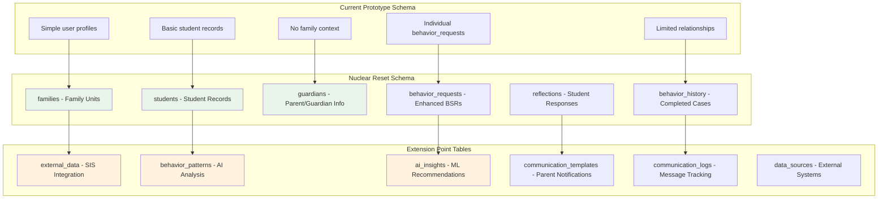
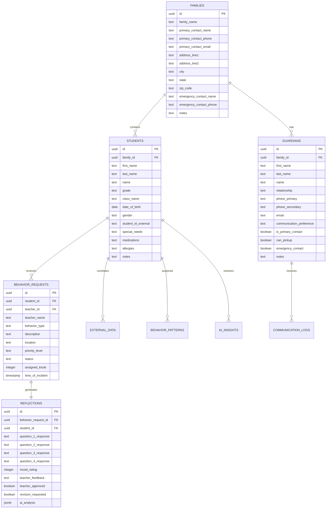
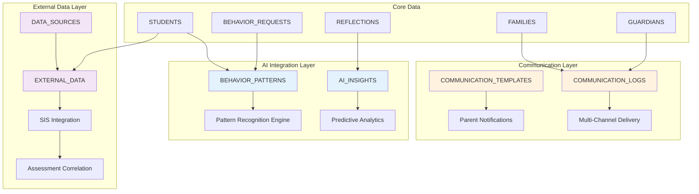
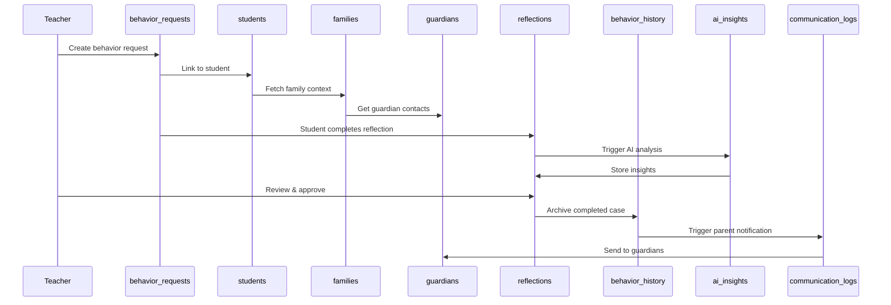
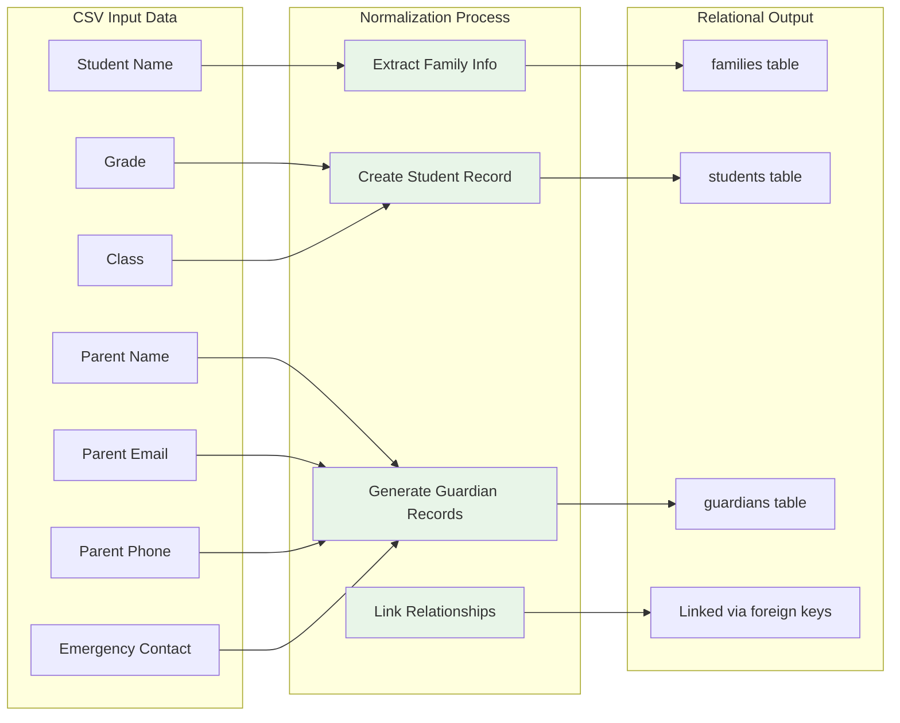
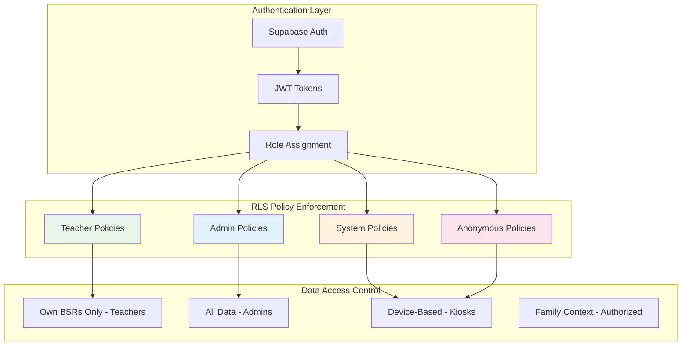
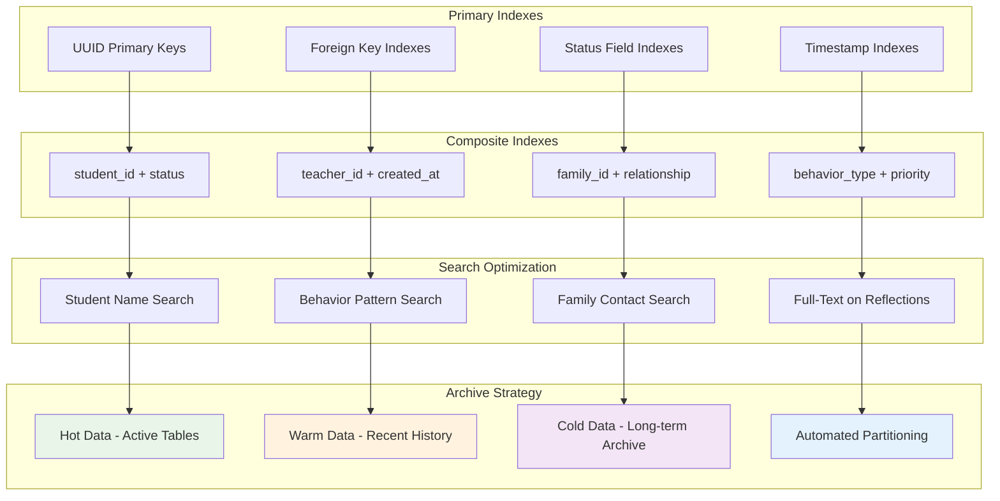
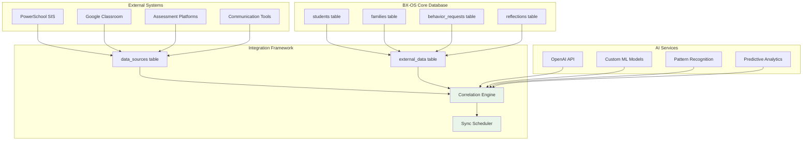
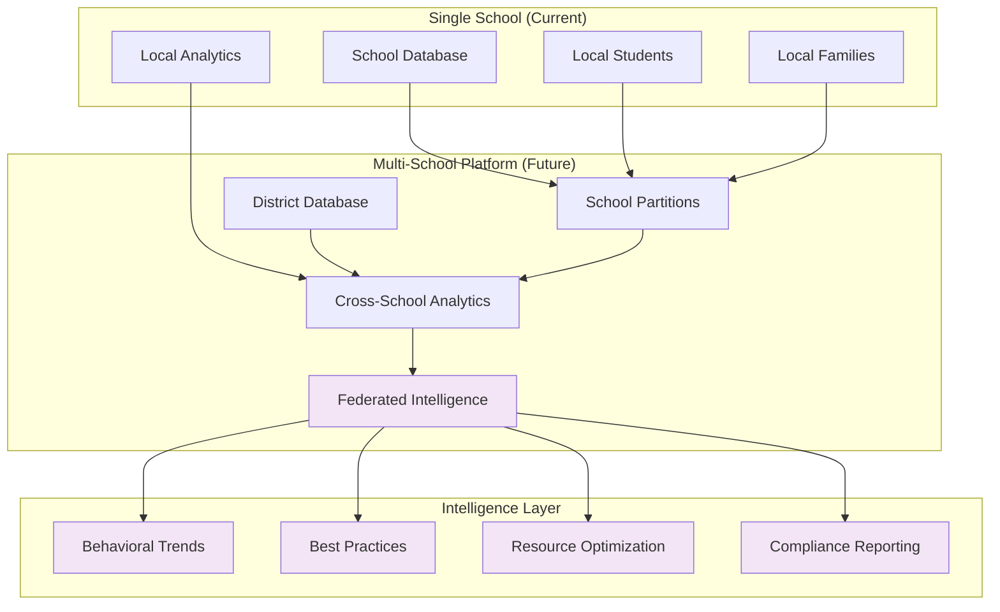

# 🗄️ BX-OS Database Schema Flowcharts

## Complete Database Architecture for Nuclear Reset

This document provides comprehensive database architecture flowcharts for the BX-OS Nuclear Reset transformation, showing the evolution from prototype to production-ready Behavioral Intelligence Platform.

## 🎯 Nuclear Reset Database Architecture

### Current vs. Future Database Design

## 🏗️ Core Student-Centric Architecture

### Family → Student → Guardian Relationships

## 🔮 Extension Point Architecture

### AI & External Integration Framework

## 📊 Data Flow Architecture

### Complete Student Journey Through Database

## 🔄 CSV Import Data Transformation

### Flat CSV to Relational Structure

## 🛡️ Security & Access Control Schema

### Row Level Security (RLS) Architecture

## 🚀 Performance & Scalability Architecture

### Indexing and Optimization Strategy

## 🔗 API Integration Architecture

### External System Connection Framework

## 📈 Future Evolution Architecture

### Multi-School Platform Database Design

---

**🎯 Database Architecture Success Definition:** Complete student-centric relational architecture with family context, AI integration hooks, external data correlation framework, and scalable multi-school platform foundation, ready for immediate production deployment and future behavioral intelligence expansion.