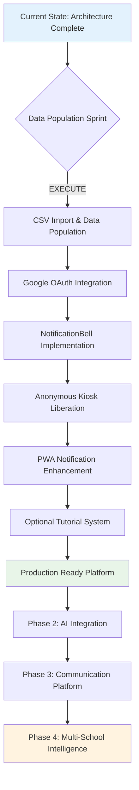
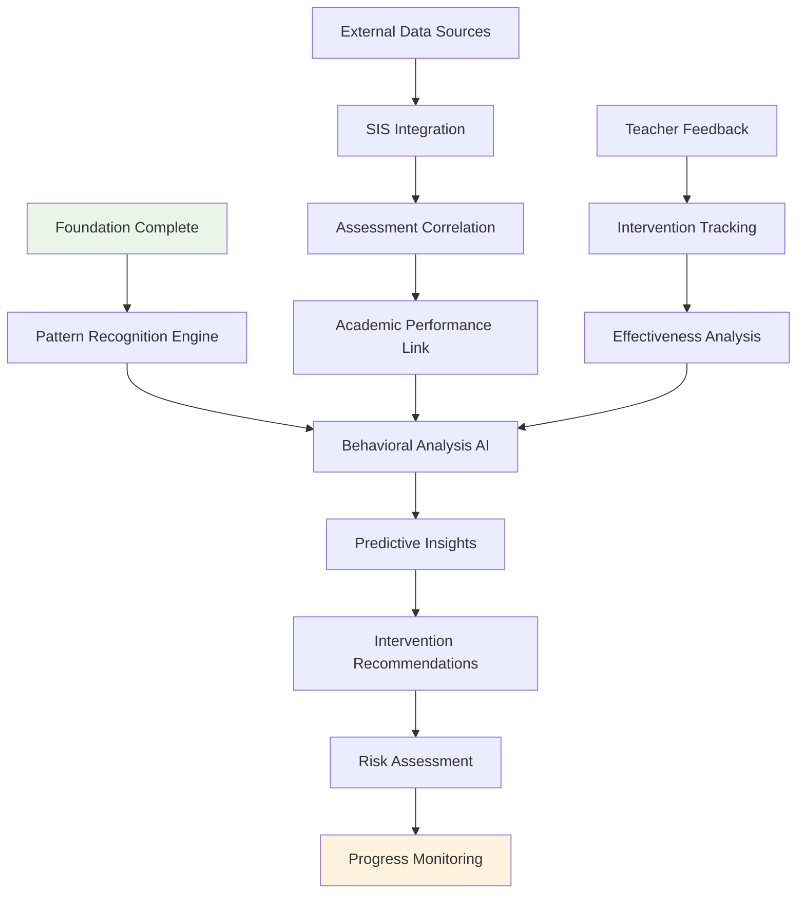
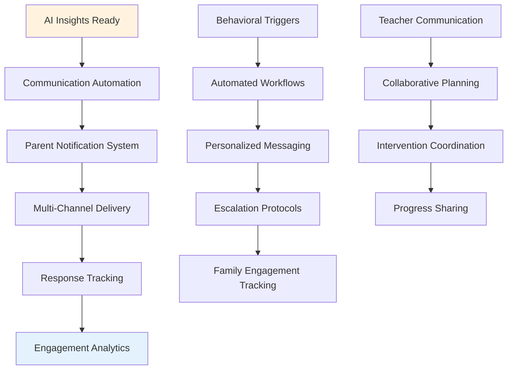
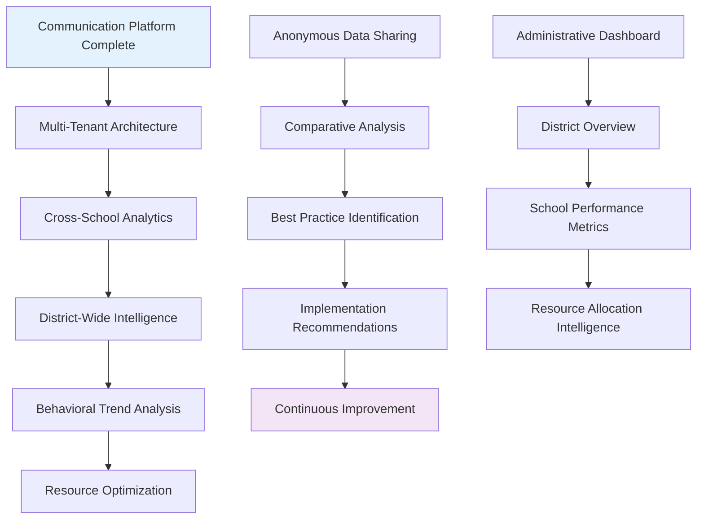
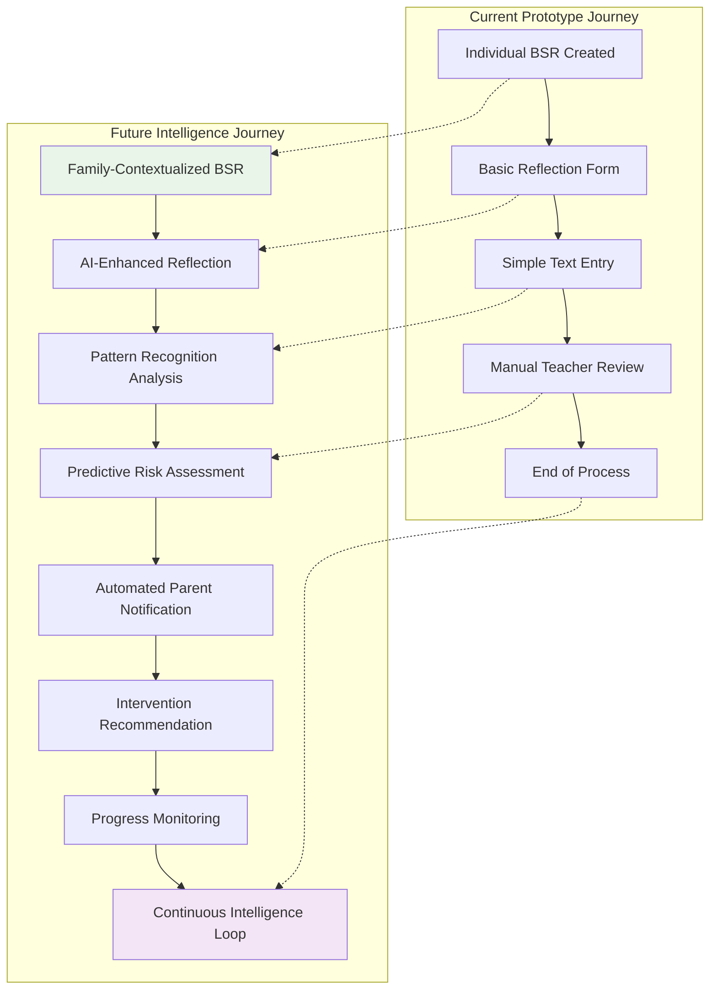
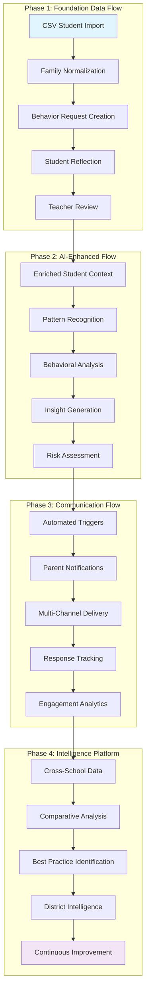
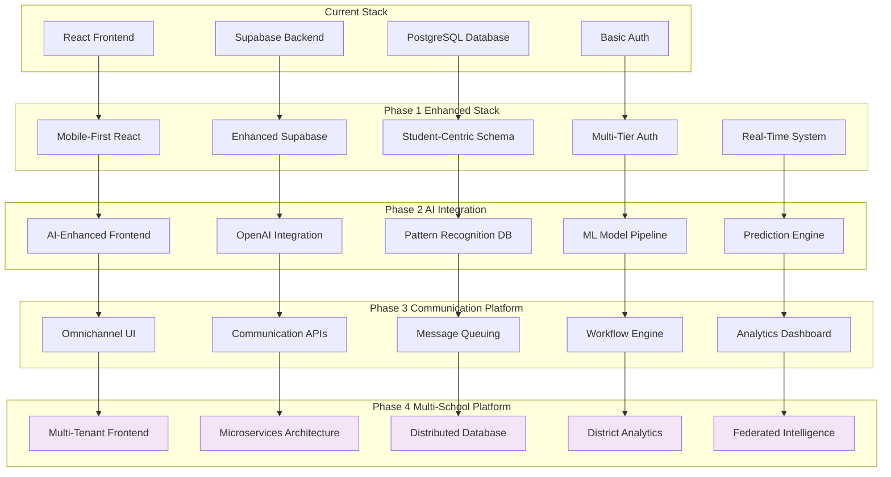
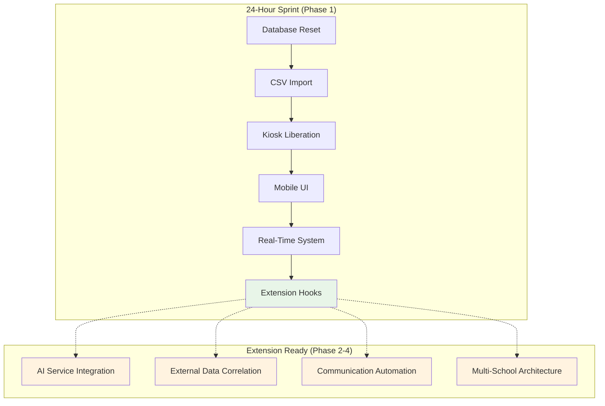

# 🚀 BX-OS Platform Evolution Flowcharts

## Complete Platform Transformation Journey

This document visualizes the complete evolution of BX-OS from prototype to Behavioral Intelligence Platform through detailed flowcharts.

## 🎯 Data Population & Feature Implementation Flow



## 🏗️ Implementation Phases

### Phase 1: Data Population & Core Features (24 Hours)

```mermaid
flowchart LR
    subgraph "Current State (VERIFIED)"
        A1[✅ Complete Database Schema]
        A2[✅ Mobile-Responsive UI]
        A3[❌ Auth Guards Block Kiosks]
        A4[❌ Empty Database Tables]
        A5[❌ Missing Notifications]
        A6[❌ Email-Only Auth]
    end
    
    subgraph "Implementation Process"
        B1[CSV Import Pipeline]
        B2[Google OAuth Setup]
        B3[NotificationBell Component]
        B4[Remove Auth Guards]
        B5[PWA Guidance System]
        B6[Tutorial System (Optional)]
    end
    
    subgraph "Production Ready"
        C1[✅ 100+ Students Populated]
        C2[✅ Google + Email Auth]
        C3[✅ Real-Time Notifications]
        C4[✅ Anonymous Kiosk Access]
        C5[✅ Mobile Notifications]
        C6[✅ User Guidance System]
    end
    
    A1 --> B1
    A2 --> B5
    A3 --> B4
    A4 --> B1
    A5 --> B3
    A6 --> B2
    
    B1 --> C1
    B2 --> C2
    B3 --> C3
    B4 --> C4
    B5 --> C5
    B6 --> C6
    
    C6 -.-> D[Ready for AI Integration]
    
    style C1 fill:#e8f5e8
    style C2 fill:#e8f5e8
    style C3 fill:#e8f5e8
    style C4 fill:#e8f5e8
    style C5 fill:#e8f5e8
    style C6 fill:#e8f5e8
```

### Phase 2: AI Integration (Future)



### Phase 3: Communication Platform (Future)



### Phase 4: Multi-School Intelligence (Future)



## 🔄 Student Journey Evolution

### Current State vs. Future Vision



## 📊 Data Flow Evolution

### From Simple Records to Behavioral Intelligence



## 🚀 Technology Stack Evolution

### Infrastructure Growth Path



## 📈 Implementation Readiness Matrix

### Immediate vs. Future Implementation



---

**Strategic Insight**: These flowcharts visualize the complete transformation journey, showing how the 24-hour nuclear reset creates the foundation for immediate production deployment while preparing extension points for future behavioral intelligence capabilities.