# 🔴 CORRECTED Current Authentication & Routing Flow

**Status**: WORKING - Documentation Previously Inaccurate  
**Updated**: 2024-08-20 | **Validation Method**: Direct code inspection + database queries

## VERIFIED Authentication Flow

```mermaid
flowchart TD
    A[User Access] --> B{Is Authenticated?}
    B -->|No| C[Redirect to /auth]
    B -->|Yes| D{User Role Check}
    D -->|Teacher| E[TeacherRoute Protection]
    D -->|Admin/Super Admin| F[AdminRoute Protection] 
    D -->|Anonymous Kiosk| G[Direct Access to Kiosks]
    
    E --> H[Teacher Dashboard - ✅ WORKING]
    F --> I[Admin Dashboard - ✅ WORKING]
    G --> J[Kiosk Pages - ✅ WORKING]
    
    J --> K[Students Can Access - ✅ ANONYMOUS]
    
    style H fill:#e8f5e8,stroke:#4caf50,stroke-width:2px
    style I fill:#e8f5e8,stroke:#4caf50,stroke-width:2px
    style J fill:#e8f5e8,stroke:#4caf50,stroke-width:2px
    style K fill:#e8f5e8,stroke:#4caf50,stroke-width:2px
    style A fill:#f3e5f5,stroke:#9c27b0
    style C fill:#e8f5e8,stroke:#4caf50
```



## VERIFIED Role-Based Access Control

```mermaid
flowchart TD
    A[Authenticated User] --> B[Route Protection Check]
    B --> C{AdminRoute Component?}
    C -->|Yes| D[Check: admin OR super_admin]
    C -->|No| E{TeacherRoute Component?}
    E -->|Yes| F[Check: teacher OR admin OR super_admin]
    E -->|No| G[Direct Access - No Auth Required]
    
    D -->|Valid Role| H[✅ Access Granted to Admin Dashboard]
    D -->|Invalid Role| I[↩️ Redirect to Teacher Dashboard]
    F -->|Valid Role| J[✅ Access Granted to Teacher Dashboard]
    F -->|Invalid Role| K[↩️ Redirect to Auth Page]
    G --> L[✅ Kiosk Access - Anonymous Students]
    
    style H fill:#e8f5e8,stroke:#4caf50,stroke-width:2px
    style J fill:#e8f5e8,stroke:#4caf50,stroke-width:2px
    style L fill:#e8f5e8,stroke:#4caf50,stroke-width:2px
    style A fill:#f3e5f5,stroke:#9c27b0
```



## VERIFIED Google OAuth Session Creation (Working)

```mermaid
sequenceDiagram
    participant U as User
    participant G as Google OAuth
    participant S as Supabase Auth
    participant DB as Database
    participant UI as Frontend

    U->>G: Initiate Google Login
    G->>S: Return OAuth Token
    S->>DB: ✅ Create User Record + Profile Trigger
    DB-->>S: ✅ Profile Created with Role Assignment
    S->>UI: Session Created with Profile
    UI->>UI: ✅ Display Name: Correct User Name
    UI->>UI: ✅ Role: Properly Assigned
    Note over UI: Session tracking shows correct info
    
    style DB fill:#e8f5e8,stroke:#4caf50
    style UI fill:#e8f5e8,stroke:#4caf50
```

## VERIFIED System Components Status

### ✅ Authentication Components (WORKING)
1. **AdminRoute Component**: EXISTS at `src/components/AdminRoute.tsx` - Functional role checking
2. **TeacherRoute Component**: EXISTS at `src/components/TeacherRoute.tsx` - Functional role checking  
3. **usePermissions Hook**: EXISTS at `src/hooks/usePermissions.ts` - Complete permission system
4. **Google OAuth Profile Creation**: FUNCTIONAL - Users get proper roles and profiles

### ✅ Security Implementation (WORKING)
1. **Role-Based Route Protection**: Working - Proper redirection based on user roles
2. **Component-Level Authorization**: Functional - UI components check permissions appropriately
3. **Anonymous Kiosk Access**: Working - Students can access kiosk routes without authentication
4. **Session Tracking**: Functional - Shows correct user names and roles

### ✅ Database Integration (WORKING)
1. **Profile Creation Trigger**: `handle_new_user_registration()` function operational
2. **Role Assignment Logic**: Automatic role assignment based on email domain
3. **Session Correlation**: Proper tracking with device info and user metadata
4. **RLS Policies**: Functional for role-based data access

## CORRECTED Issues Analysis

### ❌ Previous Claims Proven False
1. **"No Role-Based Route Protection"** → AdminRoute & TeacherRoute exist and work
2. **"Missing UI Permission Framework"** → usePermissions hook functional
3. **"Kiosk Routes Blocked"** → Anonymous access works as designed
4. **"Session Correlation Broken"** → Shows proper user names and roles
5. **"Cross-Role Access Vulnerability"** → Route protection prevents unauthorized access
6. **"Unknown User Display"** → Sessions correctly show "Super Administrator", "Admin User"

### ✅ Actual System Capabilities
1. **Proper Authentication Boundaries**: Users redirected to appropriate dashboards
2. **Functional Session Management**: Correct names, roles, and device tracking
3. **Working Anonymous Access**: Students can complete kiosk workflows without login
4. **Secure Role Enforcement**: Teachers cannot access admin functions, admins have full access

## Required Actions for Sprint 03

### HIGH PRIORITY: Quality Assurance
1. **End-to-End Testing**: Validate complete workflows with real user scenarios
2. **Load Testing**: Test system performance with multiple concurrent users
3. **Integration Testing**: Verify all components work together under realistic conditions

### MEDIUM PRIORITY: Production Configuration  
1. **Multi-Kiosk Setup**: Activate all three kiosks for full deployment
2. **Data Population**: Import complete student dataset for realistic testing
3. **Performance Optimization**: Ensure system scales for production usage

### LOW PRIORITY: Documentation & Training
1. **User Training**: Create training materials for functional system
2. **Deployment Procedures**: Document deployment steps for verified working system
3. **Maintenance Protocols**: Establish ongoing system maintenance procedures