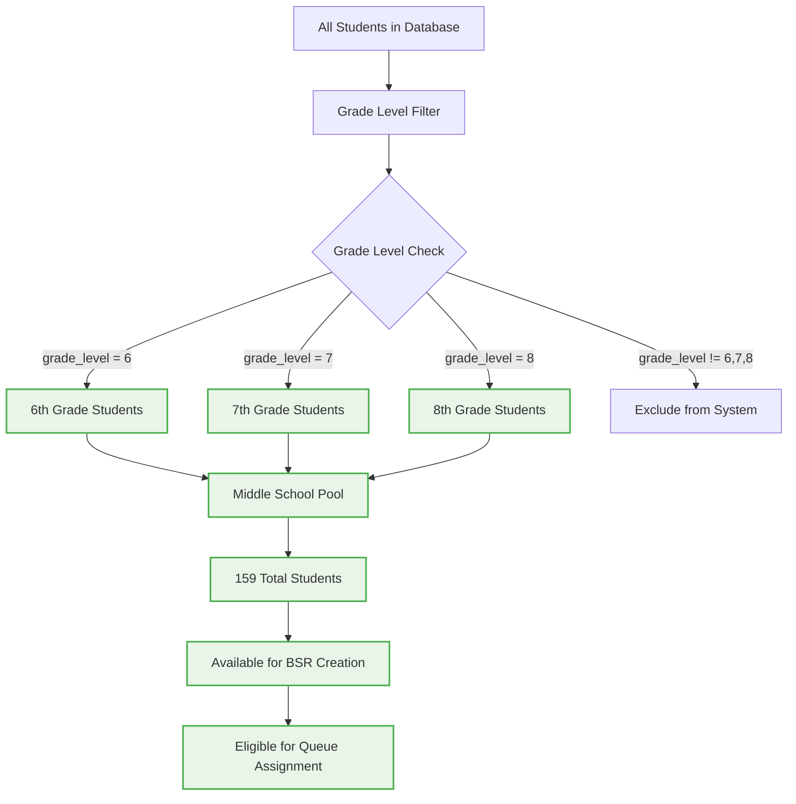
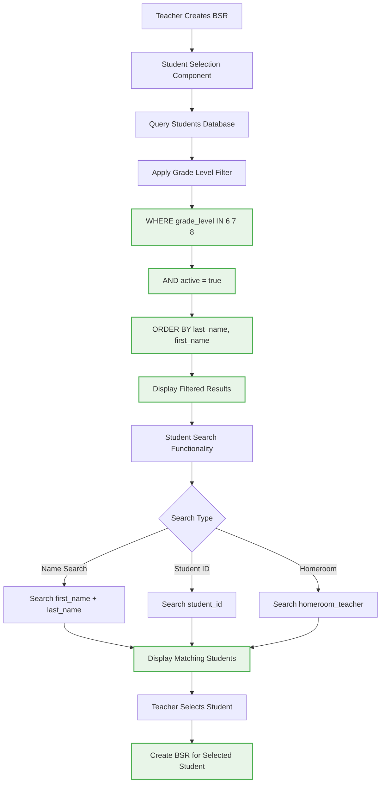
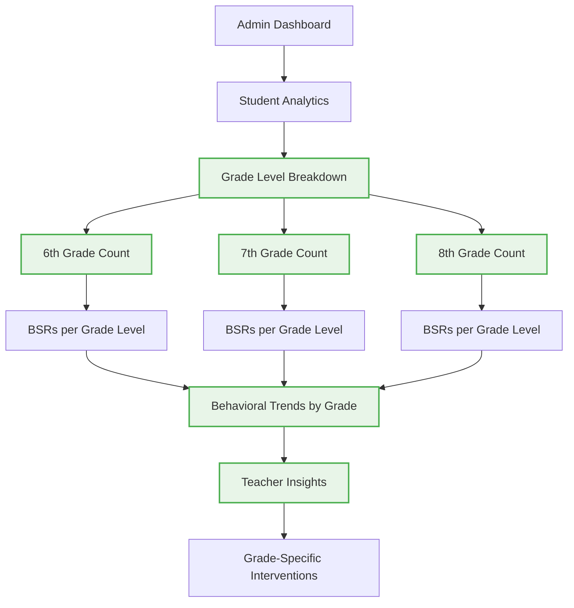
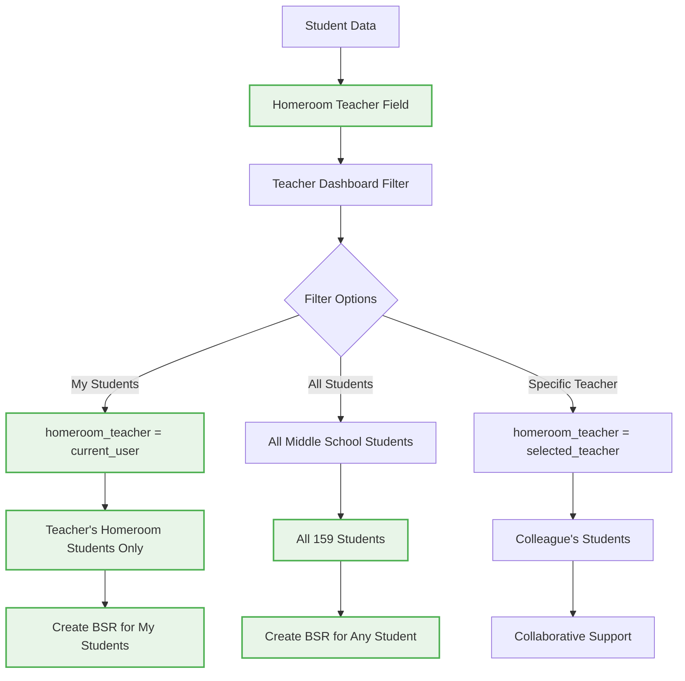
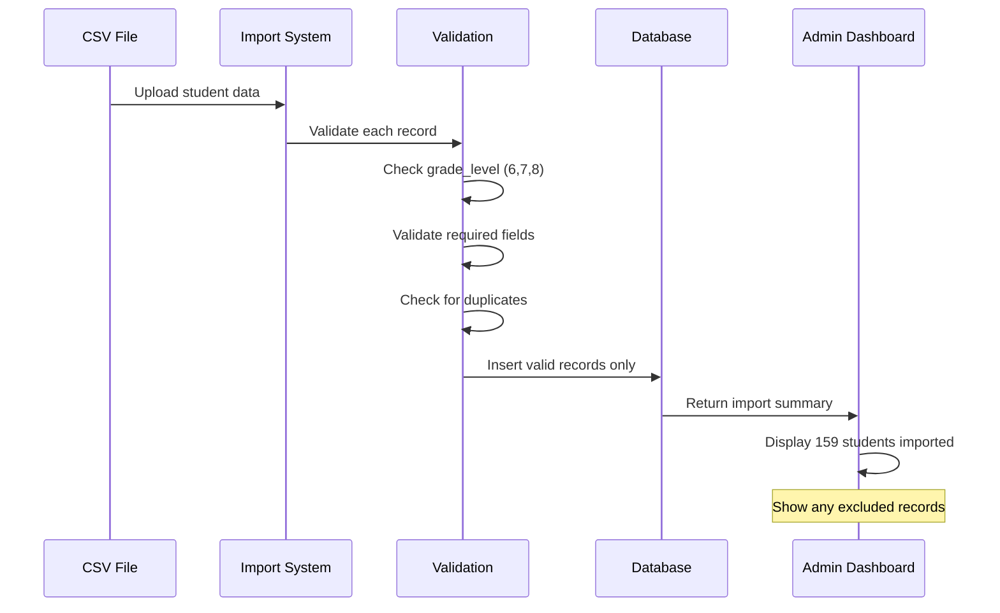

# 🟢 Middle School Student Filtering System (Sprint 02 Target)

**Status**: SPRINT TARGET - Student filtering and data management for 159 middle school students

## Target Student Population Management



## Student Data Import and Validation

```mermaid
flowchart TD
    A[CSV Import: hillel_students_2025.csv] --> B[Data Validation]
    B --> C{Grade Level Validation}
    
    C -->|Valid (6,7,8)| D[Import Student]
    C -->|Invalid (other)| E[Skip Student]
    
    D --> F[Create Student Record]
    F --> G[Assign Middle School Flag]
    G --> H[Set Active Status]
    
    H --> I[Student Available for BSR]
    I --> J[Add to System Count]
    
    E --> K[Log Excluded Student]
    K --> L[Exclude from Count]
    
    J --> M[Verify Total = 159]
    
    style D fill:#e8f5e8,stroke:#4caf50,stroke-width:2px
    style F fill:#e8f5e8,stroke:#4caf50,stroke-width:2px
    style G fill:#e8f5e8,stroke:#4caf50,stroke-width:2px
    style H fill:#e8f5e8,stroke:#4caf50,stroke-width:2px
    style I fill:#e8f5e8,stroke:#4caf50,stroke-width:2px
    style J fill:#e8f5e8,stroke:#4caf50,stroke-width:2px
    style M fill:#e8f5e8,stroke:#4caf50,stroke-width:2px
```

## Student Selection Interface



## Grade-Based Dashboard Analytics



## Homeroom Teacher Integration



## Data Quality Validation



## Implementation Status

### ✅ IMPLEMENTED
- Student database with grade_level field
- CSV import functionality exists
- Student selection components exist

### 🔄 PARTIALLY IMPLEMENTED
- Grade level filtering needs validation
- Student count verification needed
- Dashboard analytics need grade breakdowns

### ❌ NOT IMPLEMENTED
- Automatic grade level filtering in all components
- Middle school student count validation (159 total)
- Grade-based analytics dashboard
- Homeroom teacher filtering system

## Implementation Requirements

### 1. Add Grade Level Filtering
```sql
-- Update all student queries to include grade level filter
WHERE grade_level IN (6, 7, 8) AND active = true
```

### 2. Validate Student Count
```typescript
// Verify exactly 159 middle school students imported
// Add validation to CSV import process
// Display total count in admin dashboard
```

### 3. Update Student Selection
```typescript
// Filter student selection to middle school only
// Add grade level display in student lists
// Implement homeroom teacher filtering
```

### 4. Add Grade-Based Analytics
```typescript
// Dashboard component showing grade level breakdown
// BSR counts per grade level
// Behavioral trend analysis by grade
```

## Student Data Structure

### 📋 Required Fields
```typescript
interface Student {
  id: uuid;
  first_name: string;
  last_name: string;
  student_id: string;
  grade_level: number; // Must be 6, 7, or 8
  homeroom_teacher: string;
  active: boolean; // Only active students available
}
```

### 🎯 Filtering Logic
- **Grade Filter**: `grade_level IN (6, 7, 8)`
- **Active Filter**: `active = true`
- **Total Count**: Exactly 159 students
- **Homeroom Filter**: Optional filtering by homeroom teacher

## Data Import Validation

### ✅ Valid Records
- Grade level is 6, 7, or 8
- All required fields present
- No duplicate student IDs
- Active status set to true

### ❌ Invalid Records
- Grade level not in middle school range
- Missing required fields
- Duplicate student IDs
- Inactive students

## Cross-References
- **Implementation Details**: `SPRINT-02-LAUNCH/IMPLEMENTATION-CHECKLIST.md` items 4.1-4.3
- **Technical Context**: `SPRINT-02-LAUNCH/BX-OS-TECHNICAL-CONTEXT.md` Student Data Management
- **Student Data**: `public/data/hillel_students_2025.csv`