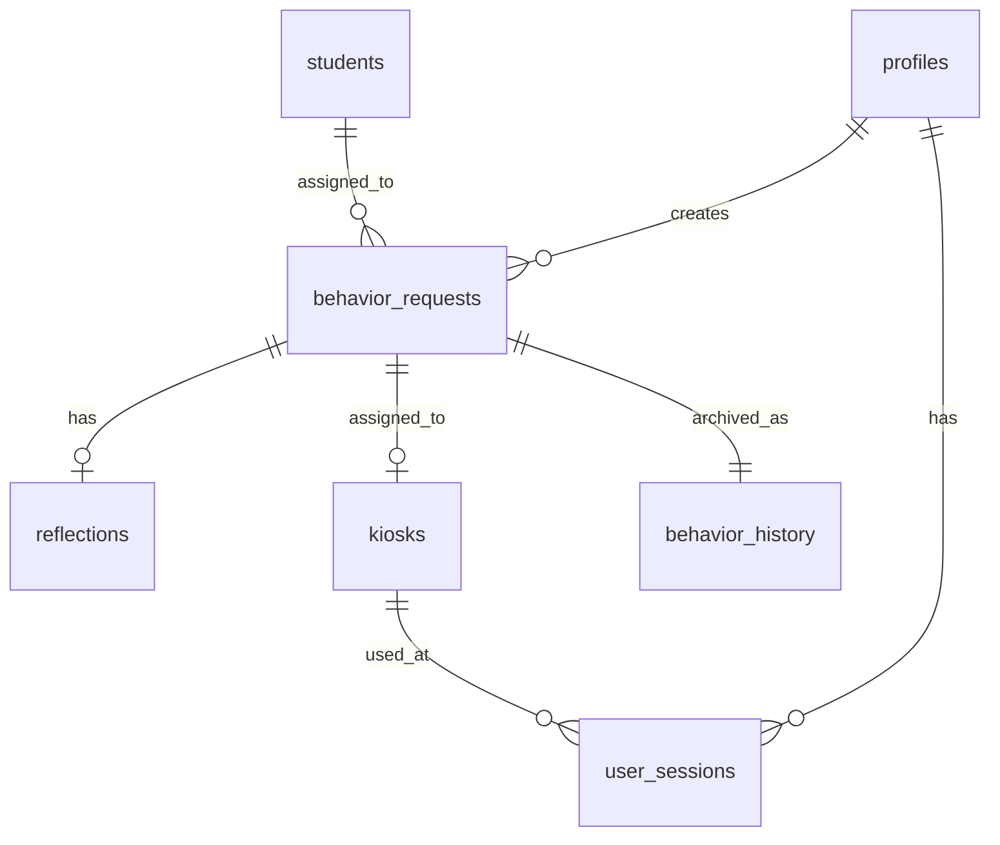

# Backend Documentation

## Architecture Overview

The backend is built on Supabase, providing a complete Backend-as-a-Service (BaaS) solution with PostgreSQL database, real-time subscriptions, authentication, and edge functions.

### Technology Stack

- **Supabase**: PostgreSQL database with real-time features
- **PostgreSQL**: Relational database with advanced features
- **Row Level Security (RLS)**: Fine-grained access control
- **Supabase Auth**: JWT-based authentication system
- **Edge Functions**: Serverless TypeScript functions
- **Real-time Subscriptions**: WebSocket-based live updates

## Database Schema

### Core Tables

#### `students`
```sql
CREATE TABLE public.students (
  id UUID NOT NULL DEFAULT gen_random_uuid() PRIMARY KEY,
  name TEXT NOT NULL,
  grade TEXT,
  class_name TEXT,
  created_at TIMESTAMP WITH TIME ZONE NOT NULL DEFAULT now(),
  updated_at TIMESTAMP WITH TIME ZONE NOT NULL DEFAULT now()
);
```

Student records for the behavior support system.

#### `profiles`
```sql
CREATE TABLE public.profiles (
  id UUID NOT NULL DEFAULT NULL PRIMARY KEY,
  full_name TEXT,
  email TEXT,
  role TEXT NOT NULL DEFAULT 'teacher'::text,
  created_at TIMESTAMP WITH TIME ZONE NOT NULL DEFAULT now(),
  updated_at TIMESTAMP WITH TIME ZONE NOT NULL DEFAULT now()
);
```

User profile information linked to Supabase Auth users.

#### `behavior_requests`
```sql
CREATE TABLE public.behavior_requests (
  id UUID NOT NULL DEFAULT gen_random_uuid() PRIMARY KEY,
  student_id UUID NOT NULL,
  teacher_id UUID NOT NULL,
  urgent BOOLEAN NOT NULL DEFAULT false,
  assigned_kiosk_id INTEGER,
  mood TEXT NOT NULL,
  behaviors TEXT[] NOT NULL DEFAULT '{}'::text[],
  status TEXT NOT NULL DEFAULT 'waiting'::text,
  notes TEXT,
  created_at TIMESTAMP WITH TIME ZONE NOT NULL DEFAULT now(),
  updated_at TIMESTAMP WITH TIME ZONE NOT NULL DEFAULT now()
);
```

Active behavior support requests in the queue system.

#### `behavior_history`
```sql
CREATE TABLE public.behavior_history (
  id UUID NOT NULL DEFAULT gen_random_uuid() PRIMARY KEY,
  original_request_id UUID NOT NULL,
  student_id UUID NOT NULL,
  teacher_id UUID NOT NULL,
  student_name TEXT NOT NULL,
  student_grade TEXT,
  student_class_name TEXT,
  teacher_name TEXT,
  teacher_email TEXT,
  mood TEXT NOT NULL,
  behaviors TEXT[] NOT NULL DEFAULT '{}'::text[],
  urgent BOOLEAN NOT NULL DEFAULT false,
  notes TEXT,
  assigned_kiosk_id INTEGER,
  kiosk_name TEXT,
  kiosk_location TEXT,
  device_type TEXT,
  device_location TEXT,
  queue_position INTEGER,
  queue_created_at TIMESTAMP WITH TIME ZONE NOT NULL DEFAULT now(),
  queue_started_at TIMESTAMP WITH TIME ZONE,
  time_in_queue_minutes INTEGER,
  session_id UUID,
  reflection_id UUID,
  question1 TEXT,
  question2 TEXT,
  question3 TEXT,
  question4 TEXT,
  teacher_feedback TEXT,
  intervention_outcome TEXT NOT NULL DEFAULT 'approved'::text,
  completion_status TEXT NOT NULL DEFAULT 'completed'::text,
  completed_at TIMESTAMP WITH TIME ZONE NOT NULL DEFAULT now(),
  created_at TIMESTAMP WITH TIME ZONE NOT NULL DEFAULT now(),
  updated_at TIMESTAMP WITH TIME ZONE NOT NULL DEFAULT now()
);
```

Historical record of all completed behavior interventions for analytics and reporting.

#### `reflections`
```sql
CREATE TABLE public.reflections (
  id UUID NOT NULL DEFAULT gen_random_uuid() PRIMARY KEY,
  behavior_request_id UUID NOT NULL,
  question1 TEXT NOT NULL,
  question2 TEXT NOT NULL,
  question3 TEXT NOT NULL,
  question4 TEXT NOT NULL,
  status TEXT NOT NULL DEFAULT 'pending'::text,
  teacher_feedback TEXT,
  created_at TIMESTAMP WITH TIME ZONE NOT NULL DEFAULT now(),
  updated_at TIMESTAMP WITH TIME ZONE NOT NULL DEFAULT now()
);
```

Student reflection responses for behavior incidents.

#### `kiosks`
```sql
CREATE TABLE public.kiosks (
  id INTEGER NOT NULL DEFAULT nextval('kiosks_id_seq'::regclass) PRIMARY KEY,
  name TEXT NOT NULL,
  location TEXT,
  is_active BOOLEAN NOT NULL DEFAULT true,
  current_student_id UUID,
  current_behavior_request_id UUID,
  activated_at TIMESTAMP WITH TIME ZONE,
  activated_by UUID,
  created_at TIMESTAMP WITH TIME ZONE NOT NULL DEFAULT now(),
  updated_at TIMESTAMP WITH TIME ZONE NOT NULL DEFAULT now()
);
```

Physical kiosk stations where students complete reflections.

#### `user_sessions`
```sql
CREATE TABLE public.user_sessions (
  id UUID NOT NULL DEFAULT gen_random_uuid() PRIMARY KEY,
  user_id UUID NOT NULL,
  device_type TEXT NOT NULL,
  device_identifier TEXT,
  location TEXT,
  kiosk_id INTEGER,
  session_status TEXT NOT NULL DEFAULT 'active'::text,
  login_time TIMESTAMP WITH TIME ZONE NOT NULL DEFAULT now(),
  last_activity TIMESTAMP WITH TIME ZONE NOT NULL DEFAULT now(),
  metadata JSONB DEFAULT '{}'::jsonb,
  created_at TIMESTAMP WITH TIME ZONE NOT NULL DEFAULT now(),
  updated_at TIMESTAMP WITH TIME ZONE NOT NULL DEFAULT now()
);
```

User session tracking for monitoring and analytics.

### Database Relationships



## Row Level Security (RLS)

### Security Model

All tables implement Row Level Security to ensure data access follows the principle of least privilege.

#### Teachers and Admins
- Can view, create, and update behavior requests, reflections, and student records
- Cannot delete historical data (behavior_history)
- Admins have additional permissions for user management and system configuration

#### Authentication Required
- All operations require valid JWT authentication
- Public access is disabled for all sensitive tables

### Example RLS Policies

```sql
-- Teachers and admins can view behavior requests
CREATE POLICY "Teachers and admins can view behavior requests" 
ON public.behavior_requests 
FOR SELECT 
USING (
  EXISTS (
    SELECT 1 FROM profiles 
    WHERE profiles.id = auth.uid() 
    AND profiles.role = ANY (ARRAY['teacher'::text, 'admin'::text])
  )
);

-- Users can view their own sessions
CREATE POLICY "Users can view their own sessions" 
ON public.user_sessions 
FOR SELECT 
USING (auth.uid() = user_id);

-- Admins can manage any session
CREATE POLICY "Admins can update any session" 
ON public.user_sessions 
FOR UPDATE 
USING (
  EXISTS (
    SELECT 1 FROM profiles 
    WHERE profiles.id = auth.uid() 
    AND profiles.role = 'admin'::text
  )
);
```

## Authentication System

### JWT-Based Authentication

Supabase Auth provides secure, standards-based authentication:

- **Access Tokens**: Short-lived JWT tokens for API access
- **Refresh Tokens**: Long-lived tokens for renewing access
- **Role-Based Access**: User roles stored in profiles table
- **Session Management**: Automatic token refresh and logout

### User Registration Flow

1. User submits registration form
2. Supabase creates auth.users record
3. Trigger creates corresponding profiles record
4. Email verification sent (optional)
5. User can sign in after verification

### Authorization Levels

- **Teacher**: Can create and manage behavior requests, review reflections
- **Admin**: Full system access including user management and kiosk control
- **Student**: No direct access (kiosks use teacher authentication)

## Real-time Features

### Supabase Realtime

WebSocket-based real-time subscriptions provide live updates:

```javascript
// Subscribe to behavior request changes
const subscription = supabase
  .channel('behavior_requests')
  .on('postgres_changes', 
    { event: '*', schema: 'public', table: 'behavior_requests' },
    handleRealtimeUpdate
  )
  .subscribe();
```

### Real-time Use Cases

1. **Queue Updates**: New behavior requests appear instantly in all dashboards
2. **Kiosk Status**: Activation/deactivation propagates to admin dashboards
3. **Reflection Submissions**: Teachers see completed reflections immediately
4. **Session Monitoring**: Active sessions update in real-time

## API Patterns

### Supabase Client Operations

#### Query Operations
```javascript
// Fetch behavior requests with related data
const { data, error } = await supabase
  .from('behavior_requests')
  .select(`
    *,
    student:students(*),
    teacher:profiles(*),
    reflection:reflections(*)
  `)
  .eq('status', 'waiting')
  .order('created_at', { ascending: true });
```

#### Insert Operations
```javascript
// Create new behavior request
const { data, error } = await supabase
  .from('behavior_requests')
  .insert({
    student_id: studentId,
    teacher_id: teacherId,
    mood: 'frustrated',
    behaviors: ['disruption', 'defiance'],
    urgent: false,
    notes: 'Student needs reflection time'
  })
  .select()
  .single();
```

#### Update Operations
```javascript
// Update reflection status
const { error } = await supabase
  .from('reflections')
  .update({ 
    status: 'approved',
    teacher_feedback: feedback 
  })
  .eq('id', reflectionId);
```

### Error Handling

Comprehensive error handling for all database operations:

```javascript
const handleDatabaseOperation = async (operation) => {
  try {
    const { data, error } = await operation();
    
    if (error) {
      console.error('Database error:', error);
      throw new Error(error.message);
    }
    
    return data;
  } catch (err) {
    console.error('Operation failed:', err);
    throw err;
  }
};
```

## Data Integrity

### Database Constraints

- **Foreign Key Constraints**: Ensure referential integrity
- **Check Constraints**: Validate data values (e.g., valid mood values)
- **Unique Constraints**: Prevent duplicate records
- **Not Null Constraints**: Ensure required fields are populated

### Triggers and Functions

#### Automatic Timestamp Updates
```sql
CREATE OR REPLACE FUNCTION public.update_updated_at_column()
RETURNS TRIGGER AS $$
BEGIN
  NEW.updated_at = now();
  RETURN NEW;
END;
$$ LANGUAGE plpgsql;

-- Apply to all tables
CREATE TRIGGER update_behavior_requests_updated_at
  BEFORE UPDATE ON public.behavior_requests
  FOR EACH ROW
  EXECUTE FUNCTION public.update_updated_at_column();
```

#### Data Archival
Automatic archival of completed behavior requests to behavior_history table:

```sql
-- Trigger function to archive completed interventions
CREATE OR REPLACE FUNCTION archive_completed_intervention()
RETURNS TRIGGER AS $$
BEGIN
  -- Insert into behavior_history when request is approved
  INSERT INTO public.behavior_history (
    original_request_id,
    student_id,
    teacher_id,
    -- ... other fields
  ) VALUES (
    OLD.id,
    OLD.student_id,
    OLD.teacher_id,
    -- ... other values
  );
  
  RETURN OLD;
END;
$$ LANGUAGE plpgsql;
```

## Performance Optimization

### Database Indexing

Strategic indexes for common query patterns:

```sql
-- Index for queue ordering
CREATE INDEX idx_behavior_requests_queue 
ON behavior_requests(status, created_at) 
WHERE status = 'waiting';

-- Index for student lookups
CREATE INDEX idx_behavior_requests_student 
ON behavior_requests(student_id);

-- Index for teacher filtering
CREATE INDEX idx_behavior_requests_teacher 
ON behavior_requests(teacher_id);

-- Composite index for kiosk assignment
CREATE INDEX idx_behavior_requests_kiosk_status 
ON behavior_requests(assigned_kiosk_id, status);
```

### Query Optimization

- **Select Specific Columns**: Avoid SELECT * in production queries
- **Use Appropriate Joins**: Inner joins for required relationships
- **Limit Result Sets**: Implement pagination for large datasets
- **Filter Early**: Apply WHERE clauses before JOINs when possible

### Connection Pooling

Supabase provides built-in connection pooling:
- **Session Mode**: For simple queries and transactions
- **Transaction Mode**: For single queries with lower latency
- **Statement Mode**: For maximum throughput

## Monitoring and Analytics

### Database Metrics

Monitor key performance indicators:
- **Query Performance**: Slow query logs and execution plans
- **Connection Usage**: Active connections and pool utilization
- **Storage Growth**: Table sizes and index usage
- **Real-time Activity**: Subscription counts and message volume

### Error Tracking

Comprehensive error logging:
- **Database Errors**: Constraint violations and query failures
- **Authentication Errors**: Failed login attempts and token issues
- **Real-time Errors**: Subscription failures and connection drops
- **Performance Issues**: Slow queries and timeout errors

## Backup and Recovery

### Automated Backups

Supabase provides automated daily backups:
- **Point-in-Time Recovery**: Restore to any point within retention period
- **Full Database Backups**: Complete schema and data snapshots
- **Incremental Backups**: Efficient storage of changes only

### Disaster Recovery

- **Multi-Region Availability**: Deploy across multiple regions
- **Read Replicas**: Distribute read traffic and provide failover
- **Data Export**: Regular exports for external backup storage

## Security Best Practices

### Data Protection

- **Encryption at Rest**: All data encrypted using AES-256
- **Encryption in Transit**: TLS 1.3 for all connections
- **Access Logging**: Comprehensive audit trail of all operations
- **Data Anonymization**: Sensitive data masked in non-production environments

### Security Monitoring

- **Unusual Access Patterns**: Automated detection of suspicious activity
- **Failed Authentication**: Monitoring and alerting for brute force attempts
- **Privilege Escalation**: Alerts for unauthorized permission changes
- **Data Exfiltration**: Detection of unusual data access volumes

## Future Enhancements

### Planned Improvements

1. **Advanced Analytics**: Behavior pattern analysis and predictive modeling
2. **Data Warehouse**: Separate analytical database for reporting
3. **API Rate Limiting**: Enhanced protection against abuse
4. **Audit Trail**: Comprehensive change tracking for compliance
5. **Automated Testing**: Database migration and query testing
6. **Performance Monitoring**: Real-time query performance dashboards

### Scalability Considerations

1. **Horizontal Scaling**: Read replicas for increased throughput
2. **Partitioning**: Table partitioning for large historical data
3. **Caching**: Redis layer for frequently accessed data
4. **CDN Integration**: Asset delivery optimization
5. **Microservices**: Breaking down monolithic functions