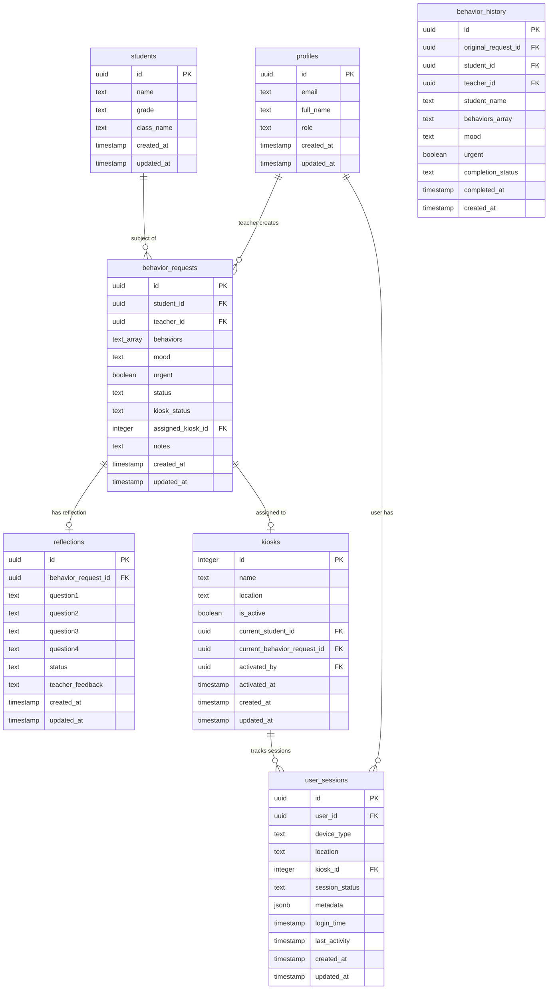

# Database Schema Documentation

## Schema Overview

The Behavior Support System uses a PostgreSQL database hosted on Supabase with comprehensive Row Level Security (RLS) policies. The schema supports a complete workflow from behavior incident reporting through student reflection and administrative oversight.

## Visual Database Schema

## Data Flow Overview

**Workflow**: BSR Creation → Queue → Kiosk Assignment → Reflection → Review → Archive

**Status Progression**:
- `waiting` → `ready` → `in_progress` → `completed` → `approved`

## Security Model

All tables implement Row Level Security (RLS) with role-based policies:
- **Teachers**: Can view/manage their own requests
- **Admins**: Full system access
- **Students**: Limited kiosk interface access

## Key Features

- Real-time subscriptions for live updates
- Automated archival to behavior_history
- Session tracking and management
- Comprehensive audit trails
- Performance-optimized indexes