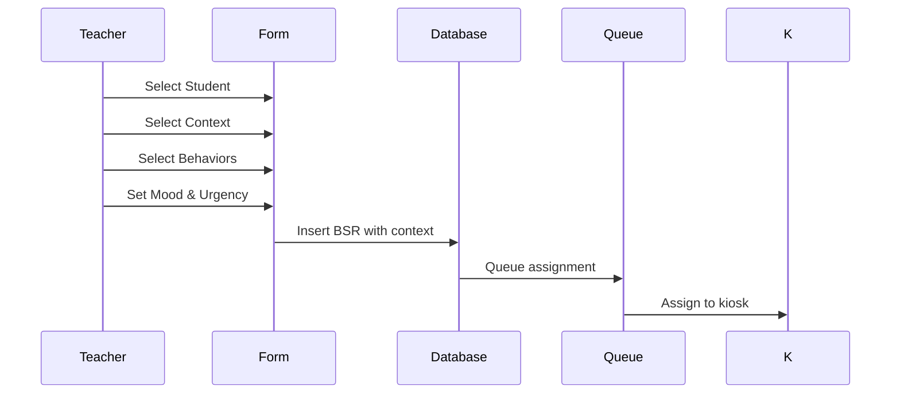

# Antecedent (Context) Feature Technical Specification

## Overview

The Antecedent Feature enhances BX-OS behavior logging by adding structured context capture that identifies what students were doing immediately before behavioral incidents occurred. This aligns with clinical best practices for behavior analysis while maintaining teacher-friendly workflows.

## Clinical Foundation

### Antecedent-Behavior-Consequence (ABC) Model
The feature implements the ABC model where:
- **Antecedent**: Environmental context that triggers behavior
- **Behavior**: Observable student actions  
- **Consequence**: Responses to the behavior

By capturing antecedent data, the system enables:
- Pattern recognition across instructional contexts
- Data-driven intervention planning
- Evidence-based behavior support strategies

### Unified Context Labels
Six context categories provide clinical relevance while remaining intuitive for teachers:

1. **Frontal teaching (lecture)** - Teacher-led whole class instruction
2. **Individual quiet classwork** - Independent student work
3. **Group/partner classwork** - Collaborative peer activities
4. **Group discussion** - Class discussions and sharing
5. **Test/Quiz** - Assessment activities
6. **Transitions** - Movement between activities/locations

## Database Design

### New Tables

#### `antecedent_contexts`
```sql
CREATE TABLE antecedent_contexts (
  id UUID PRIMARY KEY DEFAULT gen_random_uuid(),
  key TEXT UNIQUE NOT NULL,              -- Machine-readable identifier
  label TEXT NOT NULL,                   -- Display label for UI
  description TEXT,                      -- Detailed explanation
  sort_order INTEGER NOT NULL,           -- Display ordering
  created_at TIMESTAMP WITH TIME ZONE DEFAULT now(),
  updated_at TIMESTAMP WITH TIME ZONE DEFAULT now()
);
```

### Enhanced `behavior_requests` Table
```sql
ALTER TABLE behavior_requests ADD COLUMN:
- antecedent_context_id UUID REFERENCES antecedent_contexts(id)
- urgency_level TEXT CHECK (urgency_level IN ('standard','re_integration','urgent'))
- teacher_mood INTEGER CHECK (teacher_mood BETWEEN 1 AND 5)  
- note TEXT
```

## User Interface Design

### 4-Step Wizard Flow

1. **Student Selection** (unchanged)
   - Search and select student
   - Existing validation and UI patterns

2. **Context Selection** (NEW)
   - 6 context buttons with unified labels
   - Single selection requirement
   - Consistent styling with behavior selection

3. **Behavior Selection** (enhanced)
   - Multiple behavior selection support
   - Existing color-coded categories
   - Maintains current visual design

4. **Review & Submit** (NEW)
   - Summary with colored chips
   - Teacher mood slider (1-5 scale)
   - Urgency level selector
   - Optional notes field
   - Final submission

### Progress Indication
- Clear "Step X of 4" display
- Visual progress bar
- Navigation between steps

## Component Architecture

### New Components

#### `ActivitySelection`
- Models existing `BehaviorSelection` component
- Single selection logic (radio button style)
- Displays unified context labels
- Consistent grid layout and styling

#### `ReviewScreen` 
- Summary display with colored selection chips
- Teacher mood slider integration
- Urgency level segmented control
- Notes field with future quick-select support
- Final submission validation

### Enhanced Components

#### `CreateBSRForm`
- Extended to 4-step wizard
- State management for new fields
- Progress tracking and validation
- Integration with enhanced submission flow

## Data Flow & Integration

### BSR Creation Flow


### Real-time Updates
- Context data included in queue subscriptions
- Maintains existing real-time functionality
- Backward compatibility with pre-context BSRs

## API Endpoints

### Context Management
```typescript
// Fetch available contexts
const { data: contexts } = await supabase
  .from('antecedent_contexts')
  .select('*')
  .order('sort_order');

// Create BSR with context
const { error } = await supabase
  .from('behavior_requests')
  .insert({
    student_id,
    teacher_id,
    behavior_type,
    antecedent_context_id,
    urgency_level,
    teacher_mood,
    note
  });
```

## Future-Proofing Considerations

### Analytics Foundation
- Context data enables pattern analysis
- Teacher mood tracking for system insights
- Urgency level data for queue optimization

### SIS Integration Readiness
- Unified labels suitable for external reporting
- Clinical terminology for professional documentation
- Structured data format for automated reports

### AI Enhancement Preparation
- Context-behavior correlation analysis
- Intervention suggestion engine foundation
- Pattern recognition training data

## Implementation Phases

### Phase 1: Core Feature (Current)
- Database schema with context table
- 4-step wizard implementation
- Basic context selection and review

### Phase 2: Quick-Select Notes
- Note suggestions based on context
- Dynamic recommendation system
- Enhanced teacher efficiency

### Phase 3: Analytics Integration
- Context pattern analysis
- Intervention effectiveness tracking
- Data-driven insights dashboard

### Phase 4: AI Enhancement
- Intelligent context recommendations
- Predictive behavior analysis
- Automated intervention suggestions

## Testing Strategy

### Component Testing
- Individual component functionality
- Multi-step wizard flow validation
- State management verification

### Integration Testing
- Database transaction integrity
- Real-time subscription compatibility
- Queue assignment with context data

### User Acceptance Testing
- Teacher workflow validation
- Clinical advisor review
- Performance under load

## Success Metrics

### Immediate (Phase 1)
- Successful BSR creation with context data
- Teacher adoption rate
- System performance maintenance

### Short-term (Phases 2-3)
- Improved teacher efficiency metrics
- Enhanced data quality scores
- Pattern recognition capabilities

### Long-term (Phase 4)
- Reduced behavioral incidents
- Improved intervention success rates
- Comprehensive behavior analytics

---

*This specification supports BX-OS evolution toward comprehensive behavior analysis while maintaining the simplicity and speed that teachers require.*