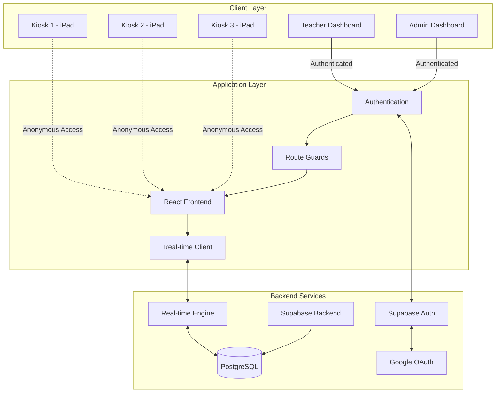
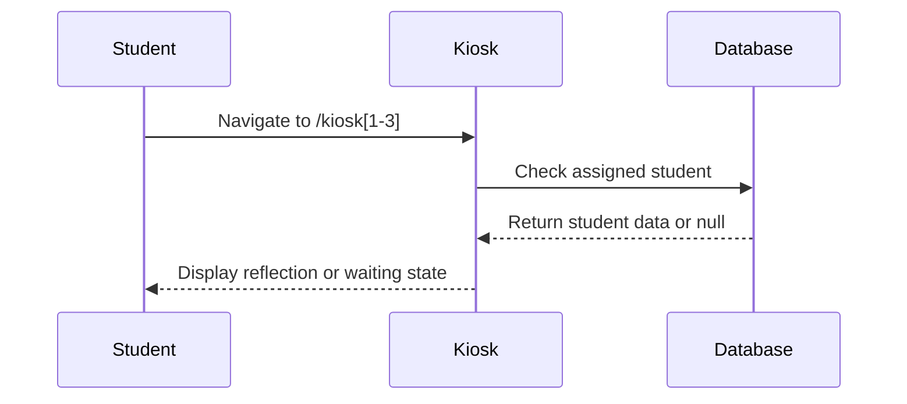
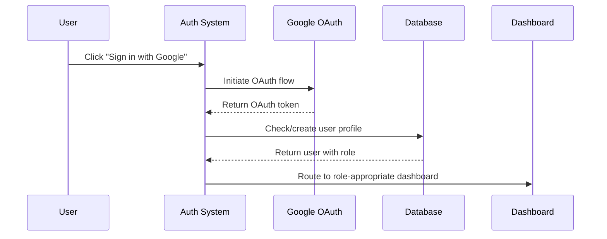
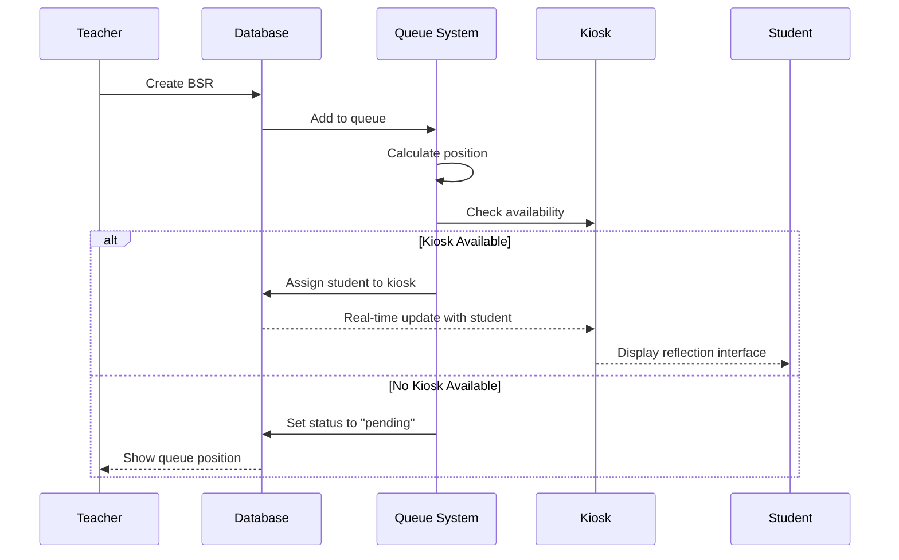

# System Architecture

## Overview

BX-OS is built on a modern web application stack optimized for real-time collaboration and role-based access control. The architecture supports anonymous student access while maintaining secure authentication for staff members.

## Technology Stack

### Frontend Framework
- **React 18.3**: Component-based UI with hooks for state management
- **TypeScript**: Type safety and enhanced developer experience
- **Vite**: Fast build tool and development server
- **Tailwind CSS**: Utility-first styling with custom design system

### Backend Services
- **Supabase**: PostgreSQL database with real-time subscriptions
- **Supabase Auth**: Google OAuth integration with automatic profile creation
- **Row Level Security**: Database-level access control policies
- **Real-time Subscriptions**: WebSocket connections for live updates

### Deployment Platform
- **Lovable Hosting**: Production deployment with custom domain support
- **CDN Distribution**: Global content delivery for optimal performance
- **SSL/TLS**: Automatic HTTPS with certificate management

## System Architecture Diagram


```mermaid
graph TB
    subgraph "Client Layer"
        K1[Kiosk 1 - iPad]
        K2[Kiosk 2 - iPad] 
        K3[Kiosk 3 - iPad]
        TD[Teacher Dashboard]
        AD[Admin Dashboard]
    end
    
    subgraph "Application Layer"
        RT[React Frontend]
        AU[Authentication]
        RG[Route Guards]
        RC[Real-time Client]
    end
    
    subgraph "Backend Services"
        SB[Supabase Backend]
        DB[(PostgreSQL)]
        RT_SUB[Real-time Engine]
        AUTH[Supabase Auth]
        GOOGLE[Google OAuth]
    end
    
    K1 -.->|Anonymous Access| RT
    K2 -.->|Anonymous Access| RT  
    K3 -.->|Anonymous Access| RT
    TD -->|Authenticated| AU
    AD -->|Authenticated| AU
    
    AU --> RG
    RG --> RT
    RT --> RC
    
    RC <--> RT_SUB
    AU <--> AUTH
    AUTH <--> GOOGLE
    RT_SUB <--> DB
    SB --> DB
```

## Component Architecture

### Authentication Layer

#### Anonymous Access (Kiosks)

```mermaid
sequenceDiagram
    participant S as Student
    participant K as Kiosk
    participant DB as Database
    
    S->>K: Navigate to /kiosk[1-3]
    K->>DB: Check assigned student
    DB-->>K: Return student data or null
    K-->>S: Display reflection or waiting state
```

#### Authenticated Access (Staff)

```mermaid
sequenceDiagram
    participant U as User
    participant A as Auth System
    participant G as Google OAuth
    participant DB as Database
    participant D as Dashboard
    
    U->>A: Click "Sign in with Google"
    A->>G: Initiate OAuth flow
    G-->>A: Return OAuth token
    A->>DB: Check/create user profile
    DB-->>A: Return user with role
    A->>D: Route to role-appropriate dashboard
```

### Route Protection System

#### Route Guard Implementation
```typescript
// Route protection flow
<AdminRoute>          // Checks for admin/super_admin role
  <AdminDashboard />  // Only accessible to administrators
</AdminRoute>

<TeacherRoute>        // Checks for teacher/admin/super_admin role  
  <TeacherDashboard />// Accessible to teachers and above
</TeacherRoute>

// Anonymous routes (no authentication required)
<Route path="/kiosk1" element={<KioskOnePage />} />
<Route path="/kiosk2" element={<KioskTwoPage />} />
<Route path="/kiosk3" element={<KioskThreePage />} />
```

### Data Flow Architecture

#### BSR Creation & Queue Management

```mermaid
sequenceDiagram
    participant T as Teacher
    participant DB as Database
    participant Q as Queue System
    participant K as Kiosk
    participant S as Student
    
    T->>DB: Create BSR
    DB->>Q: Add to queue
    Q->>Q: Calculate position
    Q->>K: Check availability
    alt Kiosk Available
        Q->>DB: Assign student to kiosk
        DB-->>K: Real-time update with student
        K-->>S: Display reflection interface
    else No Kiosk Available
        Q->>DB: Set status to "pending"
        DB-->>T: Show queue position
    end
```

## Database Architecture

### Core Tables Structure

```sql
-- User management and authentication
profiles (
  id UUID PRIMARY KEY,
  user_id UUID REFERENCES auth.users,
  email TEXT,
  role TEXT DEFAULT 'teacher',
  created_at TIMESTAMP
)

-- Student demographic data
students (
  id UUID PRIMARY KEY,
  student_id TEXT UNIQUE,
  first_name TEXT,
  last_name TEXT,
  grade INTEGER,
  homeroom TEXT,
  is_active BOOLEAN DEFAULT true
)

-- Behavioral support request tracking
behavior_requests (
  id UUID PRIMARY KEY,
  student_id UUID REFERENCES students,
  teacher_id UUID REFERENCES profiles,
  behavior_type TEXT,
  description TEXT,
  antecedent_context_id UUID REFERENCES antecedent_contexts,
  urgency_level TEXT DEFAULT 'standard',
  teacher_mood INTEGER,
  note TEXT,
  status TEXT DEFAULT 'waiting',
  created_at TIMESTAMP
)

-- Antecedent context reference table
antecedent_contexts (
  id UUID PRIMARY KEY,
  key TEXT UNIQUE,
  label TEXT,
  description TEXT,
  sort_order INTEGER,
  created_at TIMESTAMP
)

-- Kiosk station management
kiosks (
  id INTEGER PRIMARY KEY,
  name TEXT NOT NULL,
  is_active BOOLEAN DEFAULT false,
  current_student_id UUID REFERENCES students,
  current_behavior_request_id UUID REFERENCES behavior_requests,
  last_heartbeat TIMESTAMP DEFAULT now(),
  created_at TIMESTAMP DEFAULT now()
)

-- Student reflection responses
reflections (
  id UUID PRIMARY KEY,
  student_id UUID REFERENCES students,
  behavior_request_id UUID REFERENCES behavior_requests,
  mood_rating INTEGER,
  question_1_response TEXT,
  question_2_response TEXT,
  question_3_response TEXT,
  question_4_response TEXT,
  submitted_at TIMESTAMP DEFAULT now(),
  teacher_approved BOOLEAN DEFAULT false,
  teacher_feedback TEXT
)
```

### Row Level Security Policies

```sql
-- Users can only see their own profile
CREATE POLICY "Users can view own profile" ON profiles
  FOR SELECT USING (auth.uid() = user_id);

-- Teachers can see all students for BSR creation
CREATE POLICY "Teachers can view students" ON students
  FOR SELECT USING (
    EXISTS (
      SELECT 1 FROM profiles 
      WHERE user_id = auth.uid() 
      AND role IN ('teacher', 'admin', 'super_admin')
    )
  );

-- BSRs are visible to creator and administrators
CREATE POLICY "BSR visibility" ON behavior_support_requests
  FOR SELECT USING (
    teacher_id = (SELECT id FROM profiles WHERE user_id = auth.uid())
    OR EXISTS (
      SELECT 1 FROM profiles 
      WHERE user_id = auth.uid() 
      AND role IN ('admin', 'super_admin')
    )
  );
```

## Real-Time System

### Subscription Architecture
```typescript
// Real-time behavior request updates
const { data: queueItems } = useSupabaseQuery({
  queryKey: ['behavior_requests'],
  queryFn: async () => {
    const { data } = await supabase
      .from('behavior_requests')
      .select(`
        *,
        students(first_name, last_name, grade),
        kiosks(id, name, is_active),
        reflections(id, submitted_at, teacher_approved)
      `)
      .order('created_at', { ascending: false });
    return data;
  }
});

// Subscribe to real-time changes
useEffect(() => {
  const subscription = supabase
    .channel('behavior_request_changes')
    .on('postgres_changes', 
      { event: '*', schema: 'public', table: 'behavior_requests' },
      (payload) => {
        queryClient.invalidateQueries(['behavior_requests']);
      }
    )
    .on('postgres_changes', 
      { event: '*', schema: 'public', table: 'reflections' },
      (payload) => {
        queryClient.invalidateQueries(['behavior_requests']);
      }
    )
    .subscribe();

  return () => subscription.unsubscribe();
}, []);
```

## Security Architecture

### Authentication Security
- **Google OAuth integration**: Leverages school domain authentication
- **Supabase Auth**: Secure token management and session handling
- **Role-based access**: Database-level security policies
- **Anonymous kiosk access**: No authentication required for students

### Data Protection
- **Row Level Security**: Database policies prevent unauthorized data access
- **Role validation**: Server-side role checking for all operations
- **Audit trails**: Complete logging of all BSR creation and completion
- **HTTPS enforcement**: All communications encrypted in transit

### Privacy Considerations
- **Student anonymity**: Kiosks require no login or identification
- **Data minimization**: Only necessary information collected and stored
- **Access logging**: Administrative actions tracked for compliance
- **Role separation**: Clear boundaries between teacher and admin capabilities

## Performance Architecture

### Optimization Strategies
- **Real-time subscriptions**: Efficient WebSocket connections
- **Query optimization**: Selective data fetching with proper indexing
- **Component lazy loading**: Reduced initial bundle size
- **Mobile optimization**: Touch-friendly interfaces for iPad kiosks

### Scalability Considerations
- **Stateless design**: No server-side state for easy horizontal scaling
- **Database indexing**: Optimized queries for queue and student lookups
- **CDN distribution**: Global content delivery for consistent performance
- **Concurrent usage**: Designed for multiple simultaneous users

---

*This architecture supports the current deployment of 3 kiosks serving 159 middle school students with multiple concurrent staff users.*