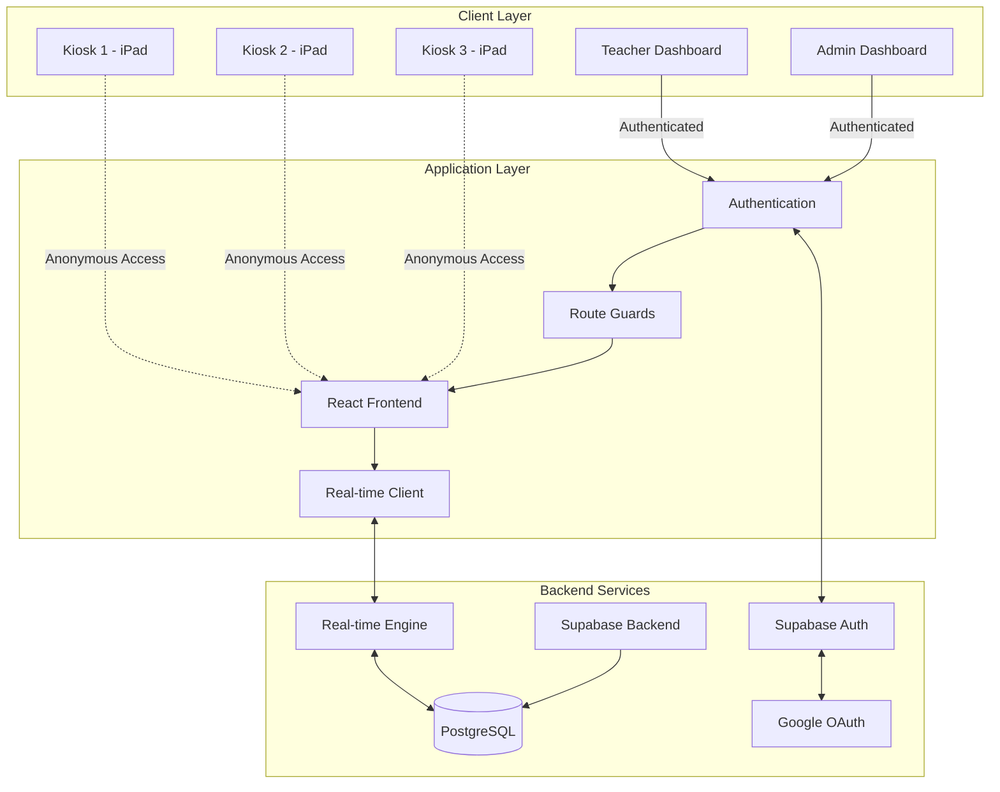
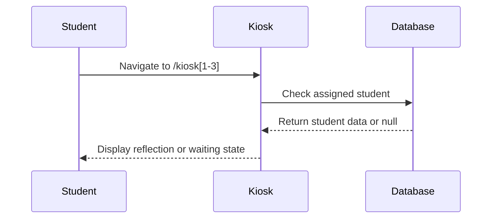
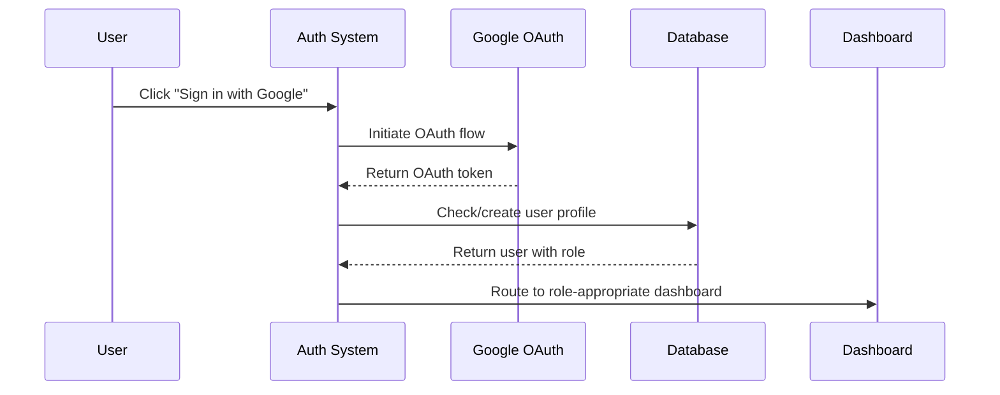
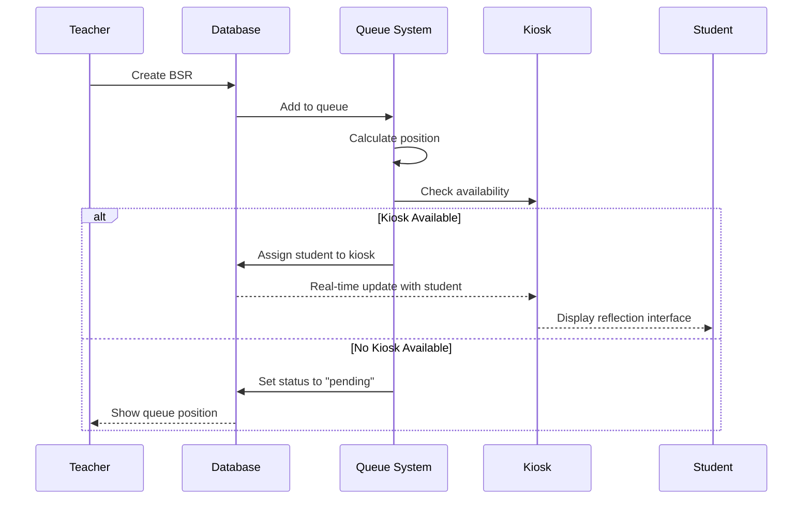

# System Architecture

## Overview

BX-OS is built on a modern web application stack optimized for real-time collaboration and role-based access control. The architecture supports anonymous student access while maintaining secure authentication for staff members.

## Technology Stack

### Frontend Framework
- **React 18.3**: Component-based UI with hooks for state management
- **TypeScript**: Type safety and enhanced developer experience
- **Vite**: Fast build tool and development server
- **Tailwind CSS**: Utility-first styling with custom design system

### Backend Services
- **Supabase**: PostgreSQL database with real-time subscriptions
- **Supabase Auth**: Google OAuth integration with automatic profile creation
- **Row Level Security**: Database-level access control policies
- **Real-time Subscriptions**: WebSocket connections for live updates

### Deployment Platform
- **Lovable Hosting**: Production deployment with custom domain support
- **CDN Distribution**: Global content delivery for optimal performance
- **SSL/TLS**: Automatic HTTPS with certificate management

## System Architecture Diagram



## Component Architecture

### Authentication Layer

#### Anonymous Access (Kiosks)


#### Authenticated Access (Staff)


### Route Protection System

#### Route Guard Implementation
```typescript
// Route protection flow
<AdminRoute>          // Checks for admin/super_admin role
  <AdminDashboard />  // Only accessible to administrators
</AdminRoute>

<TeacherRoute>        // Checks for teacher/admin/super_admin role  
  <TeacherDashboard />// Accessible to teachers and above
</TeacherRoute>

// Anonymous routes (no authentication required)
<Route path="/kiosk1" element={<KioskOnePage />} />
<Route path="/kiosk2" element={<KioskTwoPage />} />
<Route path="/kiosk3" element={<KioskThreePage />} />
```

### Data Flow Architecture

#### BSR Creation & Queue Management


## Database Architecture

### Core Tables Structure

```sql
-- User management and authentication
profiles (
  id UUID PRIMARY KEY,
  user_id UUID REFERENCES auth.users,
  email TEXT,
  role TEXT DEFAULT 'teacher',
  created_at TIMESTAMP
)

-- Student demographic data
students (
  id UUID PRIMARY KEY,
  student_id TEXT UNIQUE,
  first_name TEXT,
  last_name TEXT,
  grade INTEGER,
  homeroom TEXT,
  is_active BOOLEAN DEFAULT true
)

-- Behavioral support request tracking
behavior_support_requests (
  id UUID PRIMARY KEY,
  student_id UUID REFERENCES students,
  teacher_id UUID REFERENCES profiles,
  behavior_category TEXT,
  description TEXT,
  status TEXT DEFAULT 'pending',
  created_at TIMESTAMP
)

-- Real-time queue management
queue_items (
  id UUID PRIMARY KEY,
  bsr_id UUID REFERENCES behavior_support_requests,
  student_id UUID REFERENCES students,
  kiosk_id INTEGER,
  position INTEGER,
  status TEXT DEFAULT 'waiting',
  assigned_at TIMESTAMP,
  completed_at TIMESTAMP
)
```

### Row Level Security Policies

```sql
-- Users can only see their own profile
CREATE POLICY "Users can view own profile" ON profiles
  FOR SELECT USING (auth.uid() = user_id);

-- Teachers can see all students for BSR creation
CREATE POLICY "Teachers can view students" ON students
  FOR SELECT USING (
    EXISTS (
      SELECT 1 FROM profiles 
      WHERE user_id = auth.uid() 
      AND role IN ('teacher', 'admin', 'super_admin')
    )
  );

-- BSRs are visible to creator and administrators
CREATE POLICY "BSR visibility" ON behavior_support_requests
  FOR SELECT USING (
    teacher_id = (SELECT id FROM profiles WHERE user_id = auth.uid())
    OR EXISTS (
      SELECT 1 FROM profiles 
      WHERE user_id = auth.uid() 
      AND role IN ('admin', 'super_admin')
    )
  );
```

## Real-Time System

### Subscription Architecture
```typescript
// Real-time queue updates
const { data: queueItems } = useSupabaseQuery({
  queryKey: ['queue_items'],
  queryFn: async () => {
    const { data } = await supabase
      .from('queue_items')
      .select(`
        *,
        students(first_name, last_name, student_id),
        behavior_support_requests(behavior_category, description)
      `)
      .eq('status', 'waiting')
      .order('created_at');
    return data;
  }
});

// Subscribe to real-time changes
useEffect(() => {
  const subscription = supabase
    .channel('queue_changes')
    .on('postgres_changes', 
      { event: '*', schema: 'public', table: 'queue_items' },
      (payload) => {
        queryClient.invalidateQueries(['queue_items']);
      }
    )
    .subscribe();

  return () => subscription.unsubscribe();
}, []);
```

## Security Architecture

### Authentication Security
- **Google OAuth integration**: Leverages school domain authentication
- **Supabase Auth**: Secure token management and session handling
- **Role-based access**: Database-level security policies
- **Anonymous kiosk access**: No authentication required for students

### Data Protection
- **Row Level Security**: Database policies prevent unauthorized data access
- **Role validation**: Server-side role checking for all operations
- **Audit trails**: Complete logging of all BSR creation and completion
- **HTTPS enforcement**: All communications encrypted in transit

### Privacy Considerations
- **Student anonymity**: Kiosks require no login or identification
- **Data minimization**: Only necessary information collected and stored
- **Access logging**: Administrative actions tracked for compliance
- **Role separation**: Clear boundaries between teacher and admin capabilities

## Performance Architecture

### Optimization Strategies
- **Real-time subscriptions**: Efficient WebSocket connections
- **Query optimization**: Selective data fetching with proper indexing
- **Component lazy loading**: Reduced initial bundle size
- **Mobile optimization**: Touch-friendly interfaces for iPad kiosks

### Scalability Considerations
- **Stateless design**: No server-side state for easy horizontal scaling
- **Database indexing**: Optimized queries for queue and student lookups
- **CDN distribution**: Global content delivery for consistent performance
- **Concurrent usage**: Designed for multiple simultaneous users

---

*This architecture supports the current deployment of 3 kiosks serving 159 middle school students with multiple concurrent staff users.*