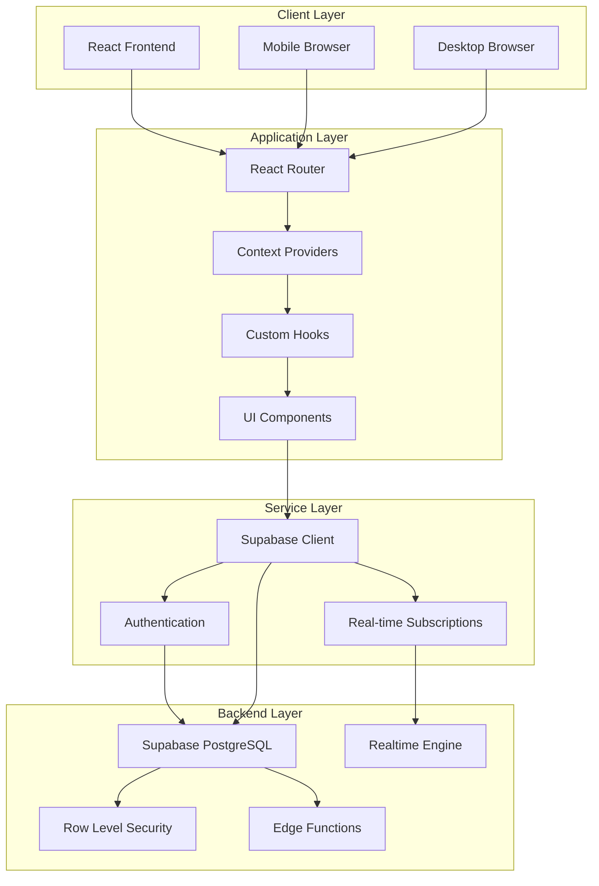
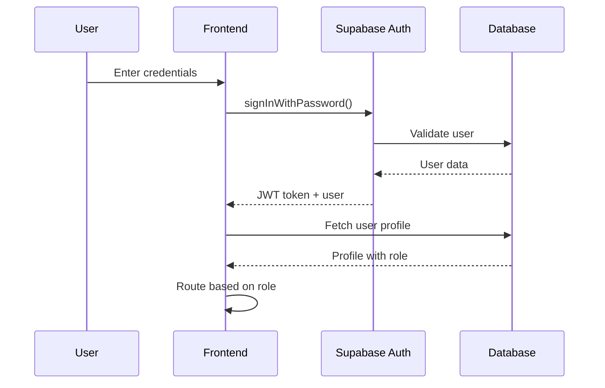

# Technical Documentation - Behavior Support System

## System Architecture

### High-Level Architecture



### Technology Stack

**Frontend Technologies**:
- **React 18**: Component-based UI framework with hooks
- **TypeScript**: Type-safe JavaScript development
- **Vite**: Fast build tool and development server
- **Tailwind CSS**: Utility-first CSS framework
- **React Router DOM**: Client-side routing
- **React Query**: Server state management and caching

**Backend Technologies**:
- **Supabase**: Backend-as-a-Service platform
- **PostgreSQL**: Relational database with advanced features
- **PostgREST**: Auto-generated REST API
- **GoTrue**: Authentication service
- **Realtime**: WebSocket-based real-time subscriptions

**UI Libraries**:
- **Radix UI**: Accessible component primitives
- **Shadcn/ui**: Pre-built component library
- **Lucide React**: Icon library
- **Class Variance Authority**: Component variant management

## Component Architecture

### Component Hierarchy

```
App
├── AuthProvider
│   ├── KioskProvider
│   │   ├── Router
│   │   │   ├── AuthPage
│   │   │   ├── TeacherDashboardPage
│   │   │   │   └── TeacherDashboard
│   │   │   │       ├── CreateBSRForm
│   │   │   │       ├── QueueDisplay
│   │   │   │       └── ReviewReflection
│   │   │   ├── AdminDashboardPage
│   │   │   │   └── AdminDashboard
│   │   │   │       ├── UserManagement
│   │   │   │       ├── SessionMonitor
│   │   │   │       └── EmptyState
│   │   │   └── KioskPages
│   │   │       ├── KioskOne
│   │   │       ├── KioskTwo
│   │   │       └── KioskThree
│   │   │           ├── StudentSelection
│   │   │           ├── BehaviorSelection
│   │   │           ├── MoodSlider
│   │   │           └── ReviewReflection
```

### Core Components

#### 1. TeacherDashboard (`src/components/TeacherDashboard.tsx`)

**Purpose**: Main interface for teachers to manage behavior requests

**Key Features**:
- Real-time queue monitoring
- BSR creation workflow
- Reflection review and approval
- Status tracking and updates

**Props Interface**:
```typescript
interface TeacherDashboardProps {
  // No props - uses context for data
}
```

**State Management**:
- Uses `useSupabaseQueue` for queue data
- Uses `useAuth` for user context
- Local state for modal controls and selections

**Key Methods**:
```typescript
const handleCreateBSR = async (request: BehaviorRequestInput) => {
  // Create new behavior request
};

const handleApproveReflection = async (reflectionId: string) => {
  // Approve student reflection
};

const handleStatusUpdate = async (requestId: string, status: string) => {
  // Update request status
};
```

#### 2. AdminDashboard (`src/components/AdminDashboard.tsx`)

**Purpose**: Administrative interface for system management

**Key Features**:
- User account management
- Kiosk activation and assignment
- Session monitoring
- System analytics

**State Management**:
- Uses `useActiveSessions` for session data
- Uses `useBehaviorHistory` for historical data
- Local state for user management

#### 3. KioskOne (`src/components/KioskOne.tsx`)

**Purpose**: Student-facing reflection interface

**Key Features**:
- Four-question reflection form
- Progress tracking
- Input validation
- Submission handling

**Workflow States**:
```typescript
type KioskStep = 'waiting' | 'welcome' | 'questions' | 'review' | 'complete';
```

### UI Component Library

#### Button System (`src/components/ui/button.tsx`)

**Variants**:
```typescript
const buttonVariants = cva(
  "inline-flex items-center justify-center rounded-md text-sm font-medium",
  {
    variants: {
      variant: {
        default: "bg-primary text-primary-foreground hover:bg-primary/90",
        destructive: "bg-destructive text-destructive-foreground hover:bg-destructive/90",
        outline: "border border-input bg-background hover:bg-accent hover:text-accent-foreground",
        secondary: "bg-secondary text-secondary-foreground hover:bg-secondary/80",
        ghost: "hover:bg-accent hover:text-accent-foreground",
        link: "text-primary underline-offset-4 hover:underline",
      },
      size: {
        default: "h-10 px-4 py-2",
        sm: "h-9 rounded-md px-3",
        lg: "h-11 rounded-md px-8",
        icon: "h-10 w-10",
      },
    },
  }
)
```

#### Card System (`src/components/ui/card.tsx`)

**Components**:
- `Card`: Container component
- `CardHeader`: Header section
- `CardTitle`: Title component
- `CardContent`: Main content area
- `CardFooter`: Footer section

## State Management

### Context Providers

#### 1. AuthContext (`src/contexts/AuthContext.tsx`)

**Purpose**: Global authentication state management

**State Interface**:
```typescript
interface AuthState {
  user: User | null;
  profile: Profile | null;
  loading: boolean;
  signIn: (email: string, password: string) => Promise<void>;
  signOut: () => Promise<void>;
  updateProfile: (updates: Partial<Profile>) => Promise<void>;
}
```

**Key Features**:
- Automatic token refresh
- Profile management
- Role-based routing
- Session persistence

#### 2. KioskContext (`src/contexts/KioskContext.tsx`)

**Purpose**: Kiosk state and management

**State Interface**:
```typescript
interface KioskState {
  kiosks: Kiosk[];
  loading: boolean;
  activateKiosk: (kioskId: number) => Promise<void>;
  deactivateKiosk: (kioskId: number) => Promise<void>;
  assignStudent: (kioskId: number, studentId: string) => Promise<void>;
}
```

### Custom Hooks

#### 1. useSupabaseQueue (`src/hooks/useSupabaseQueue.ts`)

**Purpose**: Manage behavior request queue with real-time updates

```typescript
export const useSupabaseQueue = () => {
  const [items, setItems] = useState<BehaviorRequest[]>([]);
  const [loading, setLoading] = useState(true);

  const createRequest = async (request: BehaviorRequestInput) => {
    // Create new behavior request
  };

  const updateStatus = async (id: string, status: string) => {
    // Update request status
  };

  const deleteRequest = async (id: string) => {
    // Delete behavior request
  };

  // Real-time subscription for queue updates
  useEffect(() => {
    const subscription = supabase
      .channel('behavior_requests')
      .on('postgres_changes', 
        { event: '*', schema: 'public', table: 'behavior_requests' },
        handleRealtimeUpdate
      )
      .subscribe();

    return () => subscription.unsubscribe();
  }, []);

  return {
    items,
    loading,
    createRequest,
    updateStatus,
    deleteRequest,
    refreshQueue: fetchQueue
  };
};
```

#### 2. useActiveSessions (`src/hooks/useActiveSessions.ts`)

**Purpose**: Track active user sessions with real-time updates

```typescript
interface ActiveSession {
  id: string;
  user_id: string;
  user_name: string;
  user_email: string;
  device_type: string;
  location: string;
  session_status: string;
  last_activity: string;
  login_time: string;
}

export const useActiveSessions = () => {
  const [sessions, setSessions] = useState<ActiveSession[]>([]);
  const [loading, setLoading] = useState(true);

  const endSession = async (sessionId: string) => {
    await supabase.rpc('end_user_session', { p_session_id: sessionId });
  };

  return { sessions, loading, endSession, refreshSessions };
};
```

#### 3. useBehaviorHistory (`src/hooks/useBehaviorHistory.ts`)

**Purpose**: Access historical behavior data for analytics

```typescript
export const useBehaviorHistory = () => {
  const [history, setHistory] = useState<BehaviorHistoryItem[]>([]);
  const [loading, setLoading] = useState(true);
  const [filters, setFilters] = useState<HistoryFilters>({});

  const exportData = async (format: 'csv' | 'json') => {
    // Export functionality
  };

  return { history, loading, filters, setFilters, exportData };
};
```

## API Integration

### Supabase Client Configuration

```typescript
// src/integrations/supabase/client.ts
import { createClient } from '@supabase/supabase-js';
import type { Database } from './types';

const SUPABASE_URL = "https://tuxvwpgwnnozubdpskhr.supabase.co";
const SUPABASE_PUBLISHABLE_KEY = "eyJhbGciOiJIUzI1NiIsInR5cCI6IkpXVCJ9...";

export const supabase = createClient<Database>(SUPABASE_URL, SUPABASE_PUBLISHABLE_KEY, {
  auth: {
    storage: localStorage,
    persistSession: true,
    autoRefreshToken: true,
  }
});
```

### Database Operations

#### Create Operations

```typescript
// Create behavior request
const createBehaviorRequest = async (request: BehaviorRequestInput) => {
  const { data, error } = await supabase
    .from('behavior_requests')
    .insert([{
      student_id: request.studentId,
      teacher_id: request.teacherId,
      behaviors: request.behaviors,
      mood: request.mood,
      urgent: request.urgent,
      notes: request.notes
    }])
    .select();

  if (error) throw error;
  return data[0];
};
```

#### Read Operations

```typescript
// Fetch active queue
const fetchActiveQueue = async () => {
  const { data, error } = await supabase
    .from('behavior_requests')
    .select(`
      *,
      students:student_id (name, grade, class_name),
      profiles:teacher_id (full_name, email),
      reflections (*)
    `)
    .in('status', ['waiting', 'in_progress'])
    .order('created_at', { ascending: true });

  if (error) throw error;
  return data;
};
```

#### Update Operations

```typescript
// Update request status
const updateRequestStatus = async (id: string, status: string) => {
  const { error } = await supabase
    .from('behavior_requests')
    .update({ status, updated_at: new Date().toISOString() })
    .eq('id', id);

  if (error) throw error;
};
```

### Real-time Subscriptions

```typescript
// Subscribe to queue changes
const subscribeToQueue = () => {
  return supabase
    .channel('behavior_requests_channel')
    .on(
      'postgres_changes',
      {
        event: '*',
        schema: 'public',
        table: 'behavior_requests'
      },
      (payload) => {
        console.log('Queue change detected:', payload);
        // Handle real-time update
        handleQueueUpdate(payload);
      }
    )
    .subscribe();
};

// Subscribe to reflection submissions
const subscribeToReflections = () => {
  return supabase
    .channel('reflections_channel')
    .on(
      'postgres_changes',
      {
        event: 'INSERT',
        schema: 'public',
        table: 'reflections'
      },
      (payload) => {
        console.log('New reflection submitted:', payload);
        handleNewReflection(payload.new);
      }
    )
    .subscribe();
};
```

## Authentication System

### Authentication Flow



### Session Management

```typescript
// Create user session
const createUserSession = async (userId: string, deviceInfo: any) => {
  const { data, error } = await supabase.rpc('create_user_session', {
    p_user_id: userId,
    p_device_type: deviceInfo.deviceType,
    p_location: deviceInfo.location,
    p_kiosk_id: deviceInfo.kioskId,
    p_device_identifier: deviceInfo.deviceIdentifier,
    p_metadata: deviceInfo.metadata
  });

  if (error) throw error;
  return data;
};

// Update session activity
const updateSessionActivity = async (sessionId: string) => {
  const { error } = await supabase.rpc('update_session_activity', {
    p_session_id: sessionId
  });

  if (error) throw error;
};
```

### Role-Based Access Control

```typescript
// Protected Route component
const ProtectedRoute: React.FC<{ children: React.ReactNode }> = ({ children }) => {
  const { user, profile, loading } = useAuth();

  if (loading) return <LoadingSpinner />;
  if (!user) return <Navigate to="/auth" />;
  if (!profile) return <Navigate to="/auth" />;

  return <>{children}</>;
};

// Role-specific route protection
const AdminRoute: React.FC<{ children: React.ReactNode }> = ({ children }) => {
  const { profile } = useAuth();

  if (profile?.role !== 'admin') {
    return <Navigate to="/teacher" />;
  }

  return <>{children}</>;
};
```

## Real-time Features

### WebSocket Connection Management

```typescript
class RealtimeManager {
  private subscriptions: Map<string, RealtimeChannel> = new Map();

  subscribe(channelName: string, config: SubscriptionConfig) {
    const channel = supabase.channel(channelName);
    
    config.tables.forEach(table => {
      channel.on(
        'postgres_changes',
        {
          event: table.event,
          schema: 'public',
          table: table.name,
          filter: table.filter
        },
        table.callback
      );
    });

    channel.subscribe((status) => {
      console.log(`Channel ${channelName} status:`, status);
    });

    this.subscriptions.set(channelName, channel);
    return channel;
  }

  unsubscribe(channelName: string) {
    const channel = this.subscriptions.get(channelName);
    if (channel) {
      channel.unsubscribe();
      this.subscriptions.delete(channelName);
    }
  }

  unsubscribeAll() {
    this.subscriptions.forEach((channel, name) => {
      channel.unsubscribe();
    });
    this.subscriptions.clear();
  }
}
```

### Real-time Data Synchronization

```typescript
// Queue synchronization
const useRealtimeQueue = () => {
  const [queue, setQueue] = useState<BehaviorRequest[]>([]);

  useEffect(() => {
    const channel = supabase
      .channel('queue_updates')
      .on(
        'postgres_changes',
        { event: '*', schema: 'public', table: 'behavior_requests' },
        (payload) => {
          switch (payload.eventType) {
            case 'INSERT':
              setQueue(prev => [...prev, payload.new as BehaviorRequest]);
              break;
            case 'UPDATE':
              setQueue(prev => prev.map(item => 
                item.id === payload.new.id ? payload.new as BehaviorRequest : item
              ));
              break;
            case 'DELETE':
              setQueue(prev => prev.filter(item => item.id !== payload.old.id));
              break;
          }
        }
      )
      .subscribe();

    return () => channel.unsubscribe();
  }, []);

  return queue;
};
```

## Error Handling

### Global Error Boundary

```typescript
class ErrorBoundary extends React.Component<
  { children: React.ReactNode },
  { hasError: boolean; error?: Error }
> {
  constructor(props: any) {
    super(props);
    this.state = { hasError: false };
  }

  static getDerivedStateFromError(error: Error) {
    return { hasError: true, error };
  }

  componentDidCatch(error: Error, errorInfo: React.ErrorInfo) {
    console.error('Application error:', error, errorInfo);
    // Send to error reporting service
  }

  render() {
    if (this.state.hasError) {
      return <ErrorFallback error={this.state.error} />;
    }

    return this.props.children;
  }
}
```

### Database Error Handling

```typescript
// Centralized error handling utility
export const handleDatabaseOperation = async <T>(
  operation: () => Promise<T>,
  errorMessage?: string
): Promise<T> => {
  try {
    return await operation();
  } catch (error: any) {
    console.error('Database operation failed:', error);
    
    let userMessage = errorMessage || 'An unexpected error occurred';
    
    if (error.code === 'PGRST116') {
      userMessage = 'No data found';
    } else if (error.code === '23505') {
      userMessage = 'This record already exists';
    } else if (error.code === '23503') {
      userMessage = 'Related record not found';
    }
    
    toast({
      title: "Error",
      description: userMessage,
      variant: "destructive",
    });
    
    throw error;
  }
};
```

## Performance Optimization

### Component Optimization

```typescript
// Memoized component
const QueueItem = React.memo<QueueItemProps>(({ item, onUpdate }) => {
  const handleStatusChange = useCallback(
    (newStatus: string) => onUpdate(item.id, newStatus),
    [item.id, onUpdate]
  );

  return (
    <Card className="queue-item">
      {/* Component content */}
    </Card>
  );
});

// Optimized list rendering
const QueueList: React.FC<{ items: BehaviorRequest[] }> = ({ items }) => {
  const sortedItems = useMemo(
    () => items.sort((a, b) => 
      new Date(a.created_at).getTime() - new Date(b.created_at).getTime()
    ),
    [items]
  );

  return (
    <div className="queue-list">
      {sortedItems.map(item => (
        <QueueItem key={item.id} item={item} onUpdate={handleUpdate} />
      ))}
    </div>
  );
};
```

### Query Optimization

```typescript
// Optimized data fetching with React Query
const useOptimizedQueue = () => {
  return useQuery({
    queryKey: ['behavior_requests', 'active'],
    queryFn: fetchActiveQueue,
    staleTime: 30000, // 30 seconds
    cacheTime: 300000, // 5 minutes
    refetchOnWindowFocus: false,
    retry: 3,
  });
};

// Prefetch related data
const prefetchStudentData = (studentIds: string[]) => {
  studentIds.forEach(id => {
    queryClient.prefetchQuery({
      queryKey: ['student', id],
      queryFn: () => fetchStudent(id),
      staleTime: 600000, // 10 minutes
    });
  });
};
```

## Testing Strategy

### Component Testing

```typescript
// Example component test
import { render, screen, fireEvent, waitFor } from '@testing-library/react';
import { TeacherDashboard } from '../TeacherDashboard';
import { AuthProvider } from '../../contexts/AuthContext';

const renderWithProviders = (component: React.ReactElement) => {
  return render(
    <AuthProvider>
      <QueryClientProvider client={testQueryClient}>
        {component}
      </QueryClientProvider>
    </AuthProvider>
  );
};

describe('TeacherDashboard', () => {
  test('displays active queue items', async () => {
    renderWithProviders(<TeacherDashboard />);
    
    await waitFor(() => {
      expect(screen.getByText('Active Queue')).toBeInTheDocument();
    });
    
    expect(screen.getByTestId('queue-list')).toBeInTheDocument();
  });

  test('creates new behavior request', async () => {
    renderWithProviders(<TeacherDashboard />);
    
    fireEvent.click(screen.getByText('Create Request'));
    
    await waitFor(() => {
      expect(screen.getByText('New Behavior Request')).toBeInTheDocument();
    });
  });
});
```

### Integration Testing

```typescript
// API integration tests
describe('Behavior Request API', () => {
  test('creates and retrieves behavior request', async () => {
    const requestData = {
      studentId: 'test-student-id',
      teacherId: 'test-teacher-id',
      behaviors: ['Disruptive'],
      mood: 'Agitated',
      urgent: false,
      notes: 'Test notes'
    };

    const created = await createBehaviorRequest(requestData);
    expect(created.id).toBeDefined();

    const retrieved = await fetchBehaviorRequest(created.id);
    expect(retrieved.behaviors).toEqual(['Disruptive']);
  });
});
```

## Deployment Configuration

### Build Configuration

```typescript
// vite.config.ts
import { defineConfig } from 'vite';
import react from '@vitejs/plugin-react-swc';
import path from 'path';

export default defineConfig({
  plugins: [react()],
  resolve: {
    alias: {
      "@": path.resolve(__dirname, "./src"),
    },
  },
  build: {
    outDir: 'dist',
    sourcemap: true,
    rollupOptions: {
      output: {
        manualChunks: {
          vendor: ['react', 'react-dom'],
          supabase: ['@supabase/supabase-js'],
          ui: ['@radix-ui/react-dialog', '@radix-ui/react-select'],
        }
      }
    }
  },
  server: {
    port: 5173,
    host: true
  }
});
```

### Environment Configuration

```typescript
// Environment variables (handled by Lovable)
const config = {
  supabase: {
    url: "https://tuxvwpgwnnozubdpskhr.supabase.co",
    anonKey: "eyJhbGciOiJIUzI1NiIsInR5cCI6IkpXVCJ9...",
  },
  app: {
    name: "Behavior Support System",
    version: "1.0.0",
    environment: "production"
  }
};
```

This technical documentation provides a comprehensive overview of the system's architecture, implementation details, and best practices for development and deployment.