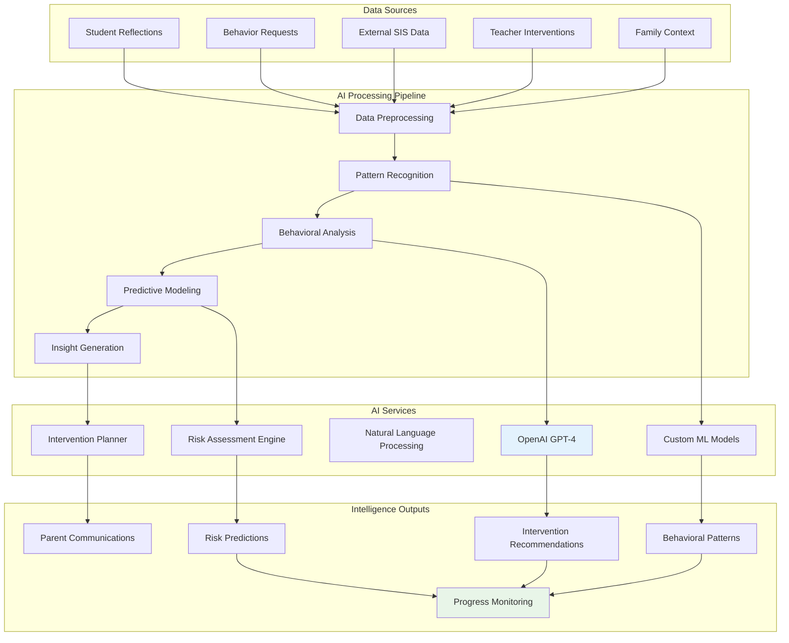
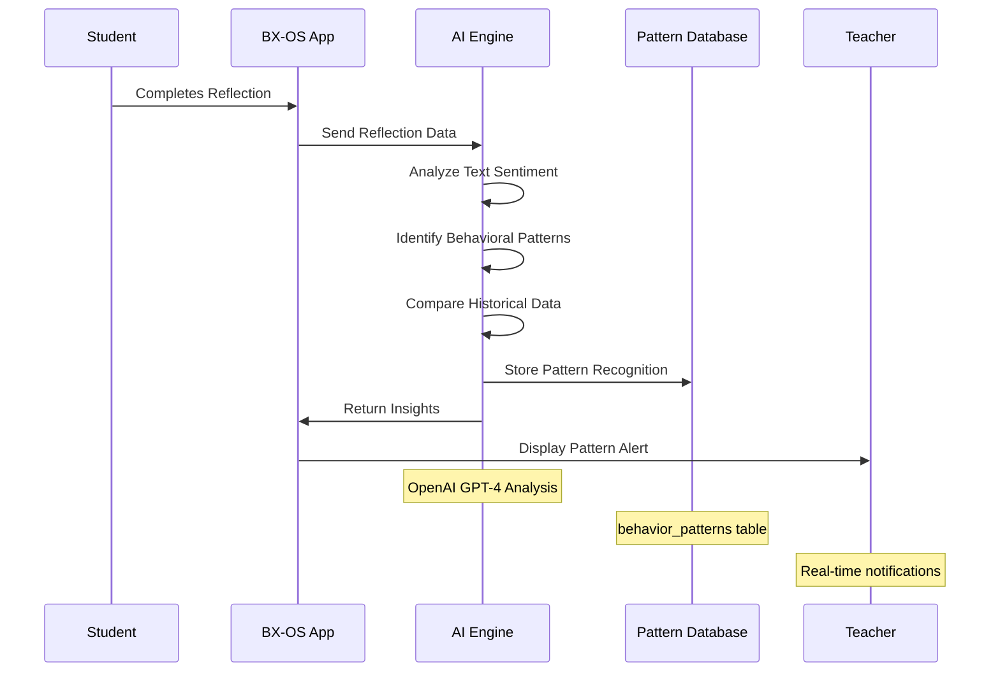
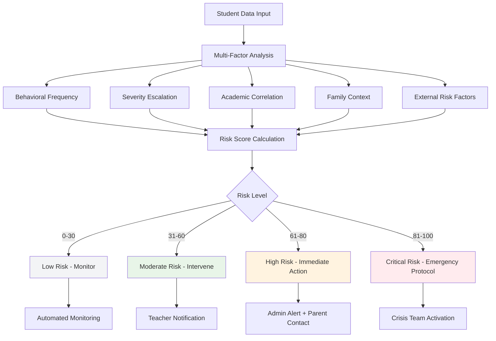
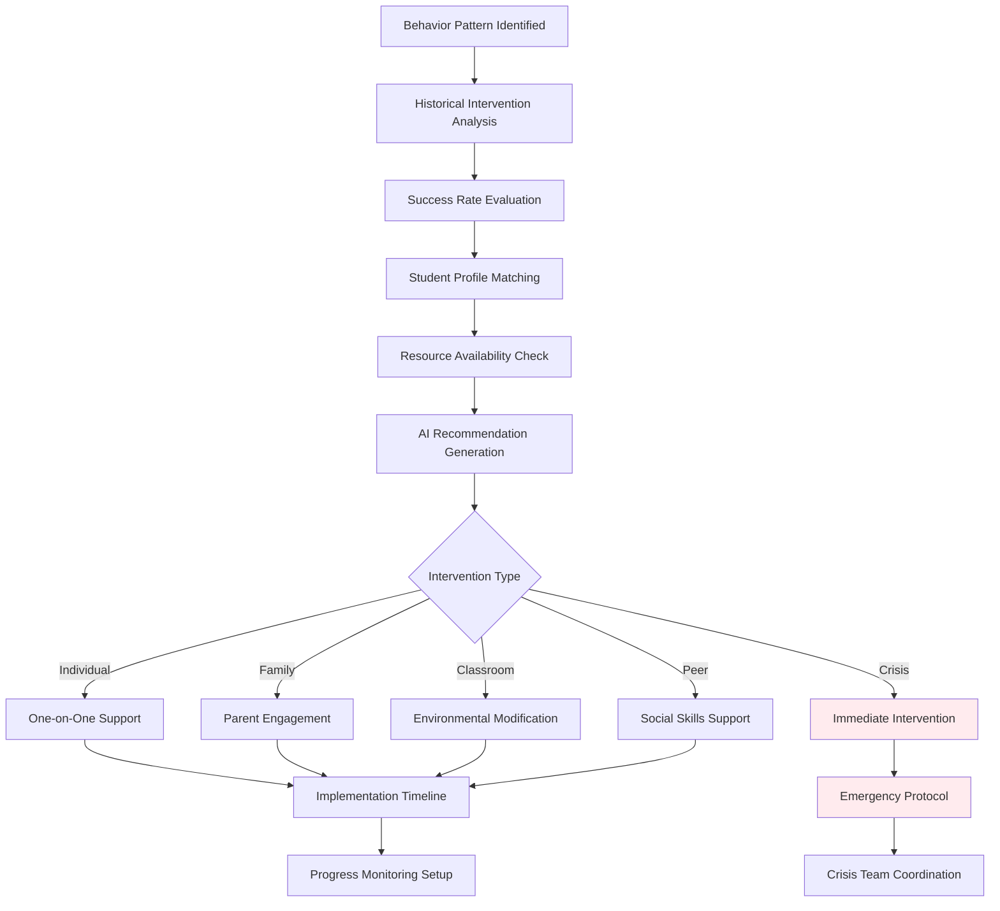
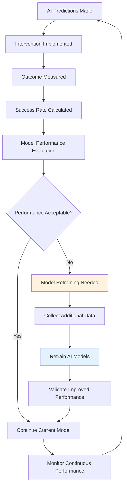

# 🤖 AI Integration Architecture

## Behavioral Intelligence Platform AI Framework

This document outlines the complete AI integration architecture that transforms BX-OS into a behavioral intelligence platform through pattern recognition, predictive analytics, and automated intervention recommendations.

## 🧠 AI Integration Overview



## 🔄 Behavioral Pattern Recognition Engine

### Pattern Identification Pipeline



### Pattern Recognition Database Schema

```sql
CREATE TABLE behavior_patterns (
    id UUID PRIMARY KEY DEFAULT gen_random_uuid(),
    student_id UUID REFERENCES students(id),
    pattern_type TEXT NOT NULL,
    pattern_data JSONB NOT NULL,
    confidence_score FLOAT DEFAULT 0.0,
    triggers JSONB DEFAULT '[]',
    identified_at TIMESTAMPTZ DEFAULT now(),
    last_occurrence TIMESTAMPTZ DEFAULT now(),
    frequency_score FLOAT DEFAULT 0.0,
    severity_level TEXT DEFAULT 'low'
);

CREATE TABLE ai_insights (
    id UUID PRIMARY KEY DEFAULT gen_random_uuid(),
    student_id UUID REFERENCES students(id),
    insight_type TEXT NOT NULL,
    insight_summary TEXT NOT NULL,
    insight_data JSONB NOT NULL,
    confidence_score FLOAT DEFAULT 0.0,
    recommended_actions JSONB DEFAULT '[]',
    generated_at TIMESTAMPTZ DEFAULT now(),
    expires_at TIMESTAMPTZ,
    status TEXT DEFAULT 'active'
);
```

## 📊 AI Service Integration Architecture

### OpenAI Integration Framework

```typescript
// AI Service Interface
interface BehaviorAnalysisService {
  analyzeReflection(reflection: ReflectionData): Promise<BehaviorInsight>;
  identifyPatterns(studentHistory: StudentBehaviorHistory): Promise<BehaviorPattern[]>;
  generateInterventions(pattern: BehaviorPattern): Promise<InterventionPlan>;
  assessRisk(studentData: StudentProfile): Promise<RiskAssessment>;
  predictOutcomes(interventionPlan: InterventionPlan): Promise<OutcomePrediction>;
}

// OpenAI Implementation
class OpenAIBehaviorAnalyzer implements BehaviorAnalysisService {
  async analyzeReflection(reflection: ReflectionData): Promise<BehaviorInsight> {
    const prompt = `
      Analyze this student reflection for behavioral patterns:
      
      Reflection: "${reflection.content}"
      Mood Rating: ${reflection.mood_rating}/5
      Previous Patterns: ${reflection.historical_patterns}
      
      Provide insights on:
      1. Emotional state indicators
      2. Behavioral trigger identification
      3. Coping mechanism assessment
      4. Risk level evaluation
      5. Recommended interventions
    `;
    
    const response = await this.openai.chat.completions.create({
      model: "gpt-4",
      messages: [{ role: "system", content: "You are a behavioral analysis expert..." }],
      temperature: 0.3,
    });
    
    return this.parseInsights(response.choices[0].message.content);
  }
  
  async identifyPatterns(studentHistory: StudentBehaviorHistory): Promise<BehaviorPattern[]> {
    // Pattern recognition logic using historical data
    const patterns = await this.analyzeHistoricalTrends(studentHistory);
    return this.validatePatterns(patterns);
  }
}
```

## 🎯 Predictive Risk Assessment Engine

### Risk Scoring Algorithm



### Risk Assessment Implementation

```typescript
class RiskAssessmentEngine {
  calculateRiskScore(studentProfile: StudentProfile): RiskScore {
    const factors = {
      behavioralFrequency: this.analyzeBehavioralFrequency(studentProfile),
      severityTrend: this.analyzeSeverityTrend(studentProfile),
      academicCorrelation: this.analyzeAcademicImpact(studentProfile),
      familyStressors: this.analyzeFamilyContext(studentProfile),
      externalFactors: this.analyzeExternalRiskFactors(studentProfile)
    };
    
    const weightedScore = (
      factors.behavioralFrequency * 0.25 +
      factors.severityTrend * 0.30 +
      factors.academicCorrelation * 0.20 +
      factors.familyStressors * 0.15 +
      factors.externalFactors * 0.10
    );
    
    return {
      score: weightedScore,
      level: this.determineRiskLevel(weightedScore),
      factors: factors,
      recommendations: this.generateRecommendations(weightedScore, factors)
    };
  }
  
  private determineRiskLevel(score: number): RiskLevel {
    if (score >= 81) return 'critical';
    if (score >= 61) return 'high';
    if (score >= 31) return 'moderate';
    return 'low';
  }
}
```

## 🔮 Intervention Recommendation System

### AI-Powered Intervention Planning



### Intervention Planning Database

```sql
CREATE TABLE intervention_plans (
    id UUID PRIMARY KEY DEFAULT gen_random_uuid(),
    student_id UUID REFERENCES students(id),
    behavior_pattern_id UUID REFERENCES behavior_patterns(id),
    plan_type TEXT NOT NULL,
    recommended_actions JSONB NOT NULL,
    success_probability FLOAT DEFAULT 0.0,
    estimated_duration INTERVAL,
    required_resources JSONB DEFAULT '[]',
    assigned_staff JSONB DEFAULT '[]',
    created_at TIMESTAMPTZ DEFAULT now(),
    status TEXT DEFAULT 'proposed'
);

CREATE TABLE intervention_progress (
    id UUID PRIMARY KEY DEFAULT gen_random_uuid(),
    intervention_plan_id UUID REFERENCES intervention_plans(id),
    milestone_name TEXT NOT NULL,
    target_date DATE,
    completion_date DATE,
    success_rating INTEGER CHECK (success_rating >= 1 AND success_rating <= 5),
    notes TEXT,
    created_at TIMESTAMPTZ DEFAULT now()
);
```

## 📈 Natural Language Processing Pipeline

### Reflection Analysis Framework

```typescript
class ReflectionNLPProcessor {
  async processReflection(reflection: string): Promise<NLPInsights> {
    const insights = {
      sentiment: await this.analyzeSentiment(reflection),
      emotions: await this.extractEmotions(reflection),
      triggers: await this.identifyTriggers(reflection),
      copingStrategies: await this.identifyCopingStrategies(reflection),
      riskIndicators: await this.detectRiskIndicators(reflection)
    };
    
    return insights;
  }
  
  private async analyzeSentiment(text: string): Promise<SentimentAnalysis> {
    const response = await this.openai.chat.completions.create({
      model: "gpt-4",
      messages: [{
        role: "system",
        content: "Analyze the sentiment of this student reflection. Rate from -1 (very negative) to +1 (very positive)."
      }, {
        role: "user",
        content: text
      }],
      temperature: 0.1
    });
    
    return this.parseSentimentResponse(response.choices[0].message.content);
  }
}
```

## 🚀 AI Extension Point Integration

### Supabase Edge Functions for AI Processing

```typescript
// supabase/functions/ai-behavior-analysis/index.ts
import { serve } from "https://deno.land/std@0.168.0/http/server.ts";
import { createClient } from "https://esm.sh/@supabase/supabase-js@2";

const openai = new OpenAI({
  apiKey: Deno.env.get('OPENAI_API_KEY'),
});

serve(async (req) => {
  const { student_id, reflection_data } = await req.json();
  
  // Analyze reflection using OpenAI
  const insights = await analyzeReflection(reflection_data);
  
  // Store insights in database
  const supabase = createClient(
    Deno.env.get('SUPABASE_URL')!,
    Deno.env.get('SUPABASE_SERVICE_ROLE_KEY')!
  );
  
  await supabase
    .from('ai_insights')
    .insert({
      student_id,
      insight_type: 'reflection_analysis',
      insight_summary: insights.summary,
      insight_data: insights,
      confidence_score: insights.confidence
    });
  
  return new Response(JSON.stringify(insights), {
    headers: { "Content-Type": "application/json" },
  });
});
```

## 📊 AI Performance Monitoring

### Model Accuracy & Effectiveness Tracking



## 🔐 AI Ethics & Privacy Framework

### Data Privacy & Model Bias Prevention

```typescript
class AIEthicsFramework {
  async validateAIDecision(decision: AIDecision): Promise<EthicsValidation> {
    return {
      biasCheck: await this.checkForBias(decision),
      privacyCompliance: await this.validatePrivacy(decision),
      fairnessAssessment: await this.assessFairness(decision),
      humanOversightRequired: this.requiresHumanReview(decision)
    };
  }
  
  private async checkForBias(decision: AIDecision): Promise<BiasAssessment> {
    // Analyze for demographic bias, cultural bias, etc.
    return {
      hasBias: false,
      biasTypes: [],
      correctionNeeded: false
    };
  }
}
```

---

**Strategic Implementation**: This AI architecture creates the framework for transforming BX-OS into a true behavioral intelligence platform, with immediate extension points ready for integration after the nuclear reset foundation is complete.