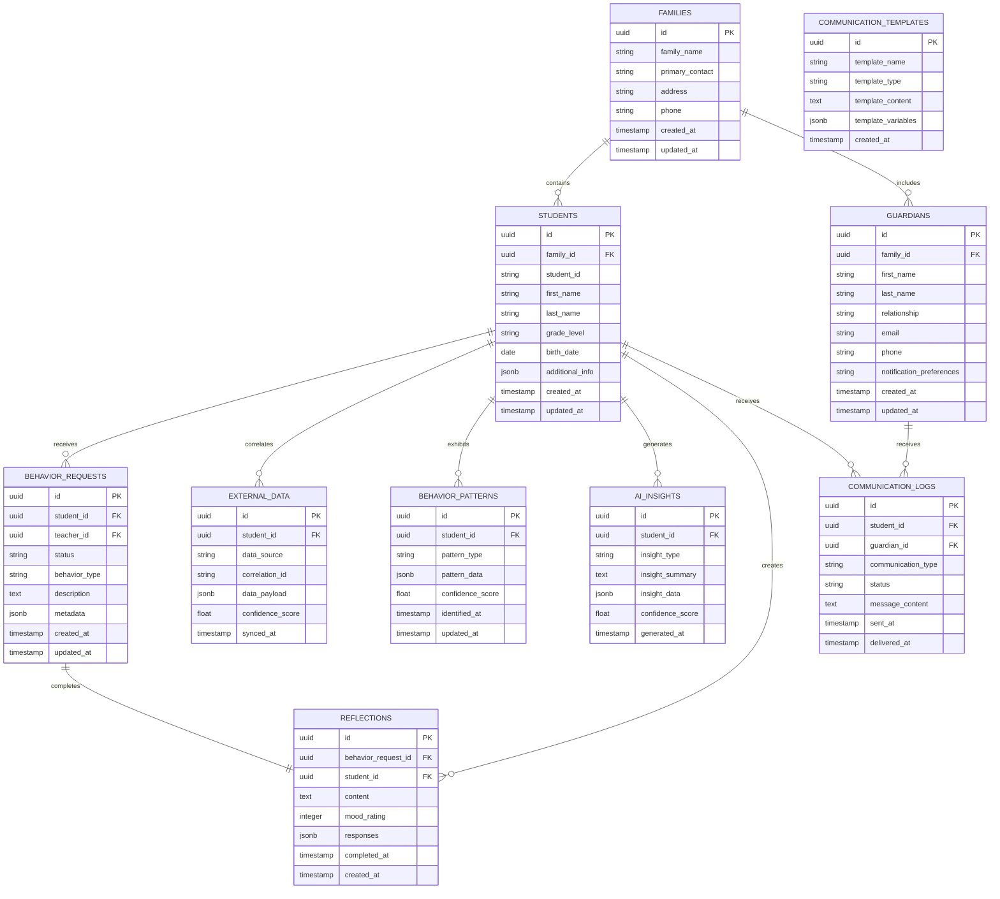

# 🗄️ Future State Database Architecture

## Complete Student-Centric Database Design

This document outlines the complete database architecture that supports the BX-OS Behavioral Intelligence Platform, from CSV import through AI-powered insights.

## 📊 Core Entity Relationship Diagram



## 🔄 Data Flow Architecture

### CSV Import to Intelligence Pipeline


## 🎯 Core Tables Detailed Schema

### Students Table (Foundation)
```sql
CREATE TABLE students (
    id UUID PRIMARY KEY DEFAULT gen_random_uuid(),
    family_id UUID REFERENCES families(id),
    student_id TEXT UNIQUE NOT NULL,
    first_name TEXT NOT NULL,
    last_name TEXT NOT NULL,
    grade_level TEXT NOT NULL,
    birth_date DATE,
    additional_info JSONB DEFAULT '{}',
    created_at TIMESTAMPTZ DEFAULT now(),
    updated_at TIMESTAMPTZ DEFAULT now()
);
```

### Families Table (Relationship Foundation)
```sql
CREATE TABLE families (
    id UUID PRIMARY KEY DEFAULT gen_random_uuid(),
    family_name TEXT NOT NULL,
    primary_contact TEXT,
    address TEXT,
    phone TEXT,
    created_at TIMESTAMPTZ DEFAULT now(),
    updated_at TIMESTAMPTZ DEFAULT now()
);
```

### Behavior Patterns Table (AI Foundation)
```sql
CREATE TABLE behavior_patterns (
    id UUID PRIMARY KEY DEFAULT gen_random_uuid(),
    student_id UUID REFERENCES students(id),
    pattern_type TEXT NOT NULL,
    pattern_data JSONB NOT NULL,
    confidence_score FLOAT DEFAULT 0.0,
    identified_at TIMESTAMPTZ DEFAULT now(),
    updated_at TIMESTAMPTZ DEFAULT now()
);
```

## 🔐 Security Architecture (RLS Policies)

### Student Data Access Control
```sql
-- Students can only access their own data
CREATE POLICY "Students access own data"
ON students FOR ALL
USING (auth.uid()::text = student_id);

-- Teachers can access students in their classes
CREATE POLICY "Teachers access class students"
ON students FOR SELECT
USING (
    EXISTS (
        SELECT 1 FROM teacher_student_assignments 
        WHERE teacher_id = auth.uid() 
        AND student_id = students.id
    )
);

-- Super admins have full access
CREATE POLICY "Super admin full access"
ON students FOR ALL
USING (
    EXISTS (
        SELECT 1 FROM profiles 
        WHERE user_id = auth.uid() 
        AND role_type = 'super_admin'
    )
);
```

## 📈 Extension Point Architecture

### AI Integration Points
- **behavior_patterns**: Stores identified behavioral patterns
- **ai_insights**: Stores AI-generated insights and recommendations
- **Pattern Recognition Hooks**: Automated analysis of reflection data
- **Intervention Suggestions**: AI-powered intervention recommendations

### External Data Integration
- **external_data**: Stores correlated data from SIS, assessment systems
- **Correlation Framework**: Links external data to student records
- **Confidence Scoring**: Validates data correlation accuracy
- **Sync Monitoring**: Tracks external data synchronization status

### Communication Automation
- **communication_templates**: Stores message templates for automation
- **communication_logs**: Tracks all parent/guardian communications
- **Workflow Engine**: Automated communication based on behavior patterns
- **Multi-Channel Support**: Email, SMS, app notifications

## 🚀 Scalability Considerations

### Performance Optimization
- **Indexing Strategy**: Optimized indexes on frequently queried columns
- **Partitioning**: Time-based partitioning for behavior_requests and reflections
- **Caching Layer**: Redis integration for frequently accessed student data
- **Query Optimization**: Materialized views for complex aggregations

### Multi-School Architecture Preparation
- **Tenant Isolation**: School-based data segregation through RLS
- **Cross-School Analytics**: Anonymized behavioral intelligence sharing
- **Administrative Hierarchy**: District, school, and classroom level access
- **Data Governance**: Compliance with privacy regulations across schools

## 📊 Data Migration Strategy

### From Current Prototype
1. **Export existing behavior_requests**: Preserve current BSR data
2. **Student normalization**: Convert individual records to family-centric
3. **Data validation**: Ensure referential integrity
4. **Extension point seeding**: Prepare tables for AI integration

### CSV Import Integration
1. **Family extraction**: Identify family groups from student data
2. **Student processing**: Create normalized student records
3. **Guardian inference**: Extract parent/guardian contact information
4. **Correlation preparation**: Set up external data correlation framework

---

**Implementation Priority**: This architecture serves as the foundation for the 24-hour nuclear reset transformation, with immediate focus on core tables and extension point preparation.