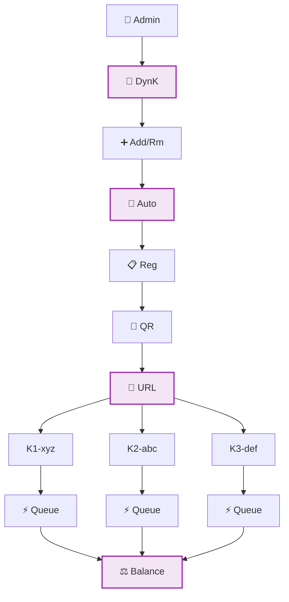
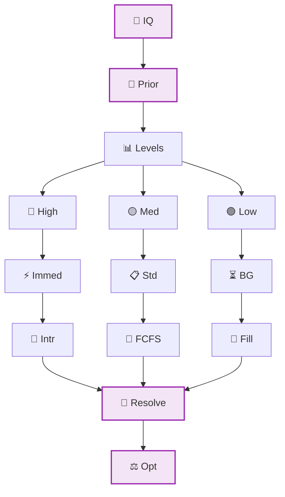
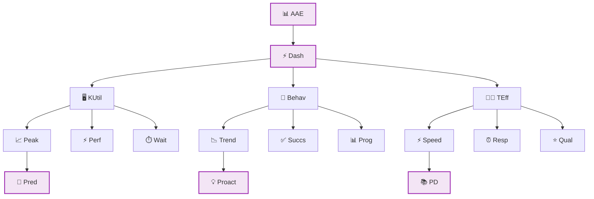
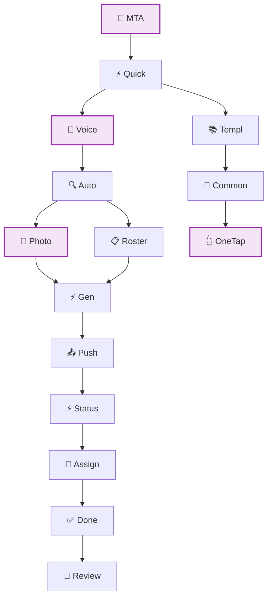

# 🟣 Scalable Single-School Architecture (Future Vision)

**Status**: FUTURE VISION - Enhanced single-school deployment beyond Sprint 02

## Enhanced Kiosk Management System

**Legend:**
- 🏫 Admin = School Administration
- 🔧 DynK = Dynamic Kiosk Management
- ➕ Add/Rm = Add/Remove Kiosk Stations
- 📡 Auto = Auto-Discovery System
- 📋 Reg = Device Registration
- 📱 QR = QR Code Assignment
- 🔗 URL = Automatic URL Generation
- K1-xyz = Kiosk device-id-xyz
- K2-abc = Kiosk device-id-abc
- K3-def = Kiosk device-id-def
- ⚡ Queue = Dynamic Queue Assignment
- ⚖️ Balance = Load Balancing Across Kiosks

## Advanced Queue Intelligence

**Legend:**
- 🧠 IQ = Intelligent Queue System
- 🎯 Prior = Priority-Based Assignment
- 📊 Levels = Student Priority Levels
- 🔴 High = High Priority Emergency BSRs
- 🟡 Med = Medium Priority Standard BSRs
- 🟢 Low = Low Priority Follow-up Reflections
- ⚡ Immed = Immediate Assignment
- 📋 Std = Standard Queue Processing
- ⏳ BG = Background Processing
- 🚨 Intr = Interrupt Current Assignment if Needed
- 📝 FCFS = First-Come-First-Served
- 🔄 Fill = Fill Available Slots
- 🔧 Resolve = Advanced Conflict Resolution
- ⚖️ Opt = Optimal Kiosk Distribution

## Enhanced Analytics & Reporting

**Legend:**
- 📊 AAE = Advanced Analytics Engine
- ⚡ Dash = Real-time Dashboards
- 🖥️ KUtil = Kiosk Utilization Metrics
- 👤 Behav = Student Behavior Patterns
- 👨‍🏫 TEff = Teacher Efficiency Reports
- 📈 Peak = Peak Usage Times
- ⚡ Perf = Kiosk Performance Stats
- ⏱️ Wait = Queue Wait Time Analysis
- 📉 Trend = Behavioral Trend Identification
- ✅ Succs = Intervention Success Rates
- 📊 Prog = Student Progress Tracking
- ⚡ Speed = BSR Processing Speed
- ⏰ Resp = Teacher Response Time
- ⭐ Qual = Review Quality Metrics
- 🔮 Pred = Predictive Kiosk Deployment
- 💡 Proact = Proactive Intervention Recommendations
- 📚 PD = Professional Development Insights

## Mobile Teacher Interface

**Legend:**
- 📱 MTA = Mobile Teacher App
- ⚡ Quick = Quick BSR Creation
- 🎤 Voice = Voice-to-Text Input
- 🔍 Auto = Auto-Student Recognition
- 📸 Photo = Photo-Based Student ID
- 📋 Roster = Classroom Roster Integration
- ⚡ Gen = Instant BSR Generation
- 📤 Push = Push to Queue
- ⚡ Status = Real-time Status Updates
- 🔔 Assign = Student Assigned Notification
- ✅ Done = Completion Alerts
- 📝 Review = Review Ready Notifications
- 📚 Templ = Template Library
- 🔄 Common = Common Behavior Patterns
- 👆 OneTap = One-Tap BSR Creation

## Foundation Dependencies

### Must Be Built on Current Foundation
- **Role-based Authentication**: ✅ COMPLETE - Google OAuth with role assignment working
- **Queue Management**: ✅ COMPLETE - Real-time queue system operational
- **Student Data Management**: ✅ COMPLETE - 690+ total students (159 middle school) properly managed
- **Basic Kiosk System**: ✅ COMPLETE - Static 3-kiosk system working reliably

### Sprint 02 → Future Vision Progression
1. **Static → Dynamic**: Evolve from 3 static URLs to dynamic kiosk management
2. **Manual → Automated**: Progress from manual assignment to intelligent automation  
3. **Basic → Advanced**: Build sophisticated analytics on proven foundation
4. **Single-Mode → Multi-Modal**: Add mobile interfaces to web-based system

## Vision Components

### 🚀 Scalability Enhancements
- **Dynamic Kiosk Addition**: Add new kiosks without code changes
- **Load Balancing**: Intelligent distribution of students across available kiosks
- **Peak Time Management**: Automatic scaling during high-usage periods
- **Maintenance Mode**: Graceful handling of kiosk downtime

### 🧠 Intelligence Features
- **Predictive Analytics**: Forecast peak usage and optimize kiosk placement
- **Behavioral Pattern Recognition**: Identify trends and intervention opportunities
- **Smart Queue Management**: Priority-based assignment with conflict resolution
- **Proactive Notifications**: Alert systems for all stakeholders

### 📱 Multi-Platform Access
- **Teacher Mobile App**: Quick BSR creation and management on-the-go
- **Student Mobile Check-in**: Optional mobile interface for older students
- **Admin Mobile Dashboard**: Real-time system monitoring from anywhere
- **Parent Portal**: Optional family communication and transparency features

### 🔗 Integration Capabilities
- **Student Information System**: Direct integration with school SIS
- **Communication Platforms**: Integration with email, SMS, and messaging systems
- **Behavioral Analytics**: Connection to district-wide behavioral tracking
- **Professional Development**: Integration with teacher training platforms

## Implementation Pathway

### Phase 1: Foundation Stability (COMPLETE)
- ✅ Complete static 3-kiosk system
- ✅ Establish reliable queue management
- ✅ Implement basic role-based access
- ✅ Achieve 690+ student management (159 middle school)

### Phase 2: Dynamic Expansion (Sprint 03-04)
- Implement dynamic kiosk registration
- Add intelligent queue management
- Build advanced analytics dashboard
- Create mobile teacher interface

### Phase 3: Intelligence Layer (Sprint 05-06)
- Add predictive analytics
- Implement behavioral pattern recognition
- Create proactive notification system
- Build comprehensive reporting suite

### Phase 4: Integration & Optimization (Sprint 07+)
- Integrate with school systems
- Optimize performance and scalability
- Add multi-platform access options
- Implement advanced security features

## Architectural Principles

### 🔧 Technical Excellence
- **Modular Design**: Each component independently upgradable
- **API-First Architecture**: All features accessible via clean APIs
- **Real-time Updates**: Live synchronization across all interfaces
- **Offline Resilience**: Core functionality works during connectivity issues

### 🎯 User Experience Focus
- **Intuitive Interfaces**: Minimal learning curve for all user types
- **Responsive Design**: Seamless experience across all device types
- **Accessibility**: Full compliance with accessibility standards
- **Performance**: Sub-second response times for all core functions

### 🔒 Security & Privacy
- **Data Protection**: Comprehensive student data privacy protection
- **Audit Trails**: Complete logging of all system interactions
- **Role-Based Security**: Granular permissions for all user types
- **Compliance**: FERPA and state privacy law compliance

## Cross-References
- **Current Sprint**: `SPRINT-02-LAUNCH/` - Foundation that enables this vision
- **Technical Foundation**: `03-current-database-schema.md` - Data model that supports scaling
- **Implementation Roadmap**: Future sprint planning documents