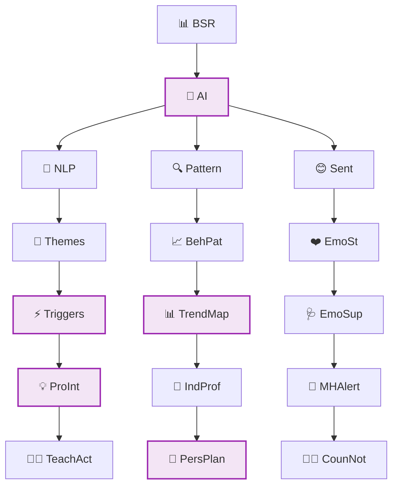
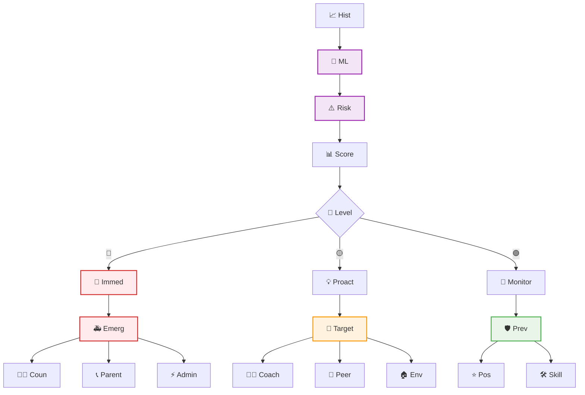
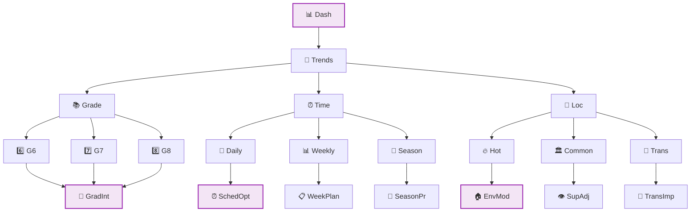
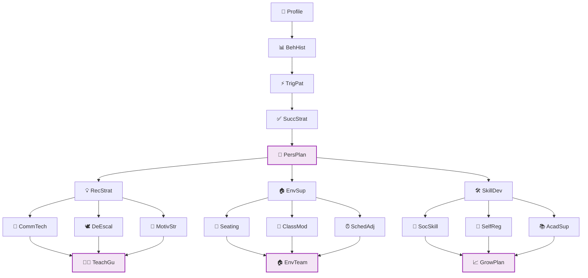
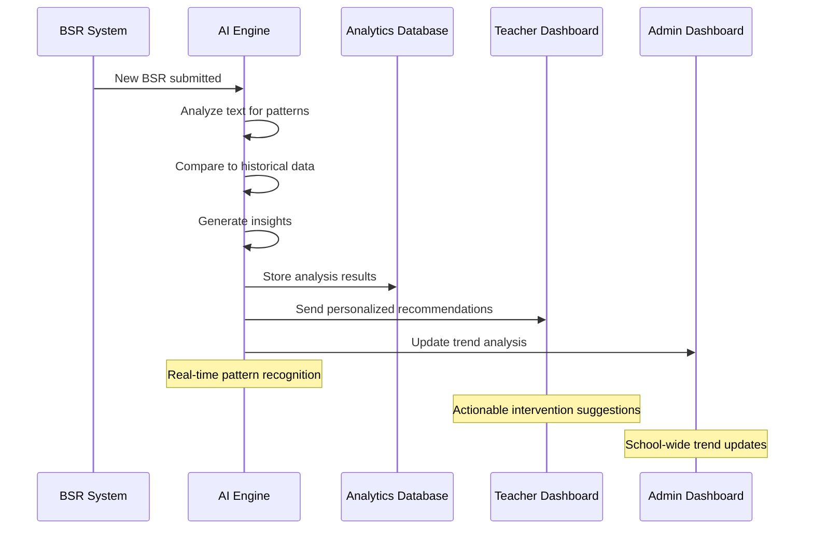

# 🟣 Behavior Analytics Enhancement (Future Vision)

**Status**: FUTURE VISION - AI analysis and pattern recognition beyond Sprint 02

## AI-Powered Behavior Analysis

**Legend:**
- 📊 BSR = Student BSR Data
- 🤖 AI = AI Analysis Engine
- 📝 NLP = Natural Language Processing
- 🔍 Pattern = Pattern Recognition
- 😊 Sent = Sentiment Analysis
- 🔑 Themes = Extract Key Themes
- 📈 BehPat = Identify Behavioral Patterns
- ❤️ EmoSt = Assess Student Emotional State
- ⚡ Triggers = Common Triggers Identification
- 📊 TrendMap = Behavioral Trend Mapping
- 🩺 EmoSup = Emotional Support Recommendations
- 💡 ProInt = Proactive Intervention Suggestions
- 👤 IndProf = Individual Student Profiles
- 🚨 MHAlert = Mental Health Alert System
- 👨‍🏫 TeachAct = Teacher Action Recommendations
- 🎯 PersPlan = Personalized Support Plans
- 👨‍⚕️ CounNot = Counselor Notifications

## Predictive Intervention System

**Legend:**
- 📈 Hist = Historical BSR Data
- 🤖 ML = Machine Learning Model
- ⚠️ Risk = Risk Assessment Algorithm
- 📊 Score = Student Risk Scoring
- 🎯 Level = Risk Level Assessment
- 🔴 = High Risk
- 🟡 = Medium Risk
- 🟢 = Low Risk
- 🚨 Immed = Immediate Intervention Alert
- 💡 Proact = Proactive Support Recommendation
- 👀 Monitor = Monitoring and Prevention
- 🚑 Emerg = Emergency Response Protocol
- 🎯 Target = Targeted Support Strategies
- 🛡️ Prev = Preventive Measures
- 👨‍⚕️ Coun = Counselor Immediate Contact
- 📞 Parent = Parent Notification
- ⚡ Admin = Admin Alert
- 👨‍🏫 Coach = Teacher Coaching Recommendations
- 👥 Peer = Peer Support Programs
- 🏠 Env = Environmental Modifications
- ⭐ Pos = Positive Reinforcement Strategies
- 🛠️ Skill = Skill Building Opportunities

## Behavioral Trend Dashboard

**Legend:**
- 📊 Dash = Analytics Dashboard
- 🏫 Trends = School-Wide Trends
- 📚 Grade = Grade-Level Analysis
- ⏰ Time = Time-Based Patterns
- 📍 Loc = Location-Based Incidents
- 6️⃣ G6 = 6th Grade Behavioral Patterns
- 7️⃣ G7 = 7th Grade Behavioral Patterns
- 8️⃣ G8 = 8th Grade Behavioral Patterns
- 📅 Daily = Daily Incident Patterns
- 📊 Weekly = Weekly Trend Analysis
- 🌱 Season = Seasonal Behavior Changes
- 🔥 Hot = Classroom Hotspots
- 🏛️ Common = Common Area Issues
- 🚶 Trans = Transition Time Problems
- 🎯 GradInt = Grade-Specific Interventions
- ⏰ SchedOpt = Schedule Optimization
- 📋 WeekPlan = Weekly Planning Insights
- 🌿 SeasonPr = Seasonal Preparation
- 🏠 EnvMod = Environmental Modifications
- 👁️ SupAdj = Supervision Adjustments
- 🔄 TransImp = Transition Improvements

## Individual Student Analytics

**Legend:**
- 👤 Profile = Individual Student Profile
- 📊 BehHist = Behavioral History Analysis
- ⚡ TrigPat = Trigger Pattern Identification
- ✅ SuccStrat = Success Strategy Recognition
- 🎯 PersPlan = Personalized Intervention Plan
- 💡 RecStrat = Recommended Strategies
- 🏠 EnvSup = Environmental Supports
- 🛠️ SkillDev = Skill Development Goals
- 💬 CommTech = Communication Techniques
- 🕊️ DeEscal = De-escalation Methods
- 🎯 MotivStr = Motivation Strategies
- 💺 Seating = Seating Arrangements
- 🏫 ClassMod = Classroom Modifications
- ⏰ SchedAdj = Schedule Adjustments
- 🤝 SocSkill = Social Skills Training
- 🧘 SelfReg = Self-Regulation Techniques
- 📚 AcadSup = Academic Support Needs
- 👨‍🏫 TeachGu = Teacher Implementation Guide
- 🏠 EnvTeam = Environment Team Actions
- 📈 GrowPlan = Student Growth Plan

## AI-Generated Insights

## Foundation Dependencies

### Current Foundation (COMPLETE)
- **Complete BSR System**: ✅ OPERATIONAL - Functional behavior support request creation and processing
- **Student Data Pool**: ✅ OPERATIONAL - 690+ total students (159 middle school) properly managed
- **Queue System**: ✅ OPERATIONAL - Reliable student assignment and progression
- **Role-based Access**: ✅ OPERATIONAL - Proper authentication and authorization

### Data Collection Requirements
- **BSR Text Analysis**: Rich reflection data from students
- **Teacher Feedback**: Quality review and intervention notes
- **Outcome Tracking**: Success/failure rates of interventions
- **Environmental Context**: Location, time, and situational data

## Vision Components

### 🤖 AI Analysis Capabilities
- **Natural Language Processing**: Extract meaning from student reflections
- **Pattern Recognition**: Identify behavioral trends and triggers
- **Sentiment Analysis**: Assess emotional state and crisis indicators
- **Predictive Modeling**: Forecast potential behavioral escalations

### 📊 Advanced Analytics Features
- **Real-time Insights**: Live analysis of behavioral data
- **Predictive Alerts**: Early warning system for at-risk students
- **Intervention Effectiveness**: Track success rates of different strategies
- **Comparative Analysis**: Benchmark against similar schools and districts

### 🎯 Personalized Recommendations
- **Individual Student Plans**: Custom intervention strategies per student
- **Teacher Coaching**: Specific technique recommendations for each educator
- **Environmental Modifications**: Data-driven classroom and schedule changes
- **Resource Allocation**: Optimize support staff and program placement

### 🔍 Research & Compliance
- **De-identified Research**: Contribute to behavioral intervention research
- **Compliance Reporting**: Automated reports for state and federal requirements
- **Evidence-based Practices**: Recommendations based on research outcomes
- **Longitudinal Studies**: Track student progress over multiple years

## Implementation Pathway

### Phase 1: Data Foundation (READY TO BEGIN)
- Collect sufficient BSR data for analysis (minimum 6 months)
- Establish data quality standards and validation
- Create secure analytics database infrastructure
- Implement basic reporting dashboards

### Phase 2: Pattern Recognition (Month 7-12)
- Deploy AI analysis engine
- Implement basic pattern recognition
- Create individual student analytics profiles
- Generate first predictive insights

### Phase 3: Advanced Intelligence (Year 2)
- Add machine learning predictive models
- Implement real-time intervention alerts
- Create comprehensive trend analysis
- Launch proactive recommendation system

### Phase 4: Research Integration (Year 3+)
- Contribute to behavioral intervention research
- Implement evidence-based recommendation engine
- Create district-wide comparative analytics
- Develop predictive intervention protocols

## Technical Architecture

### 🔧 AI/ML Infrastructure
- **Cloud-based Processing**: Scalable analysis infrastructure
- **Privacy-First Design**: De-identification and secure processing
- **Real-time Analysis**: Live processing of new BSR submissions
- **Model Training Pipeline**: Continuous improvement of predictions

### 📊 Analytics Database
- **Time-series Data**: Historical trend analysis capabilities
- **Graph Database**: Relationship mapping between students, incidents, interventions
- **Data Lake**: Comprehensive storage of all behavioral data
- **API Access**: Programmatic access to insights and recommendations

## Privacy & Ethics

### 🔒 Data Protection
- **Student Privacy**: Full FERPA compliance and beyond
- **De-identification**: Automated removal of identifying information for analysis
- **Access Controls**: Strict role-based access to sensitive insights
- **Audit Trails**: Complete logging of all data access and analysis

### ⚖️ Ethical AI
- **Bias Detection**: Regular auditing for algorithmic bias
- **Transparency**: Clear explanation of how recommendations are generated
- **Human Oversight**: Teacher and counselor review of all AI recommendations
- **Opt-out Options**: Family control over participation in advanced analytics

## Cross-References
- **Current Foundation**: `SPRINT-02-LAUNCH/` - Basic system that generates analyzable data
- **Student Management**: `08-middle-school-filtering.md` - 159 student data pool
- **Future Integration**: `11-system-integration-architecture.md` - External system connections