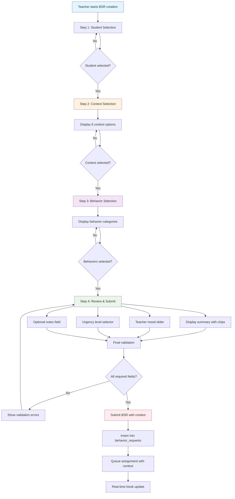
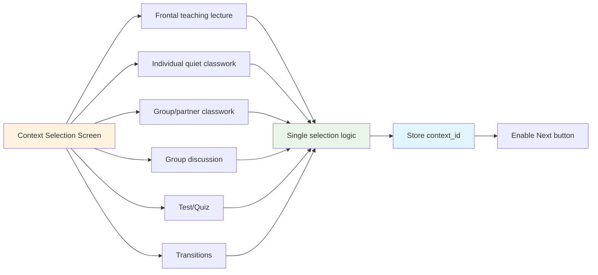
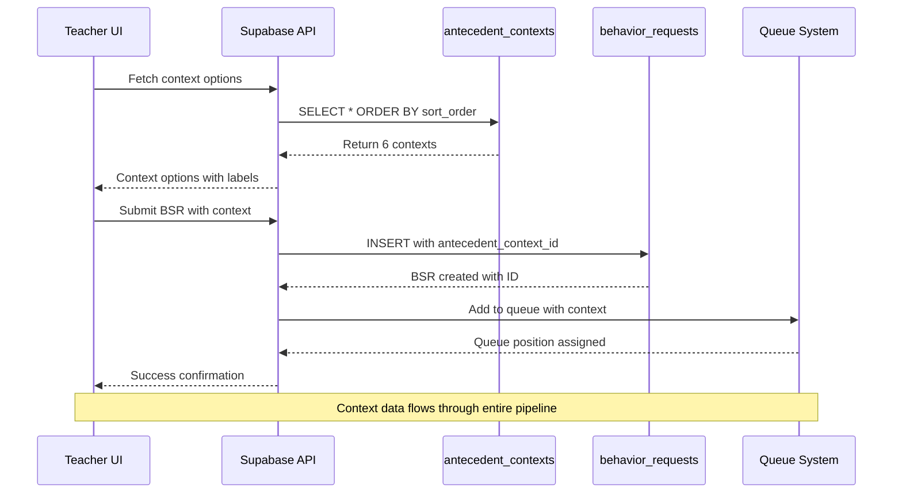
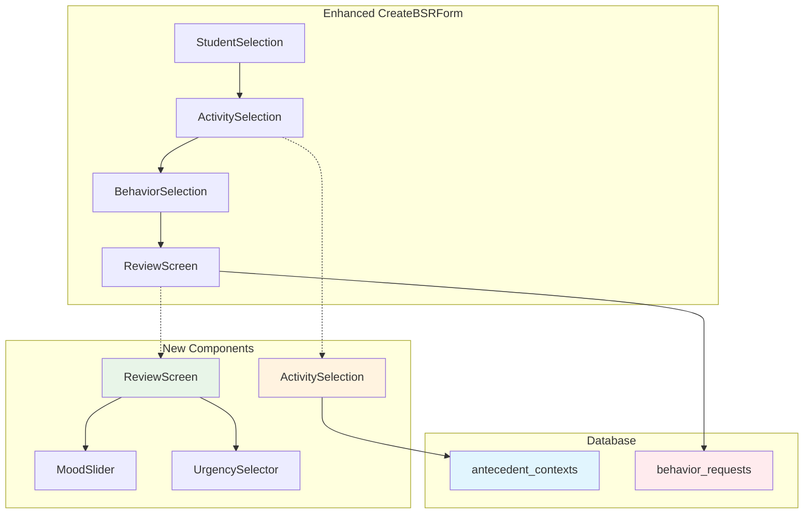
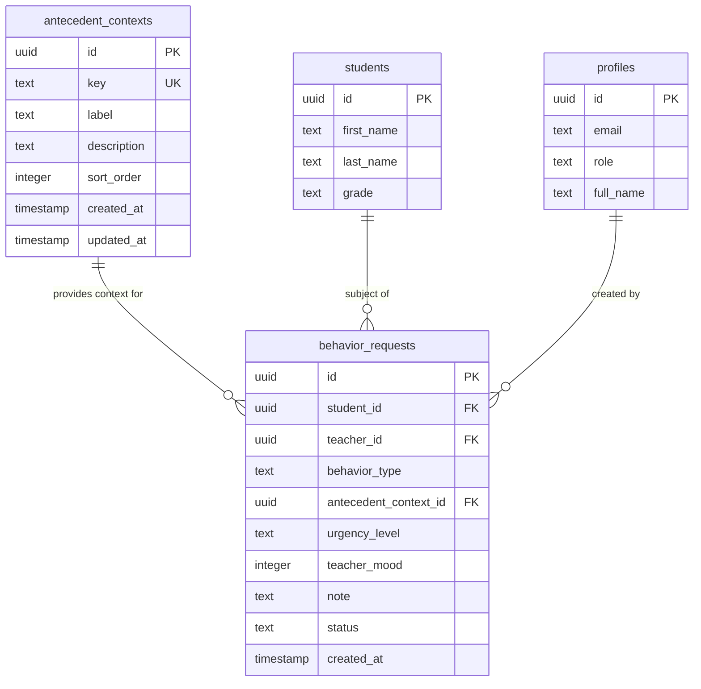
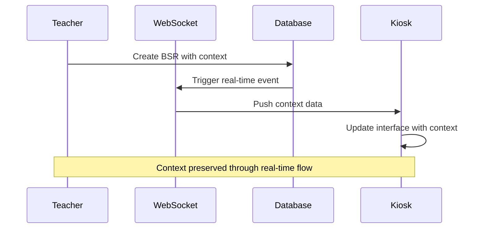
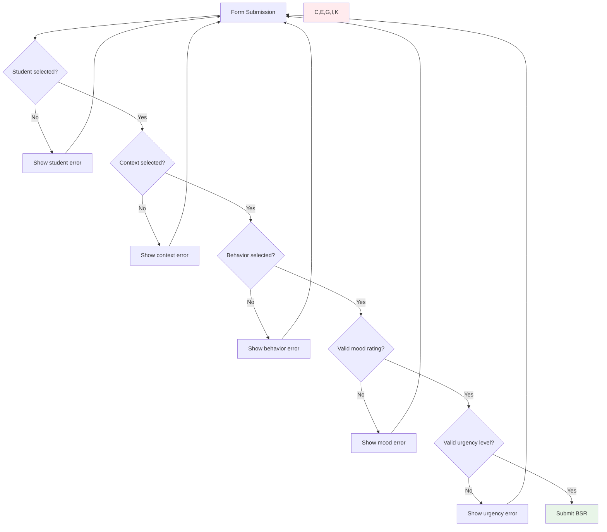
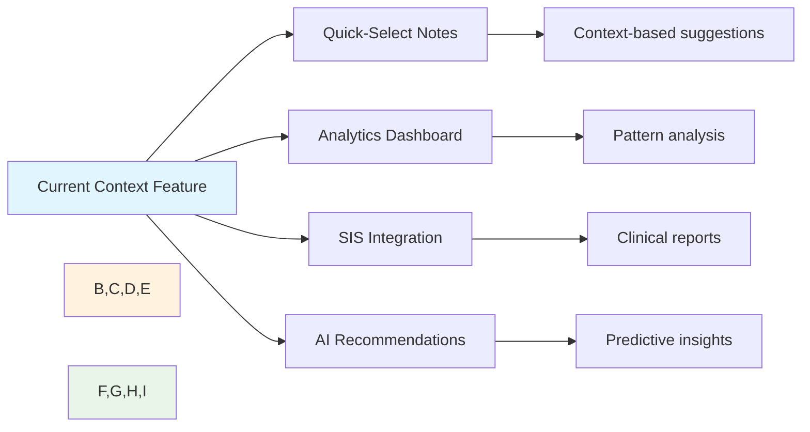

# Antecedent Context Implementation Flow

## Overview
This flowchart documents the implementation of the antecedent (context) feature that enhances BSR creation with structured context capture using a 4-step wizard approach.

## Enhanced BSR Creation Flow

## Context Selection Detail

## Database Integration Flow

## Component Architecture

## Data Structure Enhancement

## Real-time Integration

## Validation & Error Handling

## Future Enhancement Hooks

## Implementation Status: ✅ IMPLEMENTED

### Database Schema: Complete
- `antecedent_contexts` table created
- `behavior_requests` enhanced with context fields
- RLS policies configured
- Sample data seeded

### Component Development: Complete
- 4-step wizard implemented
- Context selection component
- Review screen with mood/urgency
- Enhanced behavior selection

### Integration: Complete
- Real-time functionality maintained
- Queue system enhanced with context
- Backward compatibility preserved

---

*This implementation provides the foundation for comprehensive behavior analysis while maintaining BX-OS's core principles of simplicity and clinical relevance.*