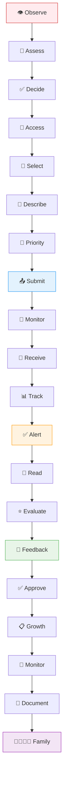
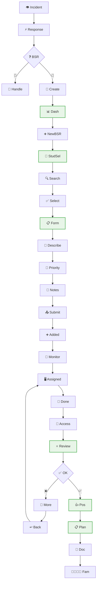
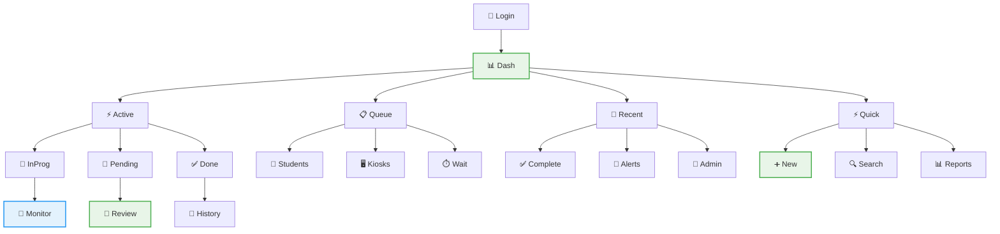
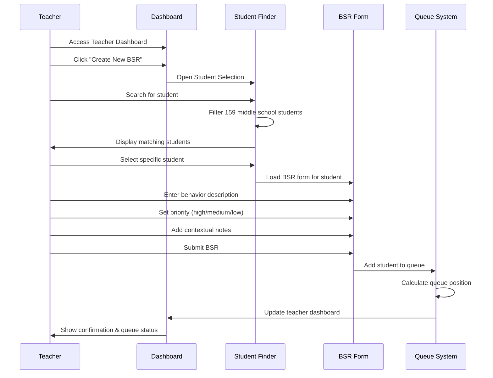
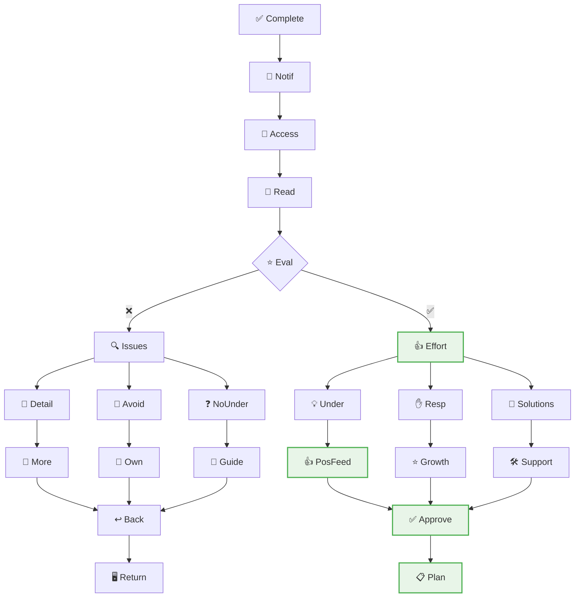

# 🎯 Teacher Workflow Journey (User Experience Flow)

**Journey Scope**: Complete teacher experience from behavior observation to student growth tracking

## Teacher BSR Management Journey

**Legend:**
- 👁️ Observe = Observe Student Behavior
- 🤔 Assess = Assess Intervention Need
- ✅ Decide = Decide on BSR Creation
- 📱 Access = Access BSR Creation Form
- 👤 Select = Select Student from List
- 📝 Describe = Describe Behavior Incident
- 🎯 Priority = Set Priority Level
- 📤 Submit = Submit BSR to Queue
- 👀 Monitor = Monitor Queue Status
- 🔔 Receive = Receive Assignment Notification
- 📊 Track = Track Student Progress
- ✅ Alert = Receive Completion Alert
- 📖 Read = Read Student Reflection
- ⭐ Evaluate = Evaluate Response Quality
- 💭 Feedback = Provide Constructive Feedback
- ✅ Approve = Approve or Request Revision
- 📋 Growth = Create Growth Plan
- 👀 Monitor = Monitor Implementation
- 📄 Document = Document Progress
- 👨‍👩‍👧‍👦 Family = Communicate with Family

## Detailed Teacher Workflow

**Legend:**
- 👁️ Incident = Behavior Incident Observed
- ⚡ Response = Immediate Response
- ❓ BSR = Needs BSR Decision
- 🔵 = Minor Issue
- 🔴 = Significant Issue
- 🏫 Handle = Handle in Classroom
- 📝 Create = Create BSR
- 📊 Dash = Access Teacher Dashboard
- ➕ NewBSR = Click Create New BSR
- 👤 StudSel = Student Selection Interface
- 🔍 Search = Search Student by Name
- ✅ Select = Select Correct Student
- 📋 Form = BSR Form Interface
- 📝 Describe = Describe Behavior Incident
- 🎯 Priority = Set Priority Level
- 📄 Notes = Add Context/Notes
- 📤 Submit = Submit to Queue
- ➕ Added = Student Added to Queue
- 👀 Monitor = Monitor Queue Status
- 🖥️ Assigned = Student Assigned to Kiosk
- 🔔 Done = Receive Completion Notification
- 📖 Access = Access Student Response
- ⭐ Review = Review Reflection Quality
- ✅ OK = Response Adequate Decision
- ❌ = No
- ✅ = Yes
- 📝 More = Request Additional Reflection
- 👍 Pos = Provide Positive Feedback
- ↩️ Back = Send Back to Student
- 📋 Plan = Create Growth/Action Plan
- 📄 Doc = Document in System
- 👨‍👩‍👧‍👦 Fam = Communicate with Family

## Teacher Dashboard Experience

**Legend:**
- 🔐 Login = Teacher Logs In
- 📊 Dash = Teacher Dashboard
- ⚡ Active = Active BSRs Overview
- 📋 Queue = Queue Status Display
- 🔔 Recent = Recent Notifications
- ⚡ Quick = Quick Actions Panel
- 🔄 InProg = In Progress BSRs
- 📝 Pending = Pending Review BSRs
- ✅ Done = Completed BSRs
- 👤 Students = Students in Queue
- 🖥️ Kiosks = Available Kiosks
- ⏱️ Wait = Wait Time Estimates
- ✅ Complete = Student Completions
- 🚨 Alerts = System Alerts
- 📧 Admin = Admin Messages
- ➕ New = Create New BSR
- 🔍 Search = Student Search
- 📊 Reports = Reports Access
- 👀 Monitor = Monitor Progress
- 📝 Review = Review & Respond
- 📜 History = View History

## BSR Creation Process

## Review & Feedback Process

**Legend:**
- ✅ Complete = Student Completes Reflection
- 🔔 Notif = Teacher Notification
- 📖 Access = Access Student Response
- 📝 Read = Read Student Answers
- ⭐ Eval = Evaluate Response Quality
- ❌ = Poor Quality
- ✅ = Good Quality
- 🔍 Issues = Identify Issues
- 👍 Effort = Acknowledge Effort
- 📄 Detail = Lacks Detail
- 🙈 Avoid = Avoids Responsibility
- ❓ NoUnder = Shows No Understanding
- 💡 Under = Shows Understanding
- ✋ Resp = Takes Responsibility
- 🔧 Solutions = Identifies Solutions
- 📝 More = Request More Detail
- 💪 Own = Encourage Ownership
- 🎯 Guide = Guide Understanding
- 👍 PosFeed = Provide Positive Feedback
- ⭐ Growth = Acknowledge Growth
- 🛠️ Support = Support Solution Implementation
- ↩️ Back = Send Back for Revision
- ✅ Approve = Approve BSR
- 🖥️ Return = Student Returns to Kiosk
- 📋 Plan = Create Growth Plan

## Teacher Experience Phases

### 🔴 Phase 1: Complete BSR Creation & Assignment (15-30 seconds total)
**Teacher Experience:**
- Observes behavior requiring immediate intervention
- Instantly decides BSR is necessary
- Opens app and locates correct student from 159 middle schoolers
- Creates BSR description and submits to queue
- Student immediately assigned to available kiosk and sent out

**Pain Points:** Must complete entire process extremely fast during class management
**Success Factors:** One-click app access, smart student search, instant queue processing

### 🟡 Phase 2: Student Reflection Period (5-10 minutes)
**Teacher Experience:**
- Continues normal classroom instruction
- Receives real-time notification when student completes reflection
- Knows exactly when to review submission
- No extended waiting or uncertainty

**Pain Points:** Need immediate notification when ready for review
**Success Factors:** Real-time alerts, clear completion status

### 🔵 Phase 3: Immediate Review & Approval (2-3 minutes)
**Teacher Experience:**
- Reviews student reflection immediately upon completion
- Provides quick feedback or approval
- Student returns to class within minutes
- Process completes during same class period

**Pain Points:** Must review quickly to minimize class disruption
**Success Factors:** Simple approval interface, clear response quality indicators

**Total Teacher Time Investment:** 3-5 minutes spread across class period

## Teacher Support Requirements

### ⚡ Efficiency Needs
- **Quick Access**: Fast login and dashboard navigation
- **Smart Search**: Efficient student finding with autocomplete
- **Form Efficiency**: Minimal required fields, smart defaults
- **Batch Actions**: Handle multiple BSRs when needed

### 📊 Information Needs
- **Queue Visibility**: Real-time status of student assignments
- **Progress Tracking**: Clear indicators of student progress
- **Historical Data**: Access to previous BSRs and patterns
- **Analytics**: Insights into behavioral trends and intervention effectiveness

### 🤝 Collaboration Needs
- **Peer Consultation**: Easy sharing with colleagues when appropriate
- **Admin Communication**: Clear escalation paths for serious incidents
- **Family Contact**: Integrated communication tools
- **Support Services**: Connection to counselors and specialists

### 📚 Professional Development Needs
- **Best Practices**: Guidance on effective BSR creation
- **Response Quality**: Tools for evaluating student reflection quality
- **Intervention Strategies**: Suggestions for growth plans and follow-up
- **Training Resources**: Access to professional development materials

## Success Indicators

### 📈 Efficiency Metrics
- **BSR Creation Time**: Average time under 5 minutes
- **Response Review Time**: Efficient evaluation and feedback process
- **Queue Visibility**: Teachers always know student status
- **System Adoption**: High usage rates across teaching staff

### 🎯 Quality Metrics
- **Student Engagement**: High completion rates for assigned reflections
- **Response Quality**: Meaningful student reflections and growth
- **Teacher Satisfaction**: Positive feedback about workflow efficiency
- **Behavioral Outcomes**: Reduced repeat incidents, improved student behavior

### 🏆 Professional Growth
- **Intervention Skills**: Improved teacher ability to address behavioral issues
- **Student Relationships**: Stronger teacher-student connections
- **Collaborative Practice**: Increased peer consultation and support
- **Data-Driven Decisions**: Use of system analytics to improve practice

## Workflow Integration Points

### 🔗 Student Journey Integration
- Clear handoff from teacher BSR creation to student reflection
- Real-time communication about student progress and completion
- Collaborative growth planning involving both teacher and student

### 🔗 Administrative Integration  
- Automatic data collection for administrative oversight
- Escalation protocols for high-priority incidents
- Professional development recommendations based on BSR patterns

### 🔗 Family Communication Integration
- Automated family notifications at appropriate points
- Easy sharing of growth plans and progress updates
- Collaborative problem-solving involving home and school

## Technology Requirements

### 📱 Mobile Optimization
- Responsive design for teacher tablets and phones
- Quick BSR creation from any location in school
- Push notifications for important updates
- Offline capability for basic functions

### 🔔 Notification System
- Real-time alerts for student completions
- Escalation notifications for overdue reviews
- System maintenance and update communications
- Customizable notification preferences

### 📊 Reporting & Analytics
- Individual teacher dashboard with personal metrics
- Grade-level and school-wide behavioral trends
- Intervention effectiveness tracking
- Professional development recommendations

## Cross-References
- **Student Journey**: `11-complete-student-journey.md` - Complementary student experience
- **Admin Journey**: `13-admin-oversight-journey.md` - System oversight and support
- **System Implementation**: `SPRINT-02-LAUNCH/` - Technical foundation enabling workflow