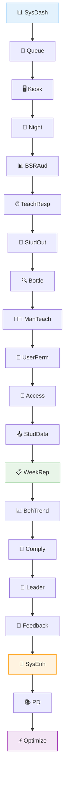
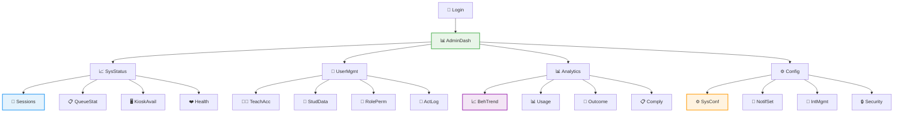
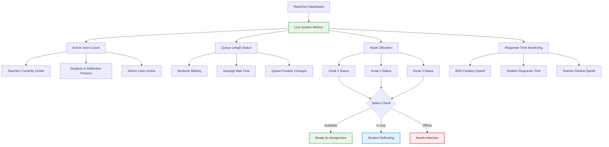
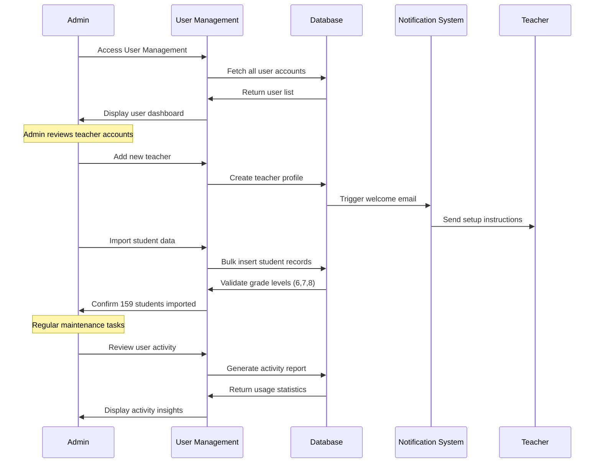
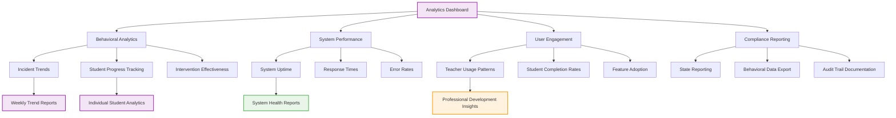
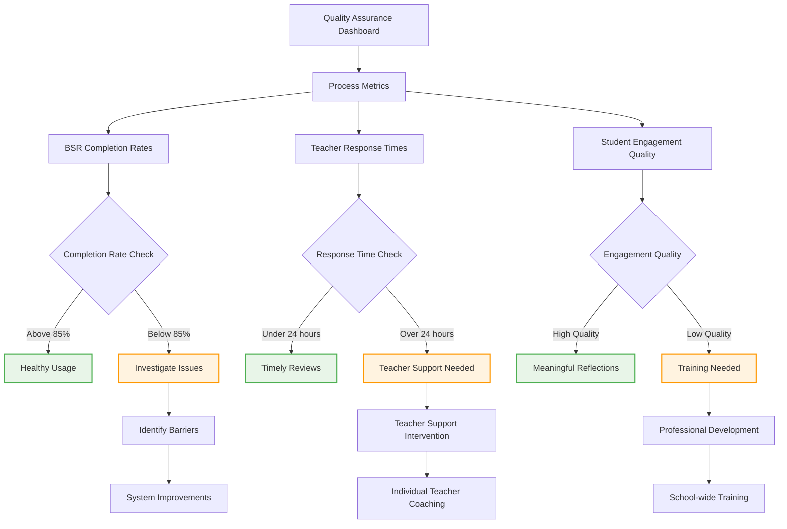

# 🎯 Administrative Oversight Journey (User Experience Flow)

**Journey Scope**: Complete administrative experience for system monitoring, management, and strategic oversight

## Administrative Management Journey

**Legend:**
- 📊 SysDash = Review System Dashboard
- 👀 Queue = Monitor Queue Status
- 🖥️ Kiosk = Check Kiosk Availability
- 🌙 Night = Review Overnight Activity
- 📊 BSRAud = Audit BSR Completion Rates
- ⏰ TeachResp = Review Teacher Response Times
- 👤 StudOut = Monitor Student Outcomes
- 🔍 Bottle = Identify System Bottlenecks
- 👨‍🏫 ManTeach = Manage Teacher Accounts
- 🔐 UserPerm = Review User Permissions
- 🔧 Access = Handle Access Issues
- 📥 StudData = Import New Student Data
- 📋 WeekRep = Generate Weekly Reports
- 📈 BehTrend = Analyze Behavioral Trends
- 📄 Comply = Create Compliance Reports
- 💼 Leader = Share Insights with Leadership
- 💭 Feedback = Review Feedback from Users
- 🔧 SysEnh = Plan System Enhancements
- 📚 PD = Coordinate Professional Development
- ⚡ Optimize = Optimize System Performance

## Administrative Dashboard Overview

**Legend:**
- 🔐 Login = Admin Login
- 📊 AdminDash = Administrative Dashboard
- 📈 SysStatus = System Status Overview
- 👥 UserMgmt = User Management Panel
- 📊 Analytics = Analytics & Reports
- ⚙️ Config = Configuration Settings
- 🔄 Sessions = Active Sessions Monitor
- 📋 QueueStat = Queue Status Display
- 🖥️ KioskAvail = Kiosk Availability
- ❤️ Health = System Health Metrics
- 👨‍🏫 TeachAcc = Teacher Account Management
- 👤 StudData = Student Data Management
- 🔐 RolePerm = Role & Permission Control
- 📜 ActLog = User Activity Logs
- 📈 BehTrend = Behavioral Trend Analysis
- 📊 Usage = Usage Statistics
- 📄 Outcome = Outcome Reporting
- 📋 Comply = Compliance Documentation
- ⚙️ SysConf = System Configuration
- 🔔 NotifSet = Notification Settings
- 🔗 IntMgmt = Integration Management
- 🔒 Security = Security Settings

## Real-time System Monitoring

## User Management Workflow

## Analytics & Reporting System

## Quality Assurance Monitoring

## Administrative Experience Phases

### 🌅 Phase 1: Daily System Check (10-15 minutes)
**Admin Experience:**
- Reviews overnight system activity
- Checks kiosk availability and system health
- Monitors queue status and any bottlenecks
- Addresses any urgent notifications or alerts

**Key Metrics:** System uptime, active users, queue length
**Success Factors:** Clear dashboard, automated alerts, quick issue resolution

### 📊 Phase 2: Performance Analysis (20-30 minutes)
**Admin Experience:**
- Analyzes behavioral trends and patterns
- Reviews teacher and student engagement metrics
- Identifies areas needing attention or improvement
- Generates reports for leadership

**Key Metrics:** Completion rates, response times, behavioral outcomes
**Success Factors:** Automated reporting, trend visualization, actionable insights

### 👥 Phase 3: User Support & Management (Variable)
**Admin Experience:**
- Manages teacher accounts and permissions
- Imports new student data and manages records
- Responds to user support requests
- Provides training and professional development

**Key Metrics:** User satisfaction, support ticket resolution, training effectiveness
**Success Factors:** Efficient user management tools, clear documentation, training resources

### 🔧 Phase 4: System Optimization (Ongoing)
**Admin Experience:**
- Reviews system performance and user feedback
- Plans and implements system improvements
- Coordinates with technical support when needed  
- Manages system updates and maintenance
- **✅ Queue Management**: Clear queue functionality operational with proper FK constraint handling

**Key Metrics:** System performance, user feedback scores, feature adoption, queue clearing success rate
**Success Factors:** User feedback collection, continuous improvement process, change management, reliable queue operations

## Administrative Success Indicators

### 📈 System Performance
- **Uptime**: 99.5%+ system availability
- **Response Time**: Sub-second dashboard loading
- **Queue Efficiency**: Students assigned within 5 minutes
- **Data Integrity**: Zero data loss incidents

### 👥 User Satisfaction
- **Teacher Adoption**: 90%+ active teacher usage
- **Student Engagement**: 85%+ BSR completion rate
- **Support Resolution**: 95% of issues resolved within 24 hours
- **Training Effectiveness**: Users report high confidence after training

### 🎯 Educational Outcomes
- **Behavioral Improvement**: Measurable reduction in repeat incidents
- **Process Efficiency**: Decreased time from incident to resolution
- **Quality Improvement**: Higher quality student reflections over time
- **Professional Growth**: Teachers report improved behavior management skills

### 📊 Data & Compliance
- **Reporting Accuracy**: 100% accurate compliance reports
- **Data Security**: Zero security incidents
- **Audit Readiness**: All required documentation maintained
- **Analytics Value**: Insights lead to measurable improvements

## Strategic Oversight Functions

### 🎯 Leadership Reporting
- **Executive Dashboards**: High-level metrics for school leadership
- **Board Presentations**: Quarterly reports on behavioral intervention effectiveness
- **District Reporting**: Comparative analysis with other schools
- **Compliance Documentation**: State and federal reporting requirements

### 📋 Professional Development Planning
- **Training Needs Analysis**: Data-driven identification of skill gaps
- **Resource Allocation**: Strategic deployment of professional development resources
- **Best Practice Sharing**: Identification and dissemination of effective practices
- **Continuous Improvement**: Regular review and refinement of processes

### 🔄 System Evolution
- **User Feedback Integration**: Regular collection and analysis of user suggestions
- **Technology Upgrades**: Planning and implementation of system enhancements
- **Process Optimization**: Continuous refinement of workflows and procedures
- **Scaling Preparation**: Planning for increased usage and additional features

## Integration with Other Journeys

### 🔗 Teacher Support Integration
- Real-time visibility into teacher workflow challenges
- Proactive support for teachers struggling with response times
- Professional development recommendations based on usage patterns

### 🔗 Student Experience Monitoring  
- Tracking student engagement and completion rates
- Identifying students who may need additional support
- Monitoring for patterns that indicate system barriers

### 🔗 Family Communication Coordination
- Ensuring appropriate family communication occurs
- Monitoring for communication gaps or issues
- Coordinating with family engagement initiatives

## Technology Requirements

### 📊 Dashboard Technology
- **Real-time Updates**: Live data refresh without page reload
- **Mobile Responsive**: Full functionality on tablets and phones
- **Customizable Views**: Administrators can personalize their dashboard
- **Export Capabilities**: Easy data export for external reporting

### 🔔 Alert & Notification System
- **Intelligent Alerts**: Smart notifications that reduce noise
- **Escalation Protocols**: Automatic escalation of critical issues
- **Multi-channel Delivery**: Email, SMS, and in-app notifications
- **Customizable Settings**: Administrators control notification preferences

### 📈 Analytics Engine
- **Predictive Analytics**: Early warning systems for potential issues
- **Comparative Analysis**: Benchmarking against historical data and goals
- **Drill-down Capabilities**: Ability to investigate trends in detail
- **Automated Insights**: System-generated recommendations and observations

## Cross-References
- **Teacher Journey**: `12-teacher-workflow-journey.md` - Understanding teacher experience for better support
- **Student Journey**: `11-complete-student-journey.md` - Monitoring student experience quality
- **System Foundation**: `SPRINT-02-LAUNCH/` - Technical infrastructure enabling administrative oversight