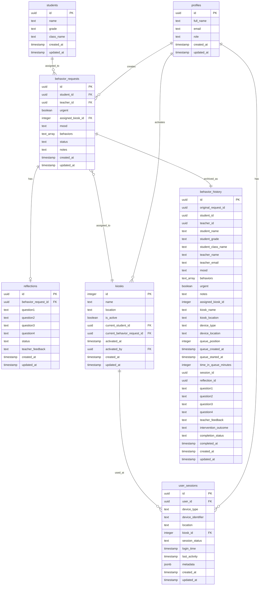

# Database Schema Documentation

## Overview

The behavior support system uses a PostgreSQL database hosted on Supabase, designed to handle real-time workflow management for student behavior interventions. The schema emphasizes data integrity, security, and performance while maintaining flexibility for future enhancements.

## Entity Relationship Diagram



## Table Specifications

### `profiles`

User profile information linked to Supabase Auth users.

| Column | Type | Constraints | Description |
|--------|------|-------------|-------------|
| `id` | UUID | PRIMARY KEY | Links to auth.users.id |
| `full_name` | TEXT | NULLABLE | User's complete name |
| `email` | TEXT | NULLABLE | User's email address |
| `role` | TEXT | NOT NULL, DEFAULT 'teacher' | User role (teacher, admin) |
| `created_at` | TIMESTAMPTZ | NOT NULL, DEFAULT now() | Record creation time |
| `updated_at` | TIMESTAMPTZ | NOT NULL, DEFAULT now() | Last update time |

**Indexes:**
- Primary key on `id`
- Index on `role` for role-based queries

**RLS Policies:**
- Users can view their own profile
- Authenticated users can view public profiles
- Users can update their own profile
- Admins can update any profile

### `students`

Student records for the behavior support system.

| Column | Type | Constraints | Description |
|--------|------|-------------|-------------|
| `id` | UUID | PRIMARY KEY, DEFAULT gen_random_uuid() | Unique student identifier |
| `name` | TEXT | NOT NULL | Student's full name |
| `grade` | TEXT | NULLABLE | Student's grade level |
| `class_name` | TEXT | NULLABLE | Student's class/homeroom |
| `created_at` | TIMESTAMPTZ | NOT NULL, DEFAULT now() | Record creation time |
| `updated_at` | TIMESTAMPTZ | NOT NULL, DEFAULT now() | Last update time |

**Indexes:**
- Primary key on `id`
- Index on `name` for name searches
- Composite index on `grade, class_name` for class queries

**RLS Policies:**
- Teachers and admins can view students
- Teachers and admins can create/update students

### `behavior_requests`

Active behavior support requests in the queue system.

| Column | Type | Constraints | Description |
|--------|------|-------------|-------------|
| `id` | UUID | PRIMARY KEY, DEFAULT gen_random_uuid() | Unique request identifier |
| `student_id` | UUID | NOT NULL, FOREIGN KEY | Reference to students.id |
| `teacher_id` | UUID | NOT NULL, FOREIGN KEY | Reference to profiles.id |
| `urgent` | BOOLEAN | NOT NULL, DEFAULT false | Priority flag for urgent cases |
| `assigned_kiosk_id` | INTEGER | NULLABLE, FOREIGN KEY | Reference to kiosks.id |
| `mood` | TEXT | NOT NULL | Student's current mood state |
| `behaviors` | TEXT[] | NOT NULL, DEFAULT '{}' | Array of observed behaviors |
| `status` | TEXT | NOT NULL, DEFAULT 'waiting' | Request status (waiting, in_progress, completed) |
| `notes` | TEXT | NULLABLE | Additional notes from teacher |
| `created_at` | TIMESTAMPTZ | NOT NULL, DEFAULT now() | Request creation time |
| `updated_at` | TIMESTAMPTZ | NOT NULL, DEFAULT now() | Last update time |

**Indexes:**
- Primary key on `id`
- Composite index on `status, created_at` for queue ordering
- Index on `student_id` for student lookups
- Index on `teacher_id` for teacher filtering
- Index on `assigned_kiosk_id` for kiosk queries

**RLS Policies:**
- Teachers and admins can view behavior requests
- Teachers and admins can create behavior requests
- Teachers and admins can update behavior requests
- Teachers and admins can delete behavior requests

**Check Constraints:**
```sql
CHECK (status IN ('waiting', 'in_progress', 'completed'))
CHECK (mood IN ('happy', 'sad', 'angry', 'frustrated', 'anxious', 'calm', 'excited'))
```

### `reflections`

Student reflection responses for behavior incidents.

| Column | Type | Constraints | Description |
|--------|------|-------------|-------------|
| `id` | UUID | PRIMARY KEY, DEFAULT gen_random_uuid() | Unique reflection identifier |
| `behavior_request_id` | UUID | NOT NULL, FOREIGN KEY | Reference to behavior_requests.id |
| `question1` | TEXT | NOT NULL | Response to "What did you do?" |
| `question2` | TEXT | NOT NULL | Response to "What were you hoping?" |
| `question3` | TEXT | NOT NULL | Response to "Who was impacted?" |
| `question4` | TEXT | NOT NULL | Response to "What's expected?" |
| `status` | TEXT | NOT NULL, DEFAULT 'pending' | Review status (pending, approved, revision_requested) |
| `teacher_feedback` | TEXT | NULLABLE | Teacher's feedback for revisions |
| `created_at` | TIMESTAMPTZ | NOT NULL, DEFAULT now() | Reflection submission time |
| `updated_at` | TIMESTAMPTZ | NOT NULL, DEFAULT now() | Last update time |

**Indexes:**
- Primary key on `id`
- Index on `behavior_request_id` for request lookups
- Index on `status` for status filtering

**RLS Policies:**
- Teachers and admins can view reflections
- Teachers and admins can create reflections
- Teachers and admins can update reflections

**Check Constraints:**
```sql
CHECK (status IN ('pending', 'approved', 'revision_requested'))
```

### `kiosks`

Physical kiosk stations where students complete reflections.

| Column | Type | Constraints | Description |
|--------|------|-------------|-------------|
| `id` | INTEGER | PRIMARY KEY, SERIAL | Unique kiosk identifier |
| `name` | TEXT | NOT NULL | Kiosk display name |
| `location` | TEXT | NULLABLE | Physical location description |
| `is_active` | BOOLEAN | NOT NULL, DEFAULT true | Kiosk activation status |
| `current_student_id` | UUID | NULLABLE, FOREIGN KEY | Currently assigned student |
| `current_behavior_request_id` | UUID | NULLABLE, FOREIGN KEY | Currently assigned request |
| `activated_at` | TIMESTAMPTZ | NULLABLE | Last activation time |
| `activated_by` | UUID | NULLABLE, FOREIGN KEY | User who activated kiosk |
| `created_at` | TIMESTAMPTZ | NOT NULL, DEFAULT now() | Record creation time |
| `updated_at` | TIMESTAMPTZ | NOT NULL, DEFAULT now() | Last update time |

**Indexes:**
- Primary key on `id`
- Index on `is_active` for active kiosk queries
- Index on `current_student_id` for student assignment

**RLS Policies:**
- Teachers and admins can view kiosks
- Teachers and admins can create kiosks
- Teachers and admins can update kiosks
- Teachers and admins can delete kiosks

### `behavior_history`

Historical record of all completed behavior interventions for analytics and reporting.

| Column | Type | Constraints | Description |
|--------|------|-------------|-------------|
| `id` | UUID | PRIMARY KEY, DEFAULT gen_random_uuid() | Unique history record identifier |
| `original_request_id` | UUID | NOT NULL | Reference to original behavior_requests.id |
| `student_id` | UUID | NOT NULL | Student identifier |
| `teacher_id` | UUID | NOT NULL | Teacher identifier |
| `student_name` | TEXT | NOT NULL | Student name (denormalized) |
| `student_grade` | TEXT | NULLABLE | Student grade (denormalized) |
| `student_class_name` | TEXT | NULLABLE | Student class (denormalized) |
| `teacher_name` | TEXT | NULLABLE | Teacher name (denormalized) |
| `teacher_email` | TEXT | NULLABLE | Teacher email (denormalized) |
| `mood` | TEXT | NOT NULL | Student mood at time of request |
| `behaviors` | TEXT[] | NOT NULL, DEFAULT '{}' | Observed behaviors |
| `urgent` | BOOLEAN | NOT NULL, DEFAULT false | Priority flag |
| `notes` | TEXT | NULLABLE | Teacher notes |
| `assigned_kiosk_id` | INTEGER | NULLABLE | Assigned kiosk ID |
| `kiosk_name` | TEXT | NULLABLE | Kiosk name (denormalized) |
| `kiosk_location` | TEXT | NULLABLE | Kiosk location (denormalized) |
| `device_type` | TEXT | NULLABLE | Device type used |
| `device_location` | TEXT | NULLABLE | Device location |
| `queue_position` | INTEGER | NULLABLE | Position in queue |
| `queue_created_at` | TIMESTAMPTZ | NOT NULL, DEFAULT now() | Original queue entry time |
| `queue_started_at` | TIMESTAMPTZ | NULLABLE | When student started reflection |
| `time_in_queue_minutes` | INTEGER | NULLABLE | Total time in queue |
| `session_id` | UUID | NULLABLE | Session identifier |
| `reflection_id` | UUID | NULLABLE | Reflection record ID |
| `question1` | TEXT | NULLABLE | Reflection question 1 response |
| `question2` | TEXT | NULLABLE | Reflection question 2 response |
| `question3` | TEXT | NULLABLE | Reflection question 3 response |
| `question4` | TEXT | NULLABLE | Reflection question 4 response |
| `teacher_feedback` | TEXT | NULLABLE | Teacher feedback on reflection |
| `intervention_outcome` | TEXT | NOT NULL, DEFAULT 'approved' | Final outcome |
| `completion_status` | TEXT | NOT NULL, DEFAULT 'completed' | Completion status |
| `completed_at` | TIMESTAMPTZ | NOT NULL, DEFAULT now() | Intervention completion time |
| `created_at` | TIMESTAMPTZ | NOT NULL, DEFAULT now() | History record creation time |
| `updated_at` | TIMESTAMPTZ | NOT NULL, DEFAULT now() | Last update time |

**Indexes:**
- Primary key on `id`
- Index on `student_id` for student analytics
- Index on `teacher_id` for teacher analytics
- Index on `completed_at` for time-based queries
- Composite index on `student_id, completed_at` for student timeline
- Index on `intervention_outcome` for outcome analysis

**RLS Policies:**
- Teachers and admins can view behavior history
- Teachers and admins can create behavior history

**Check Constraints:**
```sql
CHECK (intervention_outcome IN ('approved', 'revision_requested', 'incomplete'))
CHECK (completion_status IN ('completed', 'incomplete', 'abandoned'))
```

### `user_sessions`

User session tracking for monitoring and analytics.

| Column | Type | Constraints | Description |
|--------|------|-------------|-------------|
| `id` | UUID | PRIMARY KEY, DEFAULT gen_random_uuid() | Unique session identifier |
| `user_id` | UUID | NOT NULL, FOREIGN KEY | Reference to profiles.id |
| `device_type` | TEXT | NOT NULL | Device type (desktop, tablet, mobile) |
| `device_identifier` | TEXT | NULLABLE | Unique device identifier |
| `location` | TEXT | NULLABLE | Session location |
| `kiosk_id` | INTEGER | NULLABLE, FOREIGN KEY | Associated kiosk ID |
| `session_status` | TEXT | NOT NULL, DEFAULT 'active' | Session status |
| `login_time` | TIMESTAMPTZ | NOT NULL, DEFAULT now() | Session start time |
| `last_activity` | TIMESTAMPTZ | NOT NULL, DEFAULT now() | Last activity timestamp |
| `metadata` | JSONB | DEFAULT '{}' | Additional session metadata |
| `created_at` | TIMESTAMPTZ | NOT NULL, DEFAULT now() | Record creation time |
| `updated_at` | TIMESTAMPTZ | NOT NULL, DEFAULT now() | Last update time |

**Indexes:**
- Primary key on `id`
- Index on `user_id` for user lookups
- Index on `session_status` for active session queries
- Index on `last_activity` for cleanup operations
- Composite index on `user_id, session_status` for user session management

**RLS Policies:**
- Users can view their own sessions
- Teachers and admins can view all sessions
- Users can update their own sessions
- Admins can update any session
- Users can end their own sessions
- Admins can end any session

**Check Constraints:**
```sql
CHECK (session_status IN ('active', 'inactive', 'expired'))
CHECK (device_type IN ('desktop', 'tablet', 'mobile', 'kiosk'))
```

## Database Functions and Triggers

### Automatic Timestamp Updates

```sql
CREATE OR REPLACE FUNCTION public.update_updated_at_column()
RETURNS TRIGGER AS $$
BEGIN
  NEW.updated_at = now();
  RETURN NEW;
END;
$$ LANGUAGE plpgsql;
```

Applied to all tables with `updated_at` columns:
- `behavior_requests`
- `reflections`
- `kiosks`
- `profiles`
- `students`
- `behavior_history`
- `user_sessions`

### Behavior History Archival

Trigger function to automatically archive completed behavior interventions:

```sql
CREATE OR REPLACE FUNCTION archive_completed_intervention()
RETURNS TRIGGER AS $$
DECLARE
  student_record students%ROWTYPE;
  teacher_record profiles%ROWTYPE;
  kiosk_record kiosks%ROWTYPE;
  reflection_record reflections%ROWTYPE;
BEGIN
  -- Fetch related records for denormalization
  SELECT * INTO student_record FROM students WHERE id = OLD.student_id;
  SELECT * INTO teacher_record FROM profiles WHERE id = OLD.teacher_id;
  
  IF OLD.assigned_kiosk_id IS NOT NULL THEN
    SELECT * INTO kiosk_record FROM kiosks WHERE id = OLD.assigned_kiosk_id;
  END IF;
  
  SELECT * INTO reflection_record FROM reflections WHERE behavior_request_id = OLD.id;
  
  -- Insert into behavior_history
  INSERT INTO public.behavior_history (
    original_request_id,
    student_id,
    teacher_id,
    student_name,
    student_grade,
    student_class_name,
    teacher_name,
    teacher_email,
    mood,
    behaviors,
    urgent,
    notes,
    assigned_kiosk_id,
    kiosk_name,
    kiosk_location,
    queue_created_at,
    queue_started_at,
    time_in_queue_minutes,
    reflection_id,
    question1,
    question2,
    question3,
    question4,
    teacher_feedback,
    intervention_outcome,
    completion_status
  ) VALUES (
    OLD.id,
    OLD.student_id,
    OLD.teacher_id,
    student_record.name,
    student_record.grade,
    student_record.class_name,
    teacher_record.full_name,
    teacher_record.email,
    OLD.mood,
    OLD.behaviors,
    OLD.urgent,
    OLD.notes,
    OLD.assigned_kiosk_id,
    kiosk_record.name,
    kiosk_record.location,
    OLD.created_at,
    COALESCE(reflection_record.created_at, OLD.updated_at),
    EXTRACT(EPOCH FROM (COALESCE(reflection_record.created_at, OLD.updated_at) - OLD.created_at))/60,
    reflection_record.id,
    reflection_record.question1,
    reflection_record.question2,
    reflection_record.question3,
    reflection_record.question4,
    reflection_record.teacher_feedback,
    CASE 
      WHEN reflection_record.status = 'approved' THEN 'approved'
      WHEN reflection_record.status = 'revision_requested' THEN 'revision_requested'
      ELSE 'incomplete'
    END,
    'completed'
  );
  
  RETURN OLD;
END;
$$ LANGUAGE plpgsql;

CREATE TRIGGER archive_on_approval
  AFTER DELETE ON public.behavior_requests
  FOR EACH ROW
  EXECUTE FUNCTION archive_completed_intervention();
```

## Performance Optimization

### Index Strategy

1. **Primary Keys**: Automatic B-tree indexes on all primary keys
2. **Foreign Keys**: Indexes on all foreign key columns for join performance
3. **Query Patterns**: Composite indexes for common query patterns
4. **Time-based Queries**: Indexes on timestamp columns for date range queries
5. **Status Filtering**: Indexes on status columns for workflow queries

### Query Optimization

1. **Avoid SELECT ***: Specify only needed columns
2. **Use Appropriate Joins**: Inner joins for required relationships
3. **Filter Early**: Apply WHERE clauses before JOINs
4. **Limit Results**: Implement pagination for large datasets
5. **Use Explain Plans**: Analyze query performance regularly

### Maintenance Tasks

1. **VACUUM**: Regular cleanup of deleted row space
2. **ANALYZE**: Update table statistics for query planner
3. **REINDEX**: Rebuild indexes periodically
4. **Partition Pruning**: Archive old data to maintain performance

## Data Integrity

### Referential Integrity

- Foreign key constraints ensure all references are valid
- CASCADE options handle dependent record cleanup
- RESTRICT options prevent orphaned records

### Data Validation

- Check constraints validate enumerated values
- NOT NULL constraints ensure required data
- Unique constraints prevent duplicates
- Custom validation functions for complex rules

### Audit Trail

- `created_at` and `updated_at` timestamps on all tables
- Trigger-based automatic timestamp updates
- Comprehensive logging of all data changes
- Historical preservation in `behavior_history` table

## Security Considerations

### Row Level Security (RLS)

- Enabled on all tables containing sensitive data
- Role-based access control (teacher, admin)
- User-specific data isolation where appropriate
- Comprehensive policy coverage for all operations

### Data Encryption

- Encryption at rest using AES-256
- Encryption in transit using TLS 1.3
- Secure key management through Supabase
- Regular security audits and updates

### Access Control

- Principle of least privilege
- Regular review of user permissions
- Automated detection of unusual access patterns
- Comprehensive audit logging

## Backup and Recovery

### Backup Strategy

- Automated daily full backups
- Point-in-time recovery capability
- Cross-region backup replication
- Regular backup verification and testing

### Recovery Procedures

- Documented recovery procedures
- Regular disaster recovery testing
- RTO (Recovery Time Objective): 4 hours
- RPO (Recovery Point Objective): 1 hour

## Monitoring and Alerting

### Performance Monitoring

- Query performance tracking
- Connection pool utilization
- Storage growth monitoring
- Real-time subscription metrics

### Alerting Thresholds

- Slow query alerts (>1 second)
- High connection usage (>80%)
- Storage space warnings (>80% full)
- Failed authentication attempts

### Health Checks

- Database connectivity monitoring
- Table accessibility verification
- Index health assessment
- Replication lag monitoring