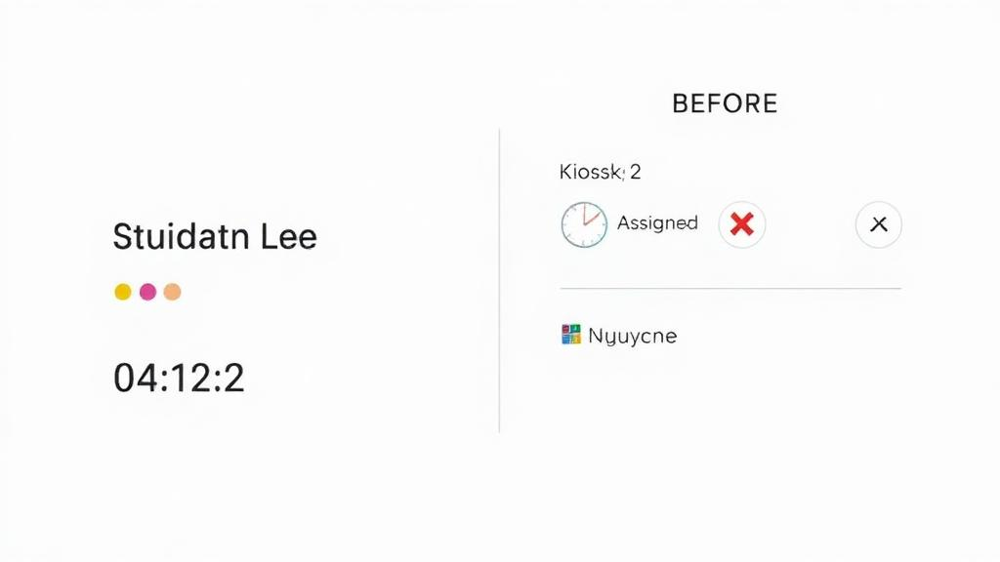
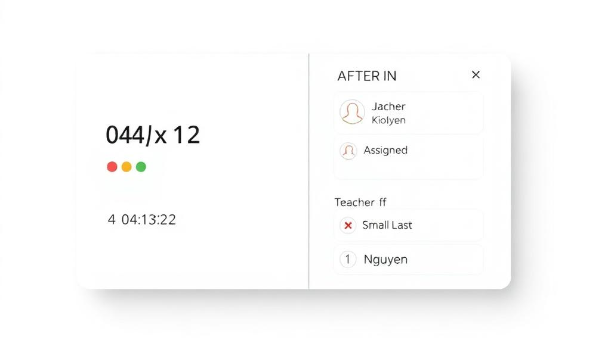

# Active Queue Card — Right-Side Two-Row Layout Update

This update adjusts the Active Queue card actions on the right side to a two-row stacked layout and adds a per-item clear confirmation dialog.

## Before / After

- Before (single-row right side, last-name chip with meta row on the left):

- After (two stacked rows on the right; Row 1 = status/review + Individual Clear, Row 2 = teacher last-name chip):

## What Changed
- Right column is now a vertical stack:
  - Row 1: left = status (Assigned/In Progress/At Kiosk/Waiting) or Review button; right = Individual Clear with confirmation.
  - Row 2: teacher last-name chip, hidden if not derivable.
- No data/binding changes. The last-name derivation is unchanged; only the fallback placeholder was removed so the chip hides when empty.
- Spacing tuned for small, even horizontal and vertical gaps; responsive on mobile and desktop.

## Readiness Check Summary
- Visual pass: Verified the new structure and spacing in code; small-screen stacking remains stable.
- Console logs: No recent errors/warnings detected at the time of this check.
- Network requests: No recent failed requests detected at the time of this check.
- Edge cases considered in layout: long names wrap, many behavior dots, missing last name (chip hidden), mobile widths.

## Known Watch Items for Field Testing
- Extremely long teacher last names may wrap; confirm desired truncation/wrapping behavior on smallest devices.
- Verify Review button + Clear alignment in "review" status across all kiosk flows.

## Files Touched
- src/components/QueueDisplay.tsx (UI-only layout changes)

