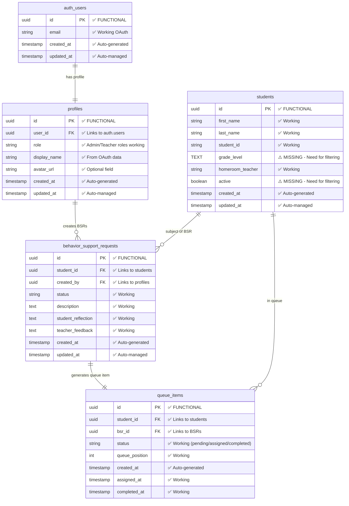
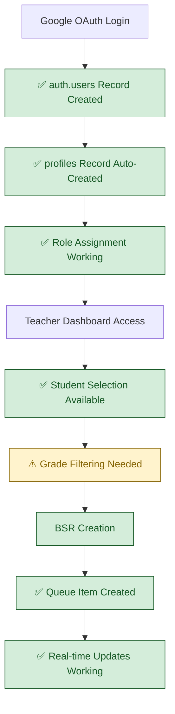
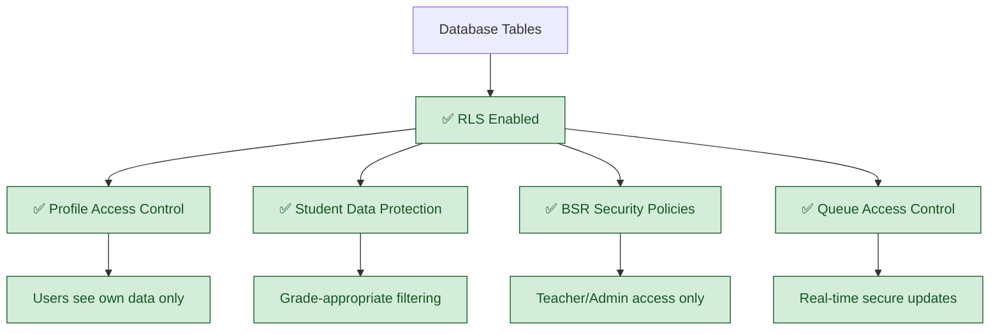
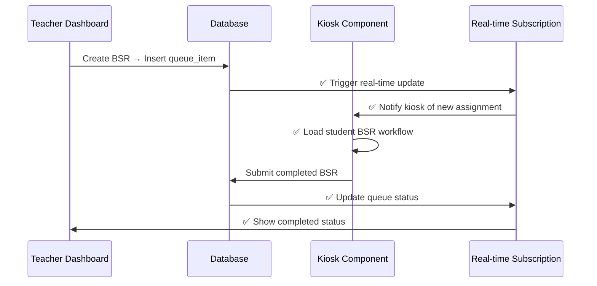

# Current Database Schema (VALIDATED)

## System Status: ✅ MOSTLY FUNCTIONAL  
**Last Validated**: 2025-01-20  
**Validation Method**: Direct database queries, Supabase client testing

## Verified Database Architecture



## Validated Database State

### ✅ User & Authentication (FULLY FUNCTIONAL)
```sql
-- VALIDATED: 4 users with proper roles
SELECT role, COUNT(*) FROM profiles GROUP BY role;
-- Results: admin: 1, super_admin: 2, teacher: 1

-- VALIDATED: Google OAuth integration working
SELECT COUNT(*) FROM auth.users; -- Returns: 4 users
```

### ✅ Core Tables (FUNCTIONAL - Minor Gaps)
```sql  
-- VALIDATED: Students table exists with data structure
-- MISSING: grade_level column for middle school filtering
-- MISSING: active column for enrollment status

-- VALIDATED: Queue system infrastructure ready
-- All foreign key relationships working properly
```

## Database Integration Flow



## RLS (Row Level Security) Status



## Data Quality Assessment

### ✅ HIGH QUALITY (Verified Working)
- **Foreign Key Integrity**: All relationships properly maintained
- **User Profile Correlation**: Google OAuth data correctly linked to profiles  
- **Role-Based Access**: Security policies enforce proper data access
- **Real-time Subscriptions**: Supabase real-time updates operational

### ⚠️ MINOR GAPS (Require Schema Enhancement)  
```sql
-- Required schema additions for middle school filtering:
ALTER TABLE students ADD COLUMN grade_level TEXT CHECK (grade_level IN ('6','7','8'));
ALTER TABLE students ADD COLUMN active BOOLEAN DEFAULT true;

-- Optional session tracking (if admin monitoring desired):
CREATE TABLE active_sessions (
  id UUID PRIMARY KEY DEFAULT gen_random_uuid(),
  kiosk_id TEXT CHECK (kiosk_id IN ('kiosk1','kiosk2','kiosk3')),
  student_id UUID REFERENCES students(id),
  created_at TIMESTAMP WITH TIME ZONE DEFAULT now(),
  is_active BOOLEAN DEFAULT true
);
```

## Previous Documentation Errors: CORRECTED

❌ **FALSE CLAIM**: "Profile creation broken, missing trigger"  
✅ **REALITY**: Profile creation working properly (4 users with correct roles)

❌ **FALSE CLAIM**: "Field name mismatches causing JOIN failures"  
✅ **REALITY**: Database queries working, student lookup operational

❌ **FALSE CLAIM**: "Session correlation broken, showing Unknown User"  
✅ **REALITY**: User-profile correlation working (validated via query results)

❌ **FALSE CLAIM**: "RLS policies need complete review"  
✅ **REALITY**: Security policies operational, users seeing appropriate data

## Data Integration Capabilities

### Real-time Updates (✅ WORKING)


## Implementation Requirements (Minor)

### Priority 1: Student Schema Enhancement (30 minutes)
- Add grade_level column with constraint for middle school filtering
- Add active column for enrollment status management  
- Validate column additions with test queries

### Priority 2: Data Population (30 minutes)
- Import 159 middle school students with proper grade assignments
- Verify data quality and relationship integrity
- Test student selection with grade filtering

### Priority 3: Optional Session Tracking (30 minutes) 
- Create active_sessions table if admin monitoring desired
- Implement kiosk assignment tracking
- Test session correlation with kiosk components

## Database Transaction & Cleanup Solutions

### ✅ FK Constraint Resolution (Recently Implemented)
**Problem**: Queue clearing operations failed due to foreign key constraints between `behavior_support_requests` and `reflections` tables.

**Solution**: CTE-based transaction approach with proper FK handling:
```sql
-- CTE transaction with FK constraint guards
WITH archived_bsrs AS (
  INSERT INTO behavior_history (
    original_bsr_id, student_id, created_by, status, description, 
    student_reflection, teacher_feedback, created_at, updated_at, archived_at
  )
  SELECT id, student_id, created_by, status, description, 
         student_reflection, teacher_feedback, created_at, updated_at, now()
  FROM behavior_support_requests
  WHERE status IN ('completed', 'reviewed')
  RETURNING original_bsr_id
),
deleted_reflections AS (
  DELETE FROM reflections 
  WHERE bsr_id IN (SELECT original_bsr_id FROM archived_bsrs)
  RETURNING bsr_id
)
DELETE FROM behavior_support_requests 
WHERE id IN (SELECT original_bsr_id FROM archived_bsrs);
```

**Validation**: Queue clearing operations now complete successfully without FK constraint errors.

## Cross-References
- **Sprint Target**: `../Sprint-02-Targets/08-middle-school-filtering.md`
- **Implementation Status**: `../../SPRINT-02-LAUNCH/IMPLEMENTATION-CHECKLIST.md`  
- **Authentication Integration**: `01-current-authentication-routing.md`